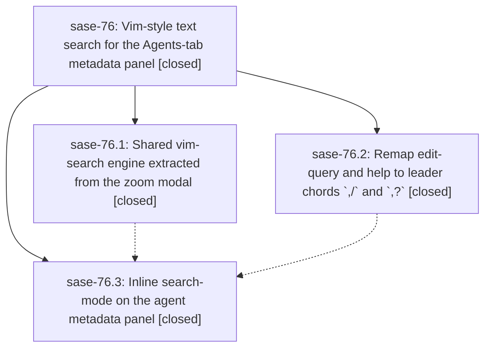

# Bead: sase-76 — Vim-style text search for the Agents-tab metadata panel

[Bead Pages](../README.md) / sase-76

**Status:** ✓ closed · **Resolution:** (unrecorded) · **Type:** plan · **Tier:** epic
**Owner:** `bryanbugyi34@gmail.com`
**Created:** 2026-07-19 13:04:27 UTC · **Closed:** 2026-07-19 15:26:19 UTC
**Plan:** [202607/agent\_metadata\_vim\_search.md](https://github.com/sase-org/sase--plans/blob/main/202607/agent_metadata_vim_search.md)

## Description

The Agents-tab metadata panel supports beautiful, reliable, vim-faithful incremental text search (`/`, `?`, `n`, `N`, `<esc>`/`q`) across every panel variant (single agent, clan, family, tribe, workflow, step), with easy free-form text copying from a jumped-to match. The previous `/` (edit query) and `?` (help) bindings move to `,/` and `,?` on all tabs.

## Notes

COMMIT: 791b250

## Phases

| Bead | Title | Status | Size | Agents | Commits |
|---|---|---|---|---:|---:|
| [sase-76.1](sase-76.1.md) | Shared vim-search engine extracted from the zoom modal | ✓ closed | small | 1 | 1 |
| [sase-76.2](sase-76.2.md) | Remap edit-query and help to leader chords \`,/\` and \`,?\` | ✓ closed | small | 1 | 1 |
| [sase-76.3](sase-76.3.md) | Inline search-mode on the agent metadata panel | ✓ closed | small | 1 | 1 |

## Lineage

## Agents

| Agent | Bead | Commits |
|---|---|---:|
| [bbugyi200.athena.sase-76.1](https://github.com/sase-org/sase--agents/blob/main/agents/bbugyi200.athena.sase-76.1/README.md) | [sase-76.1](sase-76.1.md) | 1 |
| [bbugyi200.athena.sase-76.2](https://github.com/sase-org/sase--agents/blob/main/agents/bbugyi200.athena.sase-76.2/README.md) | [sase-76.2](sase-76.2.md) | 1 |
| [bbugyi200.athena.sase-76.3](https://github.com/sase-org/sase--agents/blob/main/agents/bbugyi200.athena.sase-76.3/README.md) | [sase-76.3](sase-76.3.md) | 1 |

## Commits

| Commit | Subject | Bead | Committed (UTC) |
|---|---|---|---|
| [`286b992`](https://github.com/sase-org/sase/commit/286b992e4289edf2ca1f1ced20d37d6833b80e30) | feat(ace)!: move query and help to leader chords (sase-76.2) | [sase-76.2](sase-76.2.md) | 2026-07-19 13:54:43 |
| [`43321b8`](https://github.com/sase-org/sase/commit/43321b87837a9d6fc8c1a2627fdaa40b90b9e07f) | refactor(tui): extract shared Vim search controller (sase-76.1) | [sase-76.1](sase-76.1.md) | 2026-07-19 14:14:39 |
| [`0fe38d6`](https://github.com/sase-org/sase/commit/0fe38d6748e55c1f8cd8fe64aa9e7ced863dab6b) | feat(ace): add inline agent metadata search (sase-76.3) | [sase-76.3](sase-76.3.md) | 2026-07-19 15:16:48 |
