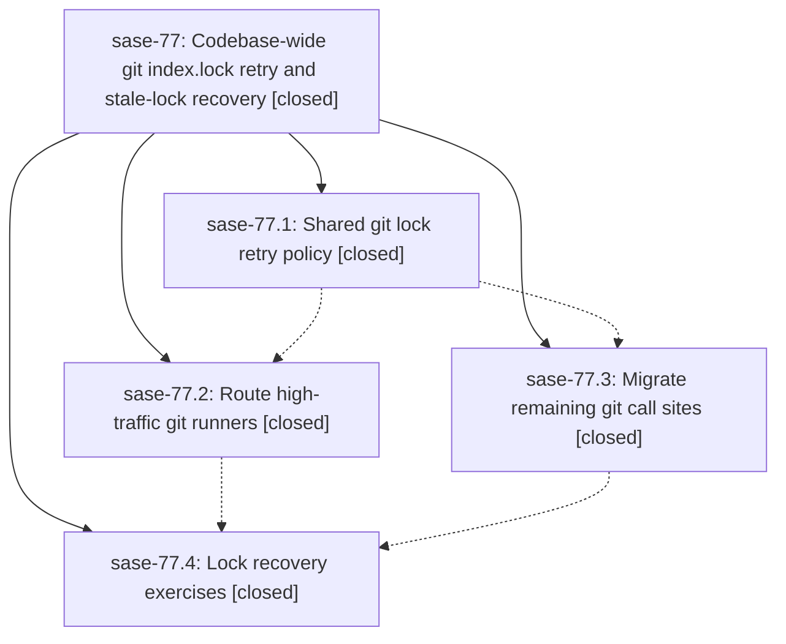

# Bead: sase-77 — Codebase-wide git index.lock retry and stale-lock recovery

[Bead Pages](../README.md) / sase-77

**Status:** ✓ closed · **Resolution:** (unrecorded) · **Type:** plan · **Tier:** epic
**Owner:** `bryanbugyi34@gmail.com`
**Created:** 2026-07-19 13:20:29 UTC · **Closed:** 2026-07-19 16:04:27 UTC
**Plan:** [202607/git\_index\_lock\_retry.md](https://github.com/sase-org/sase--plans/blob/main/202607/git_index_lock_retry.md)

## Description

Every git invocation in sase survives transient .git/index.lock contention via bounded backoff retries and, when retries are exhausted, safe automatic removal of provably-stale lock files followed by one final retry — replacing today's three inconsistent ad-hoc mechanisms with one shared policy.

## Notes

COMMIT: 76bdc6e

## Phases

| Bead | Title | Status | Size | Agents | Commits |
|---|---|---|---|---:|---:|
| [sase-77.1](sase-77.1.md) | Shared git lock retry policy | ✓ closed | small | 1 | 1 |
| [sase-77.2](sase-77.2.md) | Route high-traffic git runners | ✓ closed | small | 1 | 1 |
| [sase-77.3](sase-77.3.md) | Migrate remaining git call sites | ✓ closed | small | 1 | 1 |
| [sase-77.4](sase-77.4.md) | Lock recovery exercises | ✓ closed | small | 1 | 1 |

## Lineage

## Agents

| Agent | Bead | Commits |
|---|---|---:|
| [bbugyi200.athena.sase-77.1](https://github.com/sase-org/sase--agents/blob/main/agents/bbugyi200.athena.sase-77.1/README.md) | [sase-77.1](sase-77.1.md) | 1 |
| [bbugyi200.athena.sase-77.2](https://github.com/sase-org/sase--agents/blob/main/agents/bbugyi200.athena.sase-77.2/README.md) | [sase-77.2](sase-77.2.md) | 1 |
| [bbugyi200.athena.sase-77.3](https://github.com/sase-org/sase--agents/blob/main/agents/bbugyi200.athena.sase-77.3/README.md) | [sase-77.3](sase-77.3.md) | 1 |
| [bbugyi200.athena.sase-77.4](https://github.com/sase-org/sase--agents/blob/main/agents/bbugyi200.athena.sase-77.4/README.md) | [sase-77.4](sase-77.4.md) | 1 |
| [bbugyi200.athena.sase-77.land](https://github.com/sase-org/sase--agents/blob/main/agents/bbugyi200.athena.sase-77.land/README.md) | [sase-77](README.md) | 2 |
| [bbugyi200.athena.sase-77.land--code](https://github.com/sase-org/sase--agents/blob/main/families/bbugyi200.athena.sase-77.land.md#member-code) | [sase-77](README.md) | 0 |

## Commits

| Commit | Subject | Bead | Committed (UTC) |
|---|---|---|---|
| [`7257829`](https://github.com/sase-org/sase/commit/7257829889ad52f7138f7b3d71da344961e12478) | feat(git): add shared index lock retry policy (sase-77.1) | [sase-77.1](sase-77.1.md) | 2026-07-19 13:48:22 |
| [`4060ac6`](https://github.com/sase-org/sase/commit/4060ac6456d2ed8cca1b23371bc569e255ffb752) | fix(git): recover high-traffic runners from index locks (sase-77.2) | [sase-77.2](sase-77.2.md) | 2026-07-19 14:08:03 |
| [`09fa3fe`](https://github.com/sase-org/sase/commit/09fa3fe1e8b6a29532127ade5be2e020fd06388a) | fix(git): apply lock recovery to remaining mutation runners (sase-77.3) | [sase-77.3](sase-77.3.md) | 2026-07-19 14:36:26 |
| [`c7b84dc`](https://github.com/sase-org/sase/commit/c7b84dc46e6106a9a38aacab97b2fa4c7e8d8b71) | test(git): exercise lock recovery end-to-end across representative flows (sase-77.4) | [sase-77.4](sase-77.4.md) | 2026-07-19 14:44:43 |
| [`50f0718`](https://github.com/sase-org/sase/commit/50f0718b77722959fd7eb34d6337a853d8f74ae2) | fix(sdd): recover remaining Git index lock contention (sase-77) | [sase-77](README.md) | 2026-07-19 17:13:50 |
| [`bd7f969`](https://github.com/sase-org/sase/commit/bd7f969711101f08a5867fa6821933f29f4f5f2b) | fix(sdd): expose the shared lock retry schedule (sase-77) | [sase-77](README.md) | 2026-07-19 17:16:40 |
