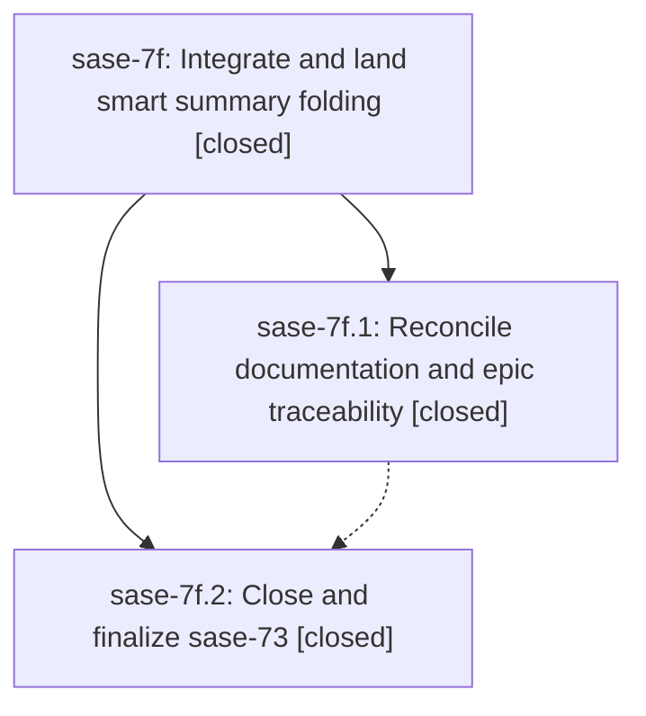

# Bead: sase-7f — Integrate and land smart summary folding

[Bead Pages](../README.md) / sase-7f

**Status:** ✓ closed · **Resolution:** (unrecorded) · **Type:** plan · **Tier:** epic
**Owner:** `bryanbugyi34@gmail.com`
**Created:** 2026-07-19 15:50:37 UTC · **Closed:** 2026-07-19 18:31:47 UTC
**Plan:** [202607/land\_sase\_73.md](https://github.com/sase-org/sase--plans/blob/main/202607/land_sase_73.md)

## Description

Documentation and bead traceability match the completed clan, family, and tribe summary behavior on current master, the verified implementation remains green with later ACE changes, and epic sase-73 is closed with post-close Symvision hygiene and its canonical plan marked done.

## Notes

COMMIT: e41269f

## Phases

| Bead | Title | Status | Size | Agents | Commits |
|---|---|---|---|---:|---:|
| [sase-7f.1](sase-7f.1.md) | Reconcile documentation and epic traceability | ✓ closed | small | 1 | 1 |
| [sase-7f.2](sase-7f.2.md) | Close and finalize sase-73 | ✓ closed | small | 1 | 1 |

## Lineage

## Agents

| Agent | Bead | Commits |
|---|---|---:|
| [bbugyi200.athena.sase-7f.1](https://github.com/sase-org/sase--agents/blob/main/agents/bbugyi200.athena.sase-7f.1/README.md) | [sase-7f.1](sase-7f.1.md) | 1 |
| [bbugyi200.athena.sase-7f.2](https://github.com/sase-org/sase--agents/blob/main/agents/bbugyi200.athena.sase-7f.2/README.md) | [sase-7f.2](sase-7f.2.md) | 1 |
| [bbugyi200.athena.sase-7f.land--code](https://github.com/sase-org/sase--agents/blob/main/families/bbugyi200.athena.sase-7f.land.md#member-code) | [sase-7f](README.md) | 0 |

## Commits

| Commit | Subject | Bead | Committed (UTC) |
|---|---|---|---|
| [`b1d192e`](https://github.com/sase-org/sase/commit/b1d192ea5f7c24e9b9b28a3963144dfb2e5a0545) | docs: align smart summary folding guidance (sase-7f.1) | [sase-7f.1](sase-7f.1.md) | 2026-07-19 16:14:09 |
| [`f9084fc`](https://github.com/sase-org/sase/commit/f9084fcd727ad8e65bbc10b8779386c982267f9e) | test: patch public git lock retry helper (sase-7f.2) | [sase-7f.2](sase-7f.2.md) | 2026-07-19 18:03:55 |
