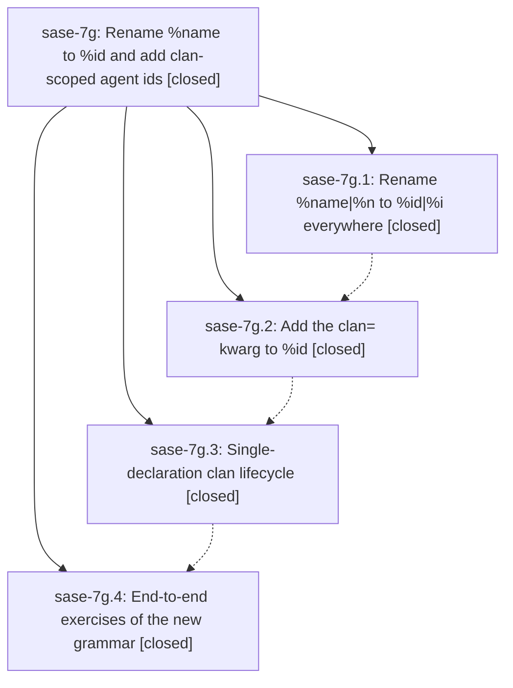

# Bead: sase-7g — Rename %name to %id and add clan-scoped agent ids

[Bead Pages](../README.md) / sase-7g

**Status:** ✓ closed · **Resolution:** (unrecorded) · **Type:** plan · **Tier:** epic
**Owner:** `bryanbugyi34@gmail.com`
**Created:** 2026-07-19 16:04:56 UTC · **Closed:** 2026-07-19 19:49:51 UTC
**Plan:** [202607/id\_directive\_clan\_kwarg.md](https://github.com/sase-org/sase--plans/blob/main/202607/id_directive_clan_kwarg.md)

## Description

The %name|%n directive is renamed to %id|%i, %clan becomes a create-only declaration that errors when the clan already exists or is declared twice, and a new clan= kwarg on %id lets every other member join (or implicitly create) a clan with a derived <clan>.<id> name — with all launch, retry, bead-epic, TUI, docs, and template surfaces migrated so nothing breaks.

## Phases

| Bead | Title | Status | Size | Agents | Commits |
|---|---|---|---|---:|---:|
| [sase-7g.1](sase-7g.1.md) | Rename %name\|%n to %id\|%i everywhere | ✓ closed | small | 1 | 1 |
| [sase-7g.2](sase-7g.2.md) | Add the clan= kwarg to %id | ✓ closed | small | 1 | 1 |
| [sase-7g.3](sase-7g.3.md) | Single-declaration clan lifecycle | ✓ closed | small | 1 | 1 |
| [sase-7g.4](sase-7g.4.md) | End-to-end exercises of the new grammar | ✓ closed | small | 1 | 1 |

## Lineage

## Agents

| Agent | Bead | Commits |
|---|---|---:|
| [bbugyi200.athena.sase-7g.1](https://github.com/sase-org/sase--agents/blob/main/agents/bbugyi200.athena.sase-7g.1/README.md) | [sase-7g.1](sase-7g.1.md) | 1 |
| [bbugyi200.athena.sase-7g.2](https://github.com/sase-org/sase--agents/blob/main/agents/bbugyi200.athena.sase-7g.2/README.md) | [sase-7g.2](sase-7g.2.md) | 1 |
| [bbugyi200.athena.sase-7g.3](https://github.com/sase-org/sase--agents/blob/main/agents/bbugyi200.athena.sase-7g.3/README.md) | [sase-7g.3](sase-7g.3.md) | 1 |
| [bbugyi200.athena.sase-7g.4](https://github.com/sase-org/sase--agents/blob/main/agents/bbugyi200.athena.sase-7g.4/README.md) | [sase-7g.4](sase-7g.4.md) | 1 |

## Commits

| Commit | Subject | Bead | Committed (UTC) |
|---|---|---|---|
| [`f628154`](https://github.com/sase-org/sase/commit/f628154527eac7e14d48f1732a00f61176f16843) | feat!: rename the agent directive to %id (sase-7g.1) | [sase-7g.1](sase-7g.1.md) | 2026-07-19 16:52:22 |
| [`985b1c0`](https://github.com/sase-org/sase/commit/985b1c0d1dbd20c91d473b5d19283bb56c28cfbe) | feat: support clan-scoped agent IDs (sase-7g.2) | [sase-7g.2](sase-7g.2.md) | 2026-07-19 17:50:21 |
| [`dea2369`](https://github.com/sase-org/sase/commit/dea236963275cbb907248a4aa766631c5c0f68ce) | feat!: enforce single-declaration clan lifecycle (sase-7g.3) | [sase-7g.3](sase-7g.3.md) | 2026-07-19 18:27:39 |
| [`09f9151`](https://github.com/sase-org/sase/commit/09f9151b61c01c6d277628981a3ead1aae0b95c6) | fix(tui): preserve clan membership on retry (sase-7g.4) | [sase-7g.4](sase-7g.4.md) | 2026-07-19 18:56:52 |
