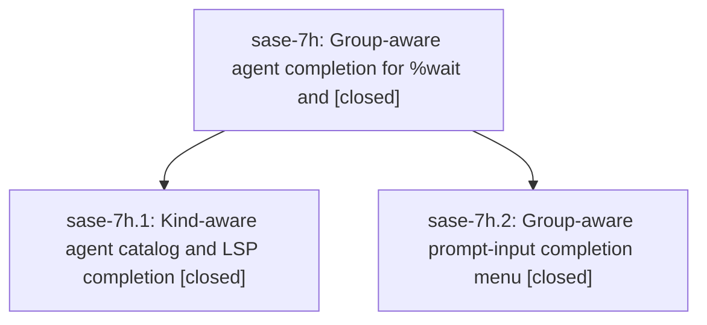

# Bead: sase-7h — Group-aware agent completion for %wait and

[Bead Pages](../README.md) / sase-7h

**Status:** ✓ closed · **Resolution:** (unrecorded) · **Type:** plan · **Tier:** epic
**Owner:** `bryanbugyi34@gmail.com`
**Created:** 2026-07-19 16:50:46 UTC · **Closed:** 2026-07-19 17:47:50 UTC
**Plan:** [202607/agent\_group\_completion.md](https://github.com/sase-org/sase--plans/blob/main/202607/agent_group_completion.md)

## Description

Completion menus in the ACE prompt input and the xprompt LSP offer agents, agent families, agent clans, and @tribes for %wait and #fork, with each entry's kind unmistakable at a glance.

## Phases

| Bead | Title | Status | Size | Agents | Commits |
|---|---|---|---|---:|---:|
| [sase-7h.1](sase-7h.1.md) | Kind-aware agent catalog and LSP completion | ✓ closed | small | 1 | 1 |
| [sase-7h.2](sase-7h.2.md) | Group-aware prompt-input completion menu | ✓ closed | small | 1 | 1 |

## Lineage

## Agents

| Agent | Bead | Commits |
|---|---|---:|
| [bbugyi200.athena.sase-7h.1](https://github.com/sase-org/sase--agents/blob/main/agents/bbugyi200.athena.sase-7h.1/README.md) | [sase-7h.1](sase-7h.1.md) | 1 |
| [bbugyi200.athena.sase-7h.2](https://github.com/sase-org/sase--agents/blob/main/agents/bbugyi200.athena.sase-7h.2/README.md) | [sase-7h.2](sase-7h.2.md) | 1 |
| [bbugyi200.athena.sase-7h.land--code](https://github.com/sase-org/sase--agents/blob/main/families/bbugyi200.athena.sase-7h.land.md#member-code) | [sase-7h](README.md) | 0 |

## Commits

| Commit | Subject | Bead | Committed (UTC) |
|---|---|---|---|
| [`390a7f1`](https://github.com/sase-org/sase/commit/390a7f1ea528e2650375d8a9805396e1b2623658) | feat(editor): add kind-aware agent catalog entries (sase-7h.1) | [sase-7h.1](sase-7h.1.md) | 2026-07-19 17:20:12 |
| [`4d7c9aa`](https://github.com/sase-org/sase/commit/4d7c9aac3aa01947fe4e261c7cccbffa22614991) | feat(ace): add group-aware prompt target completion (sase-7h.2) | [sase-7h.2](sase-7h.2.md) | 2026-07-19 17:22:52 |
