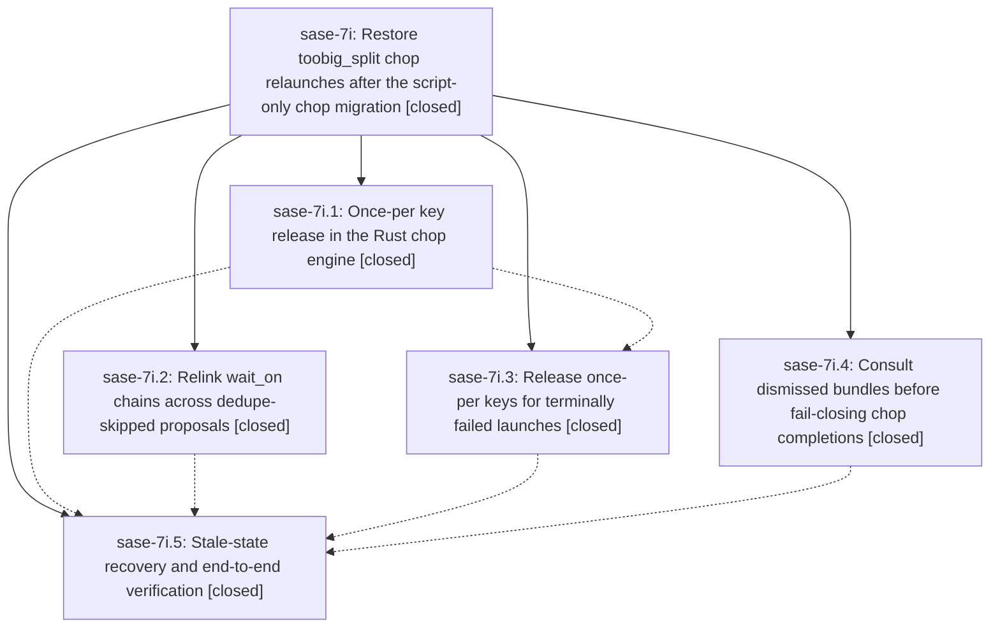

# Bead: sase-7i — Restore toobig\_split chop relaunches after the script-only chop migration

[Bead Pages](../README.md) / sase-7i

**Status:** ✓ closed · **Resolution:** (unrecorded) · **Type:** plan · **Tier:** epic
**Owner:** `bryanbugyi34@gmail.com`
**Created:** 2026-07-19 17:19:56 UTC · **Closed:** 2026-07-19 19:46:38 UTC
**Plan:** [202607/fix\_toobig\_split\_chop\_dedupe.md](https://github.com/sase-org/sase--plans/blob/main/202607/fix_toobig_split_chop_dedupe.md)

## Description

The toobig_split chop reliably launches one split_file agent per oversized file every hour (unless the split_file hood is active): a deduped head proposal no longer cascades and kills the whole wait_on chain, once-per keys are released when their launches terminally fail, and agents whose completion markers were removed by dismissal are no longer misreported as failed.

## Phases

| Bead | Title | Status | Size | Agents | Commits |
|---|---|---|---|---:|---:|
| [sase-7i.1](sase-7i.1.md) | Once-per key release in the Rust chop engine | ✓ closed | small | 1 | 2 |
| [sase-7i.2](sase-7i.2.md) | Relink wait\_on chains across dedupe-skipped proposals | ✓ closed | small | 1 | 1 |
| [sase-7i.3](sase-7i.3.md) | Release once-per keys for terminally failed launches | ✓ closed | small | 1 | 1 |
| [sase-7i.4](sase-7i.4.md) | Consult dismissed bundles before fail-closing chop completions | ✓ closed | small | 1 | 1 |
| [sase-7i.5](sase-7i.5.md) | Stale-state recovery and end-to-end verification | ✓ closed | small | 1 | 1 |

## Lineage

## Agents

| Agent | Bead | Commits |
|---|---|---:|
| [bbugyi200.athena.fb](https://github.com/sase-org/sase--agents/blob/main/agents/bbugyi200.athena.fb/README.md) | [sase-7i.5](sase-7i.5.md) | 1 |
| [bbugyi200.athena.sase-7i.1](https://github.com/sase-org/sase--agents/blob/main/agents/bbugyi200.athena.sase-7i.1/README.md) | [sase-7i.1](sase-7i.1.md) | 2 |
| [bbugyi200.athena.sase-7i.2](https://github.com/sase-org/sase--agents/blob/main/agents/bbugyi200.athena.sase-7i.2/README.md) | [sase-7i.2](sase-7i.2.md) | 1 |
| [bbugyi200.athena.sase-7i.3](https://github.com/sase-org/sase--agents/blob/main/agents/bbugyi200.athena.sase-7i.3/README.md) | [sase-7i.3](sase-7i.3.md) | 1 |
| [bbugyi200.athena.sase-7i.4](https://github.com/sase-org/sase--agents/blob/main/agents/bbugyi200.athena.sase-7i.4/README.md) | [sase-7i.4](sase-7i.4.md) | 1 |
| [bbugyi200.athena.sase-7i.land](https://github.com/sase-org/sase--agents/blob/main/agents/bbugyi200.athena.sase-7i.land/README.md) | [sase-7i](README.md) | 1 |

## Commits

| Commit | Subject | Bead | Committed (UTC) |
|---|---|---|---|
| [`807ece1`](https://github.com/sase-org/sase/commit/807ece1d0eef6401290a4d1c7108d44a13285885) | fix(axe): recover dismissed chop completions (sase-7i.4) | [sase-7i.4](sase-7i.4.md) | 2026-07-19 17:39:38 |
| [`7ef3482`](https://github.com/sase-org/sase/commit/7ef34829ef0a31143a358bab6e6ccb85006046dc) | fix(axe): relink waits across deduped chop proposals (sase-7i.2) | [sase-7i.2](sase-7i.2.md) | 2026-07-19 17:42:53 |
| [`sase-core@72969c1`](https://github.com/sase-org/sase-core/commit/72969c1aa06a8c84bf38fc85e5d1c40d24928649) | feat(axe): support releasing chop once-per keys (sase-7i.1) | [sase-7i.1](sase-7i.1.md) | 2026-07-19 17:46:01 |
| [`05c9c1c`](https://github.com/sase-org/sase/commit/05c9c1ccab5c9e8cf4769a09d8a1398aad718626) | feat(axe): persist released chop once-per keys (sase-7i.1) | [sase-7i.1](sase-7i.1.md) | 2026-07-19 17:46:42 |
| [`fc6ef85`](https://github.com/sase-org/sase/commit/fc6ef851520ad59734daad458fa8c24b2dbfcb1a) | fix(axe): release once-per keys for failed chop launches (sase-7i.3) | [sase-7i.3](sase-7i.3.md) | 2026-07-19 18:55:58 |
| [`d8b67d6`](https://github.com/sase-org/sase/commit/d8b67d602c0df6f4c2c7d26f845ec85dad3bc10e) | feat: support agent families as fork sources (sase-7i.5) | [sase-7i.5](sase-7i.5.md) | 2026-07-19 19:34:17 |
| [`sase--plans@f12893d`](https://github.com/sase-org/sase--plans/commit/f12893d1fa090bd1046bad515533c649c13be546) | docs(plans): mark fix\_toobig\_split\_chop\_dedupe plan done (sase-7i) | [sase-7i](README.md) | 2026-07-19 19:48:33 |
