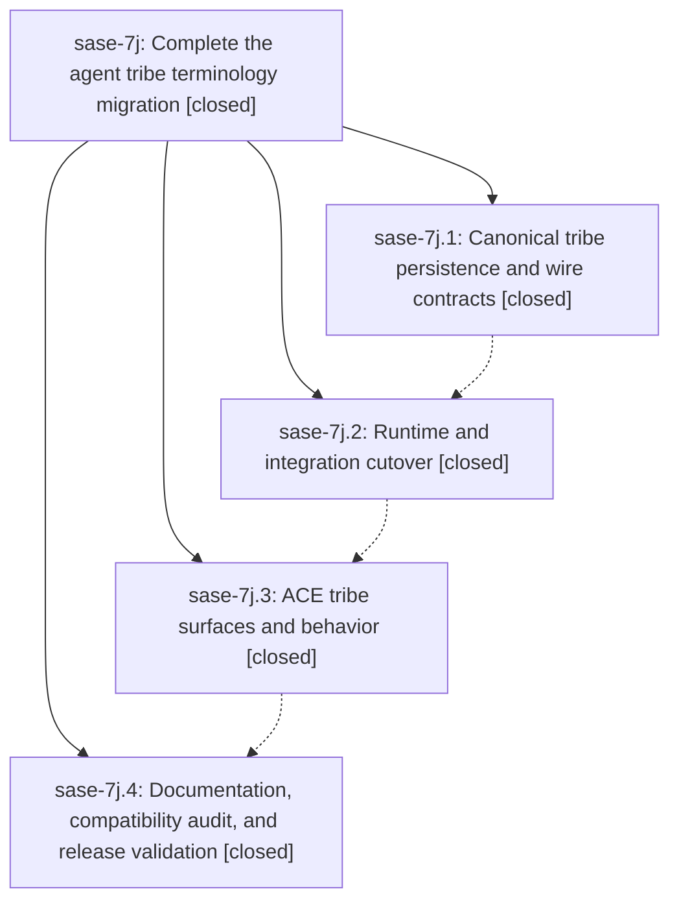

# Bead: sase-7j — Complete the agent tribe terminology migration

[Bead Pages](../README.md) / sase-7j

**Status:** ✓ closed · **Resolution:** (unrecorded) · **Type:** plan · **Tier:** epic
**Owner:** `bryanbugyi34@gmail.com`
**Created:** 2026-07-19 17:59:13 UTC · **Closed:** 2026-07-19 22:09:38 UTC
**Plan:** [202607/agent\_tribe\_terminology.md](https://github.com/sase-org/sase--plans/blob/main/202607/agent_tribe_terminology.md)

## Description

Agent tribes are named "tribe" throughout current source, APIs, persisted output, Rust/Python wire contracts, ACE, tests, and documentation, while existing tag-shaped tribe state remains safely readable at explicit legacy migration boundaries and unrelated tag concepts remain unchanged.

## Phases

| Bead | Title | Status | Size | Agents | Commits |
|---|---|---|---|---:|---:|
| [sase-7j.1](sase-7j.1.md) | Canonical tribe persistence and wire contracts | ✓ closed | small | 1 | 1 |
| [sase-7j.2](sase-7j.2.md) | Runtime and integration cutover | ✓ closed | small | 1 | 1 |
| [sase-7j.3](sase-7j.3.md) | ACE tribe surfaces and behavior | ✓ closed | small | 0 | 0 |
| [sase-7j.4](sase-7j.4.md) | Documentation, compatibility audit, and release validation | ✓ closed | small | 1 | 1 |

## Lineage

## Agents

| Agent | Bead | Commits |
|---|---|---:|
| [bbugyi200.athena.sase-7j.1](https://github.com/sase-org/sase--agents/blob/main/agents/bbugyi200.athena.sase-7j.1/README.md) | [sase-7j.1](sase-7j.1.md) | 1 |
| [bbugyi200.athena.sase-7j.2](https://github.com/sase-org/sase--agents/blob/main/agents/bbugyi200.athena.sase-7j.2/README.md) | [sase-7j.2](sase-7j.2.md) | 1 |
| [bbugyi200.athena.sase-7j.4](https://github.com/sase-org/sase--agents/blob/main/agents/bbugyi200.athena.sase-7j.4/README.md) | [sase-7j.4](sase-7j.4.md) | 1 |

## Commits

| Commit | Subject | Bead | Committed (UTC) |
|---|---|---|---|
| [`9e786c9`](https://github.com/sase-org/sase/commit/9e786c9a8280522c0be1fe012a9a7ee43801719a) | feat(agent-tribes)!: add canonical tribe persistence contracts (sase-7j.1) | [sase-7j.1](sase-7j.1.md) | 2026-07-19 18:41:24 |
| [`16309d5`](https://github.com/sase-org/sase/commit/16309d54c82de4644fec99e313dc8571276a3137) | feat(agents)!: cut runtime over to tribe terminology (sase-7j.2) | [sase-7j.2](sase-7j.2.md) | 2026-07-19 20:01:07 |
| [`0138849`](https://github.com/sase-org/sase/commit/0138849d919e0136b6eedadbcfb28e603f2b58bb) | feat(agents)!: complete tribe terminology cutover (sase-7j.4) | [sase-7j.4](sase-7j.4.md) | 2026-07-19 21:38:55 |
