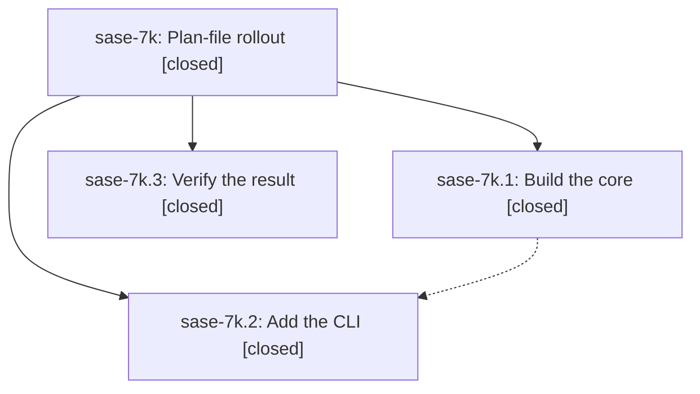

# Bead: sase-7k — Plan-file rollout

[Bead Pages](../README.md) / sase-7k

**Status:** ✓ closed · **Resolution:** (unrecorded) · **Type:** plan · **Tier:** epic
**Owner:** `bryanbugyi34@gmail.com`
**Created:** 2026-07-19 18:42:56 UTC · **Closed:** 2026-07-22 10:23:59 UTC
**Plan:** [202607/rollout.md](https://github.com/sase-org/sase--plans/blob/main/202607/rollout.md)

## Description

Exercise the host-owned plan-file launch.

## Phases

| Bead | Title | Status | Size | Agents | Commits |
|---|---|---|---|---:|---:|
| [sase-7k.1](sase-7k.1.md) | Build the core | ✓ closed | small | 0 | 0 |
| [sase-7k.2](sase-7k.2.md) | Add the CLI | ✓ closed | small | 0 | 0 |
| [sase-7k.3](sase-7k.3.md) | Verify the result | ✓ closed | small | 0 | 0 |

## Lineage

