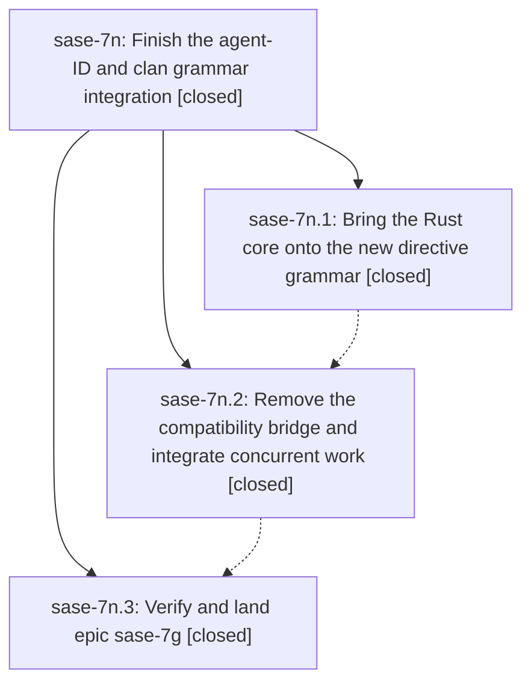

# Bead: sase-7n — Finish the agent-ID and clan grammar integration

[Bead Pages](../README.md) / sase-7n

**Status:** ✓ closed · **Resolution:** (unrecorded) · **Type:** plan · **Tier:** epic
**Owner:** `bryanbugyi34@gmail.com`
**Created:** 2026-07-19 19:04:52 UTC · **Closed:** 2026-07-19 20:24:07 UTC
**Plan:** [202607/finish\_id\_directive\_clan\_integration.md](https://github.com/sase-org/sase--plans/blob/main/202607/finish_id_directive_clan_integration.md)

## Description

The Rust core, Python launch layer, editor integrations, and post-epic changes all use the completed %id|%i and declare-once clan grammar without a legacy repeat-planner bridge, after which epic sase-7g is closed and its plan is finalized.

## Notes

COMMIT: 67c34fc

## Phases

| Bead | Title | Status | Size | Agents | Commits |
|---|---|---|---|---:|---:|
| [sase-7n.1](sase-7n.1.md) | Bring the Rust core onto the new directive grammar | ✓ closed | small | 0 | 0 |
| [sase-7n.2](sase-7n.2.md) | Remove the compatibility bridge and integrate concurrent work | ✓ closed | small | 1 | 1 |
| [sase-7n.3](sase-7n.3.md) | Verify and land epic sase-7g | ✓ closed | small | 0 | 0 |

## Lineage

## Agents

| Agent | Bead | Commits |
|---|---|---:|
| [bbugyi200.athena.sase-7n.2](https://github.com/sase-org/sase--agents/blob/main/agents/bbugyi200.athena.sase-7n.2/README.md) | [sase-7n.2](sase-7n.2.md) | 1 |
| [bbugyi200.athena.sase-7n.land](https://github.com/sase-org/sase--agents/blob/main/agents/bbugyi200.athena.sase-7n.land/README.md) | [sase-7n](README.md) | 1 |

## Commits

| Commit | Subject | Bead | Committed (UTC) |
|---|---|---|---|
| [`dc5b7ea`](https://github.com/sase-org/sase/commit/dc5b7ea8b5cba5b79503068918a81ea285c90539) | refactor: remove legacy repeat planner bridge (sase-7n.2) | [sase-7n.2](sase-7n.2.md) | 2026-07-19 19:34:45 |
| [`f452c6b`](https://github.com/sase-org/sase/commit/f452c6ba36870f87f8b74f9c218b3c6450c57e94) | test: isolate non-lock retry assertion (sase-7n) | [sase-7n](README.md) | 2026-07-19 20:27:59 |
