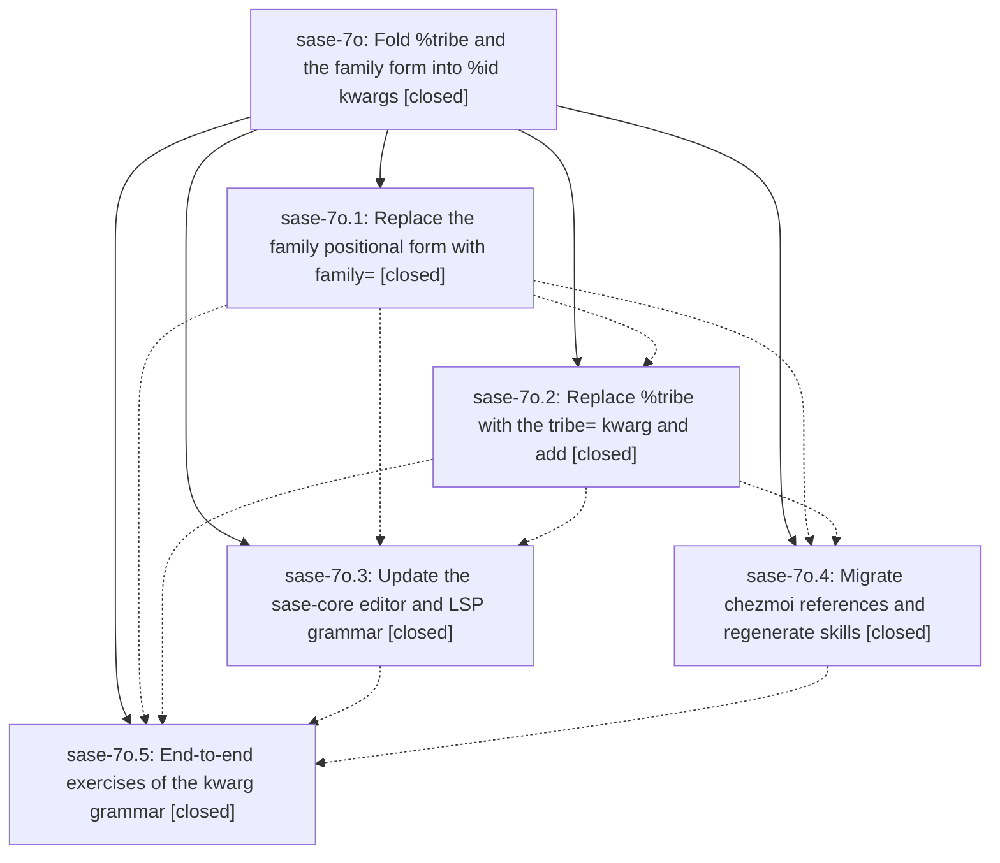

# Bead: sase-7o — Fold %tribe and the family form into %id kwargs

[Bead Pages](../README.md) / sase-7o

**Status:** ✓ closed · **Resolution:** (unrecorded) · **Type:** plan · **Tier:** epic
**Owner:** `bryanbugyi34@gmail.com`
**Created:** 2026-07-19 19:40:38 UTC · **Closed:** 2026-07-19 22:11:14 UTC
**Plan:** [202607/id\_kwargs\_tribe\_family.md](https://github.com/sase-org/sase--plans/blob/main/202607/id_kwargs_tribe_family.md)

## Description

The standalone %tribe|%t directive is removed and the two-positional %id family form is replaced by kwargs on %id: %id(bar, family=foo) creates family member foo--bar, %id(tribe=<t>) tribe-tags an auto-named agent (with a new built-in #tribe xprompt), clan=/family=/tribe= are mutually exclusive and all forbidden alongside %clan — with every emitter, TUI, Rust editor/LSP, docs, and cross-repo reference migrated so nothing breaks.

## Notes

COMMIT: 2e5445d

## Phases

| Bead | Title | Status | Size | Agents | Commits |
|---|---|---|---|---:|---:|
| [sase-7o.1](sase-7o.1.md) | Replace the family positional form with family= | ✓ closed | small | 1 | 1 |
| [sase-7o.2](sase-7o.2.md) | Replace %tribe with the tribe= kwarg and add | ✓ closed | small | 1 | 1 |
| [sase-7o.3](sase-7o.3.md) | Update the sase-core editor and LSP grammar | ✓ closed | small | 1 | 1 |
| [sase-7o.4](sase-7o.4.md) | Migrate chezmoi references and regenerate skills | ✓ closed | small | 0 | 0 |
| [sase-7o.5](sase-7o.5.md) | End-to-end exercises of the kwarg grammar | ✓ closed | small | 1 | 1 |

## Lineage

## Agents

| Agent | Bead | Commits |
|---|---|---:|
| [bbugyi200.athena.sase-7o.1](https://github.com/sase-org/sase--agents/blob/main/agents/bbugyi200.athena.sase-7o.1/README.md) | [sase-7o.1](sase-7o.1.md) | 1 |
| [bbugyi200.athena.sase-7o.2](https://github.com/sase-org/sase--agents/blob/main/agents/bbugyi200.athena.sase-7o.2/README.md) | [sase-7o.2](sase-7o.2.md) | 1 |
| [bbugyi200.athena.sase-7o.3](https://github.com/sase-org/sase--agents/blob/main/agents/bbugyi200.athena.sase-7o.3/README.md) | [sase-7o.3](sase-7o.3.md) | 1 |
| [bbugyi200.athena.sase-7o.5](https://github.com/sase-org/sase--agents/blob/main/agents/bbugyi200.athena.sase-7o.5/README.md) | [sase-7o.5](sase-7o.5.md) | 1 |
| [bbugyi200.athena.sase-7o.land](https://github.com/sase-org/sase--agents/blob/main/agents/bbugyi200.athena.sase-7o.land/README.md) | [sase-7o](README.md) | 1 |

## Commits

| Commit | Subject | Bead | Committed (UTC) |
|---|---|---|---|
| [`c8f80b2`](https://github.com/sase-org/sase/commit/c8f80b24a1869bc425810e431a5c0801c69ebb8b) | feat!: require family keyword for name directives (sase-7o.1) | [sase-7o.1](sase-7o.1.md) | 2026-07-19 20:49:07 |
| [`3f41c7c`](https://github.com/sase-org/sase/commit/3f41c7c81a9ae5da291717e3f16994775b6a86ba) | feat!: fold tribe assignment into id kwargs (sase-7o.2) | [sase-7o.2](sase-7o.2.md) | 2026-07-19 21:31:42 |
| [`sase-core@889f2f8`](https://github.com/sase-org/sase-core/commit/889f2f83678437aeadc691bc0cb386472fd176b3) | feat(editor)!: move family and tribe grammar onto %id (sase-7o.3) | [sase-7o.3](sase-7o.3.md) | 2026-07-19 21:48:05 |
| [`05cacb0`](https://github.com/sase-org/sase/commit/05cacb0ade7d094c3f7549998b5f1f1327d8e2f8) | fix: preserve concrete family names on retry (sase-7o.5) | [sase-7o.5](sase-7o.5.md) | 2026-07-19 22:06:40 |
| [`sase--plans@2e5445d`](https://github.com/sase-org/sase--plans/commit/2e5445deb47b82c681efe2fc9e1e8ec90330875a) | chore(plans): mark id\_kwargs\_tribe\_family plan done (sase-7o) | [sase-7o](README.md) | 2026-07-19 22:15:36 |
