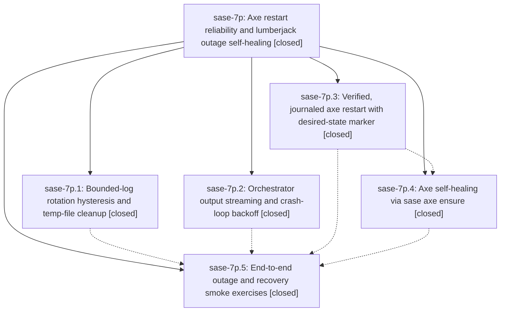

# Bead: sase-7p — Axe restart reliability and lumberjack outage self-healing

[Bead Pages](../README.md) / sase-7p

**Status:** ✓ closed · **Resolution:** (unrecorded) · **Type:** plan · **Tier:** epic
**Owner:** `bryanbugyi34@gmail.com`
**Created:** 2026-07-19 21:23:09 UTC · **Closed:** 2026-07-19 22:48:19 UTC
**Plan:** [202607/axe\_restart\_reliability.md](https://github.com/sase-org/sase--plans/blob/main/202607/axe_restart_reliability.md)

## Description

Axe outages after `sase update` restarts no longer happen silently: restarts are retried and verified, a watchdog heals a downed axe, log rotation stops thrashing the disk, and every failure is surfaced through the notification inbox instead of vanishing.

## Notes

COMMIT: 534d0a1

## Phases

| Bead | Title | Status | Size | Agents | Commits |
|---|---|---|---|---:|---:|
| [sase-7p.1](sase-7p.1.md) | Bounded-log rotation hysteresis and temp-file cleanup | ✓ closed | small | 1 | 2 |
| [sase-7p.2](sase-7p.2.md) | Orchestrator output streaming and crash-loop backoff | ✓ closed | small | 1 | 2 |
| [sase-7p.3](sase-7p.3.md) | Verified, journaled axe restart with desired-state marker | ✓ closed | small | 1 | 1 |
| [sase-7p.4](sase-7p.4.md) | Axe self-healing via sase axe ensure | ✓ closed | small | 1 | 1 |
| [sase-7p.5](sase-7p.5.md) | End-to-end outage and recovery smoke exercises | ✓ closed | small | 1 | 1 |

## Lineage

## Agents

| Agent | Bead | Commits |
|---|---|---:|
| [bbugyi200.athena.sase-7p.1](https://github.com/sase-org/sase--agents/blob/main/agents/bbugyi200.athena.sase-7p.1/README.md) | [sase-7p.1](sase-7p.1.md) | 2 |
| [bbugyi200.athena.sase-7p.2](https://github.com/sase-org/sase--agents/blob/main/agents/bbugyi200.athena.sase-7p.2/README.md) | [sase-7p.2](sase-7p.2.md) | 2 |
| [bbugyi200.athena.sase-7p.3](https://github.com/sase-org/sase--agents/blob/main/agents/bbugyi200.athena.sase-7p.3/README.md) | [sase-7p.3](sase-7p.3.md) | 1 |
| [bbugyi200.athena.sase-7p.4](https://github.com/sase-org/sase--agents/blob/main/agents/bbugyi200.athena.sase-7p.4/README.md) | [sase-7p.4](sase-7p.4.md) | 1 |
| [bbugyi200.athena.sase-7p.5](https://github.com/sase-org/sase--agents/blob/main/agents/bbugyi200.athena.sase-7p.5/README.md) | [sase-7p.5](sase-7p.5.md) | 1 |
| [bbugyi200.athena.sase-7p.land](https://github.com/sase-org/sase--agents/blob/main/agents/bbugyi200.athena.sase-7p.land/README.md) | [sase-7p](README.md) | 3 |

## Commits

| Commit | Subject | Bead | Committed (UTC) |
|---|---|---|---|
| [`10eeaf7`](https://github.com/sase-org/sase/commit/10eeaf72302a97eca47272754c1cfdd91c935b20) | fix(axe): verify and journal daemon restarts (sase-7p.3) | [sase-7p.3](sase-7p.3.md) | 2026-07-19 21:48:27 |
| [`sase-core@997c577`](https://github.com/sase-org/sase-core/commit/997c577a5d0204aa9b1be4ecb44463714d574dc0) | feat(axe): validate log rotation temp age (sase-7p.1) | [sase-7p.1](sase-7p.1.md) | 2026-07-19 21:48:59 |
| [`a30e9e3`](https://github.com/sase-org/sase/commit/a30e9e342feead3f54148530bfd1b603054e9875) | feat(axe): add bounded log rotation headroom (sase-7p.1) | [sase-7p.1](sase-7p.1.md) | 2026-07-19 21:50:04 |
| [`sase-core@ce6d8bd`](https://github.com/sase-org/sase-core/commit/ce6d8bd1818393687bb35bc27ea45d74ce942973) | fix(axe): validate restart backoff configuration (sase-7p.2) | [sase-7p.2](sase-7p.2.md) | 2026-07-19 21:50:23 |
| [`cd1fe6e`](https://github.com/sase-org/sase/commit/cd1fe6e842665e747b9c3c775b0b3bf13bf026c2) | fix(axe): harden lumberjack crash recovery (sase-7p.2) | [sase-7p.2](sase-7p.2.md) | 2026-07-19 21:56:05 |
| [`3197b91`](https://github.com/sase-org/sase/commit/3197b9148ad0800e6700b33f3b92fde4ac401471) | feat(axe): add self-healing ensure command (sase-7p.4) | [sase-7p.4](sase-7p.4.md) | 2026-07-19 22:31:19 |
| [`2e89322`](https://github.com/sase-org/sase/commit/2e89322953163f8e79ec14950e557b4dbf94ad2e) | test(axe): add end-to-end outage and recovery smoke tests (sase-7p.5) | [sase-7p.5](sase-7p.5.md) | 2026-07-19 22:42:19 |
| [`9ba591e`](https://github.com/sase-org/sase/commit/9ba591e6f6fa58cbb3a368cd97a0a568dea756f0) | refactor(axe): privatize desired\_state\_path after sase-7p close (sase-7p) | [sase-7p](README.md) | 2026-07-19 23:02:43 |
| [`88ba178`](https://github.com/sase-org/sase/commit/88ba178869162b6eb393e8c63b845db1315e9a1d) | test: make plugin preflight assertions wrap-tolerant (sase-7p) | [sase-7p](README.md) | 2026-07-19 23:03:04 |
| [`sase--plans@7588148`](https://github.com/sase-org/sase--plans/commit/75881481f1ebd403fb110533d83053b9a2345372) | chore(plans): mark axe restart reliability plan done (sase-7p) | [sase-7p](README.md) | 2026-07-19 23:03:24 |
