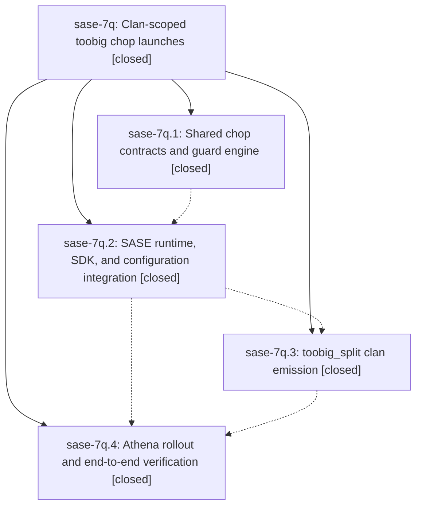

# Bead: sase-7q — Clan-scoped toobig chop launches

[Bead Pages](../README.md) / sase-7q

**Status:** ✓ closed · **Resolution:** (unrecorded) · **Type:** plan · **Tier:** epic
**Owner:** `bryanbugyi34@gmail.com`
**Created:** 2026-07-19 22:34:59 UTC · **Closed:** 2026-07-20 00:30:52 UTC
**Plan:** [202607/toobig\_chop\_clans.md](https://github.com/sase-org/sase--plans/blob/main/202607/toobig_chop_clans.md)

## Description

Every toobig_split run launches its accepted split-file agents as one toobig-@ clan, and Axe prevents another run while an active clan whose name starts with toobig- exists.

## Notes

COMMIT: 978d631

## Phases

| Bead | Title | Status | Size | Agents | Commits |
|---|---|---|---|---:|---:|
| [sase-7q.1](sase-7q.1.md) | Shared chop contracts and guard engine | ✓ closed | small | 0 | 0 |
| [sase-7q.2](sase-7q.2.md) | SASE runtime, SDK, and configuration integration | ✓ closed | small | 1 | 1 |
| [sase-7q.3](sase-7q.3.md) | toobig\_split clan emission | ✓ closed | small | 0 | 0 |
| [sase-7q.4](sase-7q.4.md) | Athena rollout and end-to-end verification | ✓ closed | small | 1 | 1 |

## Lineage

## Agents

| Agent | Bead | Commits |
|---|---|---:|
| [bbugyi200.athena.sase-7q.2](https://github.com/sase-org/sase--agents/blob/main/agents/bbugyi200.athena.sase-7q.2/README.md) | [sase-7q.2](sase-7q.2.md) | 1 |
| [bbugyi200.athena.sase-7q.4](https://github.com/sase-org/sase--agents/blob/main/agents/bbugyi200.athena.sase-7q.4/README.md) | [sase-7q.4](sase-7q.4.md) | 1 |

## Commits

| Commit | Subject | Bead | Committed (UTC) |
|---|---|---|---|
| [`24ff23f`](https://github.com/sase-org/sase/commit/24ff23f6bd1d20a0f3fd25d9482544ac96843294) | feat(axe): add clan-scoped chop launches (sase-7q.2) | [sase-7q.2](sase-7q.2.md) | 2026-07-19 23:15:38 |
| [`5360b08`](https://github.com/sase-org/sase/commit/5360b083ea1034067c2043d135ba8abedd571d1a) | fix(axe): honor clan guards before action dedupe (sase-7q.4) | [sase-7q.4](sase-7q.4.md) | 2026-07-20 00:06:32 |
