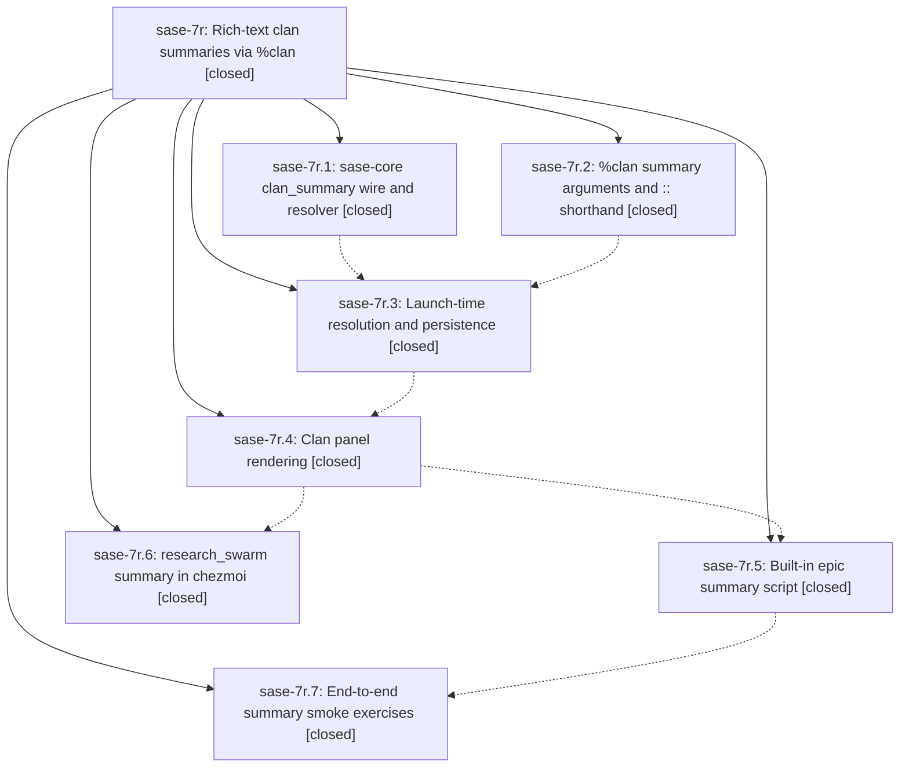

# Bead: sase-7r — Rich-text clan summaries via %clan

[Bead Pages](../README.md) / sase-7r

**Status:** ✓ closed · **Resolution:** (unrecorded) · **Type:** plan · **Tier:** epic
**Owner:** `bryanbugyi34@gmail.com`
**Created:** 2026-07-19 23:10:17 UTC · **Closed:** 2026-07-20 01:38:20 UTC
**Plan:** [202607/clan\_rich\_summary.md](https://github.com/sase-org/sase--plans/blob/main/202607/clan_rich_summary.md)

## Description

Agent clans can be initialized with a Rich-markup summary — supplied inline (with a new double-colon directive shorthand) or produced by an executable script — that is persisted with the clan and rendered beautifully in the clan's agent metadata panel; epic clans get a built-in summary script and the research_swarm xprompt shows its research prompt.

## Notes

COMMIT: 1ce408c

## Phases

| Bead | Title | Status | Size | Agents | Commits |
|---|---|---|---|---:|---:|
| [sase-7r.1](sase-7r.1.md) | sase-core clan\_summary wire and resolver | ✓ closed | small | 1 | 1 |
| [sase-7r.2](sase-7r.2.md) | %clan summary arguments and :: shorthand | ✓ closed | small | 1 | 1 |
| [sase-7r.3](sase-7r.3.md) | Launch-time resolution and persistence | ✓ closed | small | 1 | 1 |
| [sase-7r.4](sase-7r.4.md) | Clan panel rendering | ✓ closed | small | 1 | 1 |
| [sase-7r.5](sase-7r.5.md) | Built-in epic summary script | ✓ closed | small | 1 | 1 |
| [sase-7r.6](sase-7r.6.md) | research\_swarm summary in chezmoi | ✓ closed | small | 0 | 0 |
| [sase-7r.7](sase-7r.7.md) | End-to-end summary smoke exercises | ✓ closed | small | 1 | 1 |

## Lineage

## Agents

| Agent | Bead | Commits |
|---|---|---:|
| [bbugyi200.athena.sase-7r.1](https://github.com/sase-org/sase--agents/blob/main/agents/bbugyi200.athena.sase-7r.1/README.md) | [sase-7r.1](sase-7r.1.md) | 1 |
| [bbugyi200.athena.sase-7r.2](https://github.com/sase-org/sase--agents/blob/main/agents/bbugyi200.athena.sase-7r.2/README.md) | [sase-7r.2](sase-7r.2.md) | 1 |
| [bbugyi200.athena.sase-7r.3](https://github.com/sase-org/sase--agents/blob/main/agents/bbugyi200.athena.sase-7r.3/README.md) | [sase-7r.3](sase-7r.3.md) | 1 |
| [bbugyi200.athena.sase-7r.4](https://github.com/sase-org/sase--agents/blob/main/agents/bbugyi200.athena.sase-7r.4/README.md) | [sase-7r.4](sase-7r.4.md) | 1 |
| [bbugyi200.athena.sase-7r.5](https://github.com/sase-org/sase--agents/blob/main/agents/bbugyi200.athena.sase-7r.5/README.md) | [sase-7r.5](sase-7r.5.md) | 1 |
| [bbugyi200.athena.sase-7r.7](https://github.com/sase-org/sase--agents/blob/main/agents/bbugyi200.athena.sase-7r.7/README.md) | [sase-7r.7](sase-7r.7.md) | 1 |
| [bbugyi200.athena.sase-7r.land](https://github.com/sase-org/sase--agents/blob/main/agents/bbugyi200.athena.sase-7r.land/README.md) | [sase-7r](README.md) | 2 |
| [bbugyi200.athena.sase-7r.land--code](https://github.com/sase-org/sase--agents/blob/main/families/bbugyi200.athena.sase-7r.land.md#member-code) | [sase-7r](README.md) | 0 |

## Commits

| Commit | Subject | Bead | Committed (UTC) |
|---|---|---|---|
| [`sase-core@3fcc46b`](https://github.com/sase-org/sase-core/commit/3fcc46b6cd6aebd9a6f4691e405b49add77bbd9b) | feat(agent-clans): resolve clan summaries (sase-7r.1) | [sase-7r.1](sase-7r.1.md) | 2026-07-19 23:24:17 |
| [`e37315a`](https://github.com/sase-org/sase/commit/e37315ac81ae14809117fd940b44e9fe7907ee02) | feat(xprompt): support clan summary directives (sase-7r.2) | [sase-7r.2](sase-7r.2.md) | 2026-07-19 23:30:51 |
| [`734f67a`](https://github.com/sase-org/sase/commit/734f67a25203b15816aa69cb5572f3c481ccaa9b) | feat: persist launch-time clan summaries (sase-7r.3) | [sase-7r.3](sase-7r.3.md) | 2026-07-19 23:51:20 |
| [`c283d63`](https://github.com/sase-org/sase/commit/c283d638ec63ca06c36856bcd908a3db3845c617) | feat(tui): render rich clan summaries (sase-7r.4) | [sase-7r.4](sase-7r.4.md) | 2026-07-20 00:34:47 |
| [`8cfb17b`](https://github.com/sase-org/sase/commit/8cfb17b22b43ba1a3d11d4d6e5deb43a9df67a41) | feat(bead): add epic clan summary script (sase-7r.5) | [sase-7r.5](sase-7r.5.md) | 2026-07-20 00:58:01 |
| [`926d19b`](https://github.com/sase-org/sase/commit/926d19b9b0c0707b5dde5bc77892434c7ce5be3b) | test: add end-to-end smoke tests for clan summaries (sase-7r.7) | [sase-7r.7](sase-7r.7.md) | 2026-07-20 01:11:13 |
| [`974c014`](https://github.com/sase-org/sase/commit/974c0149526d16b233fb72679f07041a3a8a609e) | fix(xprompt): preserve clan summaries during directive edits (sase-7r) | [sase-7r](README.md) | 2026-07-20 01:41:33 |
| [`sase--plans@1ce408c`](https://github.com/sase-org/sase--plans/commit/1ce408ccf6cc12f4612e338c45db61ade089849c) | docs(plans): mark clan summary work complete (sase-7r) | [sase-7r](README.md) | 2026-07-20 01:41:58 |
