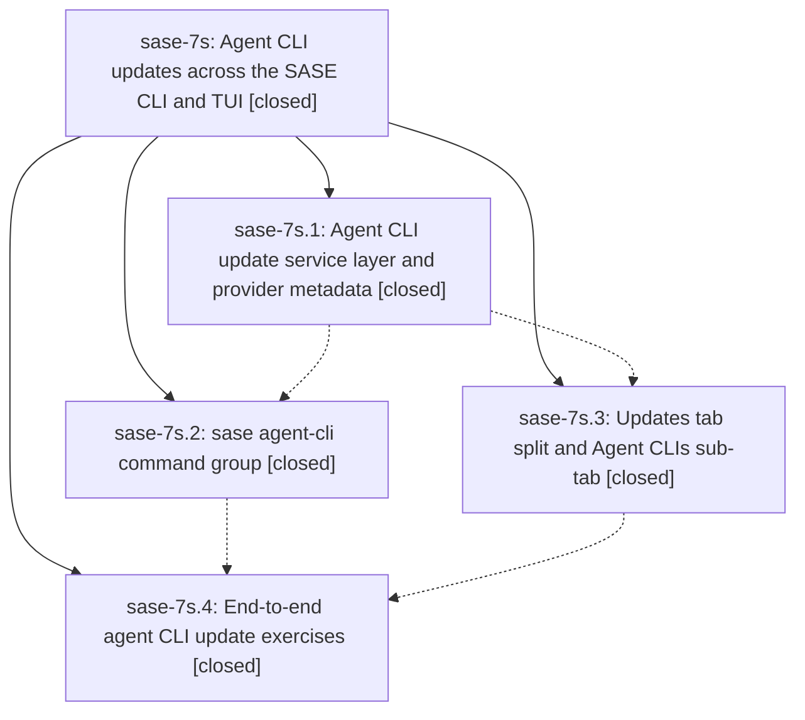

# Bead: sase-7s — Agent CLI updates across the SASE CLI and TUI

[Bead Pages](../README.md) / sase-7s

**Status:** ✓ closed · **Resolution:** (unrecorded) · **Type:** plan · **Tier:** epic
**Owner:** `bryanbugyi34@gmail.com`
**Created:** 2026-07-19 23:42:44 UTC · **Closed:** 2026-07-20 02:36:25 UTC
**Plan:** [202607/agent\_cli\_updates.md](https://github.com/sase-org/sase--plans/blob/main/202607/agent_cli_updates.md)

## Description

SASE can check and update every installed supported agent CLI (Claude Code, Codex, OpenCode, Qwen Code, Antigravity) through one shared, provider-metadata-driven service layer, exposed as a new `sase agent-cli` command group and as a redesigned Admin Center Updates tab split into Core / Plugins / Agent CLIs sub-tabs with a new `A` keymap.

## Notes

COMMIT: d3020da

## Phases

| Bead | Title | Status | Size | Agents | Commits |
|---|---|---|---|---:|---:|
| [sase-7s.1](sase-7s.1.md) | Agent CLI update service layer and provider metadata | ✓ closed | small | 1 | 1 |
| [sase-7s.2](sase-7s.2.md) | sase agent-cli command group | ✓ closed | small | 1 | 1 |
| [sase-7s.3](sase-7s.3.md) | Updates tab split and Agent CLIs sub-tab | ✓ closed | small | 1 | 1 |
| [sase-7s.4](sase-7s.4.md) | End-to-end agent CLI update exercises | ✓ closed | small | 0 | 0 |

## Lineage

## Agents

| Agent | Bead | Commits |
|---|---|---:|
| [bbugyi200.athena.sase-7s.1](https://github.com/sase-org/sase--agents/blob/main/agents/bbugyi200.athena.sase-7s.1/README.md) | [sase-7s.1](sase-7s.1.md) | 1 |
| [bbugyi200.athena.sase-7s.2](https://github.com/sase-org/sase--agents/blob/main/agents/bbugyi200.athena.sase-7s.2/README.md) | [sase-7s.2](sase-7s.2.md) | 1 |
| [bbugyi200.athena.sase-7s.3](https://github.com/sase-org/sase--agents/blob/main/agents/bbugyi200.athena.sase-7s.3/README.md) | [sase-7s.3](sase-7s.3.md) | 1 |

## Commits

| Commit | Subject | Bead | Committed (UTC) |
|---|---|---|---|
| [`fec5fa6`](https://github.com/sase-org/sase/commit/fec5fa69e2d054ab787e21e4dc52940de319ae04) | feat: add agent CLI update service layer (sase-7s.1) | [sase-7s.1](sase-7s.1.md) | 2026-07-20 00:54:27 |
| [`a3ae3df`](https://github.com/sase-org/sase/commit/a3ae3dfdcdc8c884abf79385c9037198c31301bf) | feat(cli): add agent CLI management commands (sase-7s.2) | [sase-7s.2](sase-7s.2.md) | 2026-07-20 01:18:18 |
| [`1afba63`](https://github.com/sase-org/sase/commit/1afba633d9bfe27bdfbb3fe7598b2d577d51b16f) | feat(tui): add agent CLI update browser (sase-7s.3) | [sase-7s.3](sase-7s.3.md) | 2026-07-20 01:51:22 |
