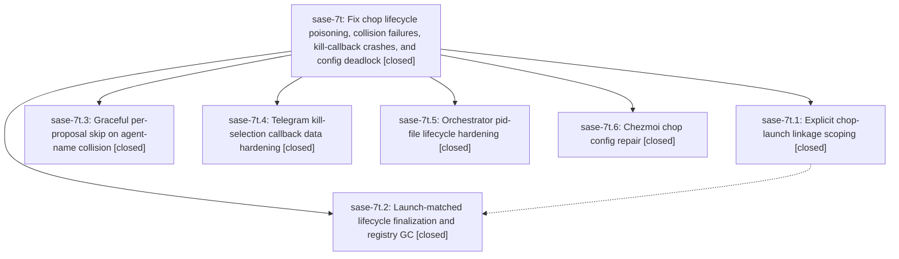

# Bead: sase-7t — Fix chop lifecycle poisoning, collision failures, kill-callback crashes, and config deadlock

[Bead Pages](../README.md) / sase-7t

**Status:** ✓ closed · **Resolution:** (unrecorded) · **Type:** plan · **Tier:** epic
**Owner:** `bryanbugyi34@gmail.com`
**Created:** 2026-07-19 23:47:00 UTC · **Closed:** 2026-07-20 01:07:26 UTC
**Plan:** [202607/chop\_lifecycle\_fixes\_v2.md](https://github.com/sase-org/sase--plans/blob/main/202607/chop_lifecycle_fixes_v2.md)

## Description

Chop runs finalize from the agents the runner actually launched (no more ambient-env registry pollution falsely failing runs and re-firing triggers hourly), explicitly-named proposals skip gracefully instead of failing the run when their agent name is taken, the Telegram /kill command survives long clan agent names instead of crashing every tg_inbound cycle, the orchestrator pid file survives concurrent restart actors, and the dead fix_just chop is revived by fixing its chezmoi once_per config.

## Notes

COMMIT: 64a6220

## Phases

| Bead | Title | Status | Size | Agents | Commits |
|---|---|---|---|---:|---:|
| [sase-7t.1](sase-7t.1.md) | Explicit chop-launch linkage scoping | ✓ closed | small | 1 | 1 |
| [sase-7t.2](sase-7t.2.md) | Launch-matched lifecycle finalization and registry GC | ✓ closed | small | 1 | 1 |
| [sase-7t.3](sase-7t.3.md) | Graceful per-proposal skip on agent-name collision | ✓ closed | small | 1 | 1 |
| [sase-7t.4](sase-7t.4.md) | Telegram kill-selection callback data hardening | ✓ closed | small | 0 | 0 |
| [sase-7t.5](sase-7t.5.md) | Orchestrator pid-file lifecycle hardening | ✓ closed | small | 1 | 1 |
| [sase-7t.6](sase-7t.6.md) | Chezmoi chop config repair | ✓ closed | small | 0 | 0 |

## Lineage

## Agents

| Agent | Bead | Commits |
|---|---|---:|
| [bbugyi200.athena.sase-7t.1](https://github.com/sase-org/sase--agents/blob/main/agents/bbugyi200.athena.sase-7t.1/README.md) | [sase-7t.1](sase-7t.1.md) | 1 |
| [bbugyi200.athena.sase-7t.2](https://github.com/sase-org/sase--agents/blob/main/agents/bbugyi200.athena.sase-7t.2/README.md) | [sase-7t.2](sase-7t.2.md) | 1 |
| [bbugyi200.athena.sase-7t.3](https://github.com/sase-org/sase--agents/blob/main/agents/bbugyi200.athena.sase-7t.3/README.md) | [sase-7t.3](sase-7t.3.md) | 1 |
| [bbugyi200.athena.sase-7t.5](https://github.com/sase-org/sase--agents/blob/main/agents/bbugyi200.athena.sase-7t.5/README.md) | [sase-7t.5](sase-7t.5.md) | 1 |
| [bbugyi200.athena.sase-7t.land](https://github.com/sase-org/sase--agents/blob/main/agents/bbugyi200.athena.sase-7t.land/README.md) | [sase-7t](README.md) | 1 |

## Commits

| Commit | Subject | Bead | Committed (UTC) |
|---|---|---|---|
| [`60cec72`](https://github.com/sase-org/sase/commit/60cec728105099a7328a87d51c4211807ce9b5d3) | fix(axe): harden orchestrator PID lifecycle (sase-7t.5) | [sase-7t.5](sase-7t.5.md) | 2026-07-19 23:59:56 |
| [`e39816a`](https://github.com/sase-org/sase/commit/e39816a1f2736c1cd54c9759cd2cca7796b52051) | fix(axe): skip explicit chop name collisions (sase-7t.3) | [sase-7t.3](sase-7t.3.md) | 2026-07-20 00:31:52 |
| [`1790e44`](https://github.com/sase-org/sase/commit/1790e441c2d37b2e61cdd919ca4c5106116af0e6) | fix: scope chop linkage to explicit launches (sase-7t.1) | [sase-7t.1](sase-7t.1.md) | 2026-07-20 00:35:08 |
| [`d55ecbb`](https://github.com/sase-org/sase/commit/d55ecbbd276ee3810a1ad4e46dd550b2eae7a243) | fix(axe): match chop results to launched agents (sase-7t.2) | [sase-7t.2](sase-7t.2.md) | 2026-07-20 00:54:48 |
| [`b8b0a92`](https://github.com/sase-org/sase/commit/b8b0a924807f2881b950fda561a99434d39d80e2) | docs(axe): document chop launch linkage and finalization semantics (sase-7t) | [sase-7t](README.md) | 2026-07-20 01:10:20 |
