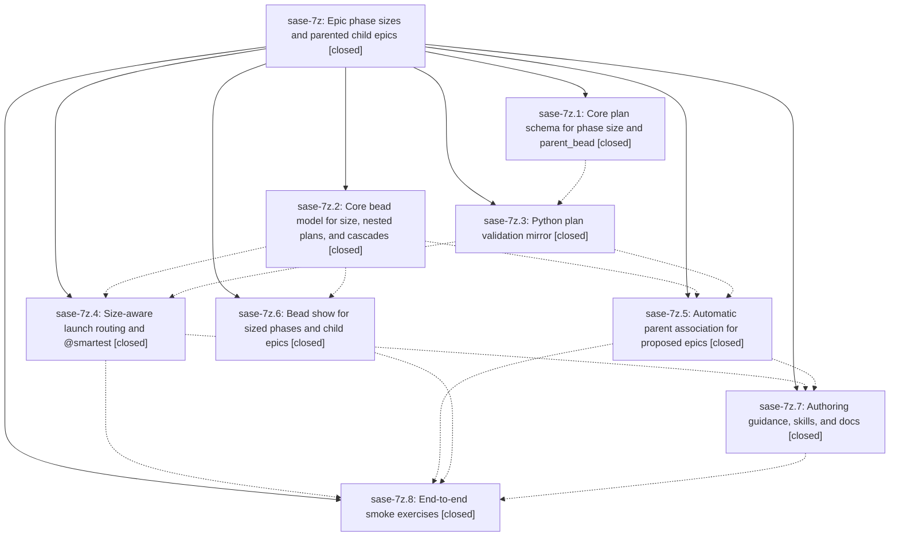

# Bead: sase-7z — Epic phase sizes and parented child epics

[Bead Pages](../README.md) / sase-7z

**Status:** ✓ closed · **Resolution:** (unrecorded) · **Type:** plan · **Tier:** epic
**Owner:** `bryanbugyi34@gmail.com`
**Created:** 2026-07-20 01:09:05 UTC · **Closed:** 2026-07-20 14:36:11 UTC
**Plan:** [202607/epic\_phase\_sizes\_and\_child\_epics.md](https://github.com/sase-org/sase--plans/blob/main/202607/epic_phase_sizes_and_child_epics.md)

## Description

Epic plans must declare a per-phase size (small/medium/large) that sase plan validate enforces; medium and large phases launch with a plan-first prompt (#plan appended), large phases route to a new @smartest model alias, and epics proposed by phase or land agents automatically become child epic beads of the bead they are responsible for (foo-5.2 begets foo-5.2.1, the lander of foo-5 begets foo-5.4) with first-class sase bead show support for the resulting hierarchy.

## Notes

COMMIT: 05c7ec65

## Phases

| Bead | Title | Status | Size | Agents | Commits |
|---|---|---|---|---:|---:|
| [sase-7z.1](sase-7z.1.md) | Core plan schema for phase size and parent\_bead | ✓ closed | small | 1 | 1 |
| [sase-7z.2](sase-7z.2.md) | Core bead model for size, nested plans, and cascades | ✓ closed | small | 1 | 1 |
| [sase-7z.3](sase-7z.3.md) | Python plan validation mirror | ✓ closed | small | 1 | 1 |
| [sase-7z.4](sase-7z.4.md) | Size-aware launch routing and @smartest | ✓ closed | small | 1 | 1 |
| [sase-7z.5](sase-7z.5.md) | Automatic parent association for proposed epics | ✓ closed | small | 1 | 1 |
| [sase-7z.6](sase-7z.6.md) | Bead show for sized phases and child epics | ✓ closed | small | 1 | 1 |
| [sase-7z.7](sase-7z.7.md) | Authoring guidance, skills, and docs | ✓ closed | small | 1 | 1 |
| [sase-7z.8](sase-7z.8.md) | End-to-end smoke exercises | ✓ closed | small | 1 | 1 |

## Lineage

## Agents

| Agent | Bead | Commits |
|---|---|---:|
| [bbugyi200.athena.sase-7z.1](https://github.com/sase-org/sase--agents/blob/main/agents/bbugyi200.athena.sase-7z.1/README.md) | [sase-7z.1](sase-7z.1.md) | 1 |
| [bbugyi200.athena.sase-7z.2](https://github.com/sase-org/sase--agents/blob/main/agents/bbugyi200.athena.sase-7z.2/README.md) | [sase-7z.2](sase-7z.2.md) | 1 |
| [bbugyi200.athena.sase-7z.3](https://github.com/sase-org/sase--agents/blob/main/agents/bbugyi200.athena.sase-7z.3/README.md) | [sase-7z.3](sase-7z.3.md) | 1 |
| [bbugyi200.athena.sase-7z.4](https://github.com/sase-org/sase--agents/blob/main/agents/bbugyi200.athena.sase-7z.4/README.md) | [sase-7z.4](sase-7z.4.md) | 1 |
| [bbugyi200.athena.sase-7z.5](https://github.com/sase-org/sase--agents/blob/main/agents/bbugyi200.athena.sase-7z.5/README.md) | [sase-7z.5](sase-7z.5.md) | 1 |
| [bbugyi200.athena.sase-7z.6](https://github.com/sase-org/sase--agents/blob/main/agents/bbugyi200.athena.sase-7z.6/README.md) | [sase-7z.6](sase-7z.6.md) | 1 |
| [bbugyi200.athena.sase-7z.7](https://github.com/sase-org/sase--agents/blob/main/agents/bbugyi200.athena.sase-7z.7/README.md) | [sase-7z.7](sase-7z.7.md) | 1 |
| [bbugyi200.athena.sase-7z.8](https://github.com/sase-org/sase--agents/blob/main/agents/bbugyi200.athena.sase-7z.8/README.md) | [sase-7z.8](sase-7z.8.md) | 1 |
| [bbugyi200.athena.sase-7z.land](https://github.com/sase-org/sase--agents/blob/main/agents/bbugyi200.athena.sase-7z.land/README.md) | [sase-7z](README.md) | 2 |
| [bbugyi200.athena.sase-7z.land--code](https://github.com/sase-org/sase--agents/blob/main/families/bbugyi200.athena.sase-7z.land.md#member-code) | [sase-7z](README.md) | 0 |

## Commits

| Commit | Subject | Bead | Committed (UTC) |
|---|---|---|---|
| [`sase-core@9150852`](https://github.com/sase-org/sase-core/commit/915085264240c7b8fc17e163769ac4146e827e02) | feat(plan): validate phase sizing and parent beads (sase-7z.1) | [sase-7z.1](sase-7z.1.md) | 2026-07-20 01:23:08 |
| [`sase-core@8704900`](https://github.com/sase-org/sase-core/commit/87049002493f0daea8d585c265f193084d150385) | feat(bead): support phase sizing and nested cascades (sase-7z.2) | [sase-7z.2](sase-7z.2.md) | 2026-07-20 01:36:09 |
| [`65bcc93`](https://github.com/sase-org/sase/commit/65bcc9391b500bc0aa77e8e66dc24a2f80b4d77e) | feat(sdd): mirror phase size validation metadata (sase-7z.3) | [sase-7z.3](sase-7z.3.md) | 2026-07-20 01:51:36 |
| [`6f9213b`](https://github.com/sase-org/sase/commit/6f9213b5b0a866398151b4830f3c74c015494daf) | feat(beads): show phase sizes and nested lineage (sase-7z.6) | [sase-7z.6](sase-7z.6.md) | 2026-07-20 02:08:37 |
| [`814026c`](https://github.com/sase-org/sase/commit/814026c20b015a0d63ff1e3cd0d39bc075e52e85) | feat(bead): associate proposed epics with parent beads (sase-7z.5) | [sase-7z.5](sase-7z.5.md) | 2026-07-20 12:24:56 |
| [`12da108`](https://github.com/sase-org/sase/commit/12da1082b580551396f1d28f5b1d822404ea78d2) | feat(bead): route phase work by size (sase-7z.4) | [sase-7z.4](sase-7z.4.md) | 2026-07-20 12:27:42 |
| [`11f6529`](https://github.com/sase-org/sase/commit/11f65293214ca741794d15a9cdb9a3899d871324) | docs: document phase sizing and child epics (sase-7z.7) | [sase-7z.7](sase-7z.7.md) | 2026-07-20 14:14:01 |
| [`sase--plans@7588b77`](https://github.com/sase-org/sase--plans/commit/7588b77b9068c3cfc85c0514a50d3221c9f8a18f) | test: smoke test artifacts for phase sizing and child epics (sase-7z.8) | [sase-7z.8](sase-7z.8.md) | 2026-07-20 14:20:04 |
| [`6cc67b9`](https://github.com/sase-org/sase/commit/6cc67b90fcc881469f7cf00f926a8a45a1c29084) | fix(beads): show child epics owned by phases (sase-7z) | [sase-7z](README.md) | 2026-07-20 14:39:27 |
| [`sase--plans@05c7ec6`](https://github.com/sase-org/sase--plans/commit/05c7ec651d6f16ad60e9e949f6cb882bc2c29718) | docs(plans): mark phase sizing epic done (sase-7z) | [sase-7z](README.md) | 2026-07-20 14:39:52 |
