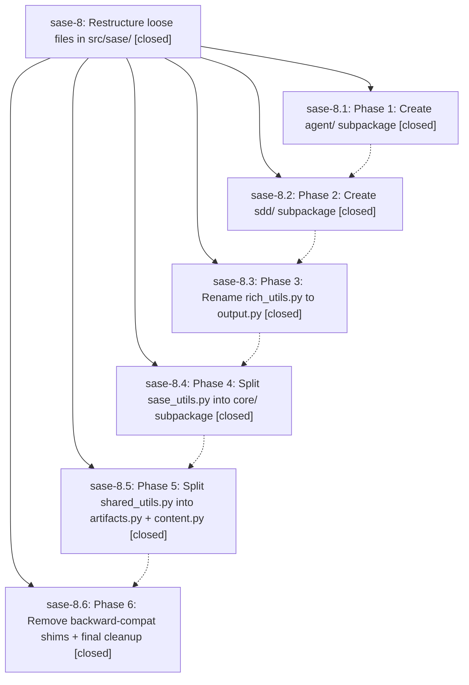

# Bead: sase-8 — Restructure loose files in src/sase/

[Bead Pages](../README.md) / sase-8

**Status:** ✓ closed · **Resolution:** (unrecorded) · **Type:** plan · **Tier:** epic
**Owner:** `bryanbugyi34@gmail.com`
**Created:** 2026-03-23 02:51:08 UTC · **Closed:** 2026-03-23 03:58:30 UTC
**Plan:** [202603/restructure\_loose\_files.md](https://github.com/sase-org/sase--plans/blob/main/202603/restructure_loose_files.md)

## Phases

| Bead | Title | Status | Size | Agents | Commits |
|---|---|---|---|---:|---:|
| [sase-8.1](sase-8.1.md) | Phase 1: Create agent/ subpackage | ✓ closed | small | 0 | 1 |
| [sase-8.2](sase-8.2.md) | Phase 2: Create sdd/ subpackage | ✓ closed | small | 0 | 1 |
| [sase-8.3](sase-8.3.md) | Phase 3: Rename rich\_utils.py to output.py | ✓ closed | small | 0 | 1 |
| [sase-8.4](sase-8.4.md) | Phase 4: Split sase\_utils.py into core/ subpackage | ✓ closed | small | 0 | 1 |
| [sase-8.5](sase-8.5.md) | Phase 5: Split shared\_utils.py into artifacts.py + content.py | ✓ closed | small | 0 | 1 |
| [sase-8.6](sase-8.6.md) | Phase 6: Remove backward-compat shims + final cleanup | ✓ closed | small | 0 | 1 |

## Lineage

## Commits

| Commit | Subject | Bead | Committed (UTC) |
|---|---|---|---|
| [`13eb171`](https://github.com/sase-org/sase/commit/13eb1714ef11cc0e49b4202d13d79e2dd79426cb) | ref: Move 4 agent lifecycle files into src/sase/agent/ subpackage (sase-8.1) | [sase-8.1](sase-8.1.md) | 2026-03-23 03:05:39 |
| [`f3b1d6b`](https://github.com/sase-org/sase/commit/f3b1d6bb73760aa0daa60c8ac985ea4f9107898c) | ref: Split sdd.py into sdd/ subpackage with files.py and beads.py (sase-8.2) | [sase-8.2](sase-8.2.md) | 2026-03-23 03:15:50 |
| [`8bb890a`](https://github.com/sase-org/sase/commit/8bb890a416f09c29fc9eaefbb1bbb64ebb6f6093) | ref: Rename rich\_utils.py to output.py for clarity (sase-8.3) | [sase-8.3](sase-8.3.md) | 2026-03-23 03:25:37 |
| [`58f1f64`](https://github.com/sase-org/sase/commit/58f1f640a55aa03e0086d4db4a0dc1be327dcf66) | ref: Split sase\_utils.py into core/ subpackage with time.py, paths.py, shell.py, and changespec.py (sase-8.4) | [sase-8.4](sase-8.4.md) | 2026-03-23 03:43:01 |
| [`3c2aebd`](https://github.com/sase-org/sase/commit/3c2aebdafaa96d42f293d00ab2e9811cefdbcb7f) | ref: Split shared\_utils.py into artifacts.py + content.py (sase-8.5) | [sase-8.5](sase-8.5.md) | 2026-03-23 03:51:52 |
| [`434622d`](https://github.com/sase-org/sase/commit/434622d64cc3b8b2ccf8f5447347b6a985cc3e18) | ref: Remove backward-compat shim files and fix stale references to old module paths (sase-8.6) | [sase-8.6](sase-8.6.md) | 2026-03-23 03:56:19 |
