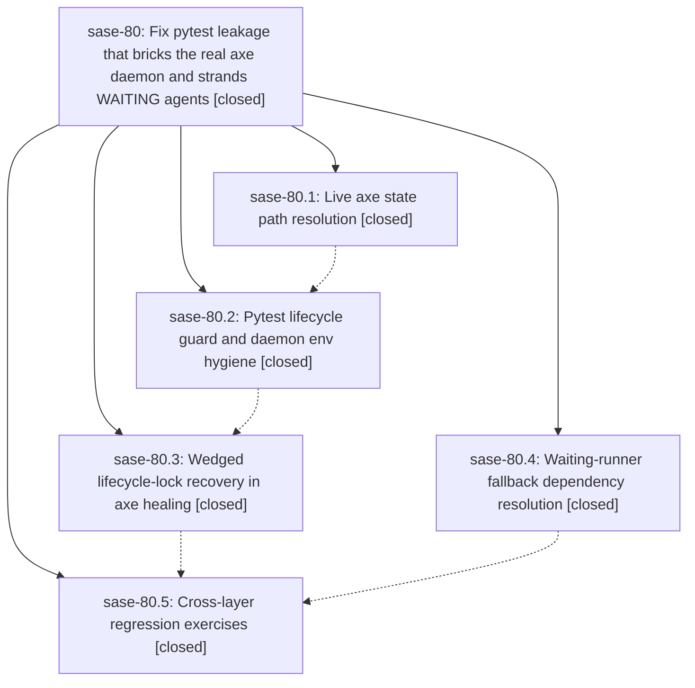

# Bead: sase-80 — Fix pytest leakage that bricks the real axe daemon and strands WAITING agents

[Bead Pages](../README.md) / sase-80

**Status:** ✓ closed · **Resolution:** (unrecorded) · **Type:** plan · **Tier:** epic
**Owner:** `bryanbugyi34@gmail.com`
**Created:** 2026-07-20 01:56:50 UTC · **Closed:** 2026-07-20 14:31:08 UTC
**Plan:** [202607/axe\_test\_isolation\_leak.md](https://github.com/sase-org/sase--plans/blob/main/202607/axe_test_isolation_leak.md)

## Description

The sase test suite can never start, stop, or take over the user's real axe daemon; axe self-heals from a wedged lifecycle lock; and waiting agents unblock when their dependencies complete even if the wait_checks chop is down.

## Notes

COMMIT: 9254b09

## Phases

| Bead | Title | Status | Size | Agents | Commits |
|---|---|---|---|---:|---:|
| [sase-80.1](sase-80.1.md) | Live axe state path resolution | ✓ closed | small | 1 | 1 |
| [sase-80.2](sase-80.2.md) | Pytest lifecycle guard and daemon env hygiene | ✓ closed | small | 1 | 1 |
| [sase-80.3](sase-80.3.md) | Wedged lifecycle-lock recovery in axe healing | ✓ closed | small | 1 | 1 |
| [sase-80.4](sase-80.4.md) | Waiting-runner fallback dependency resolution | ✓ closed | small | 1 | 1 |
| [sase-80.5](sase-80.5.md) | Cross-layer regression exercises | ✓ closed | small | 1 | 1 |

## Lineage

## Agents

| Agent | Bead | Commits |
|---|---|---:|
| [bbugyi200.athena.sase-80.1](https://github.com/sase-org/sase--agents/blob/main/agents/bbugyi200.athena.sase-80.1/README.md) | [sase-80.1](sase-80.1.md) | 1 |
| [bbugyi200.athena.sase-80.2](https://github.com/sase-org/sase--agents/blob/main/agents/bbugyi200.athena.sase-80.2/README.md) | [sase-80.2](sase-80.2.md) | 1 |
| [bbugyi200.athena.sase-80.3](https://github.com/sase-org/sase--agents/blob/main/agents/bbugyi200.athena.sase-80.3/README.md) | [sase-80.3](sase-80.3.md) | 1 |
| [bbugyi200.athena.sase-80.4](https://github.com/sase-org/sase--agents/blob/main/agents/bbugyi200.athena.sase-80.4/README.md) | [sase-80.4](sase-80.4.md) | 1 |
| [bbugyi200.athena.sase-80.5](https://github.com/sase-org/sase--agents/blob/main/agents/bbugyi200.athena.sase-80.5/README.md) | [sase-80.5](sase-80.5.md) | 1 |

## Commits

| Commit | Subject | Bead | Committed (UTC) |
|---|---|---|---|
| [`cc99b7a`](https://github.com/sase-org/sase/commit/cc99b7a3bbb13ab7273abe1d44e3aed9d6852bf3) | fix(axe): resolve state paths at call time (sase-80.1) | [sase-80.1](sase-80.1.md) | 2026-07-20 12:06:19 |
| [`70ed5fa`](https://github.com/sase-org/sase/commit/70ed5fa962ea3e3e69f94adeecbc643e8bd2098c) | fix(axe): re-resolve stranded wait dependencies (sase-80.4) | [sase-80.4](sase-80.4.md) | 2026-07-20 12:06:44 |
| [`969970b`](https://github.com/sase-org/sase/commit/969970bcb7a7cdd757cb78bcfe5eaf2bdef9e2e9) | fix(axe): guard daemon lifecycle under pytest (sase-80.2) | [sase-80.2](sase-80.2.md) | 2026-07-20 12:35:53 |
| [`c58324d`](https://github.com/sase-org/sase/commit/c58324d551049351648e0cfe2ba83c26e0e9418a) | fix(axe): recover wedged lifecycle locks (sase-80.3) | [sase-80.3](sase-80.3.md) | 2026-07-20 14:10:38 |
| [`dae1b3e`](https://github.com/sase-org/sase/commit/dae1b3ebe6e427684b416bf10a99fc8deb3df2e0) | test: cover axe outage recovery across layers (sase-80.5) | [sase-80.5](sase-80.5.md) | 2026-07-20 14:25:14 |
