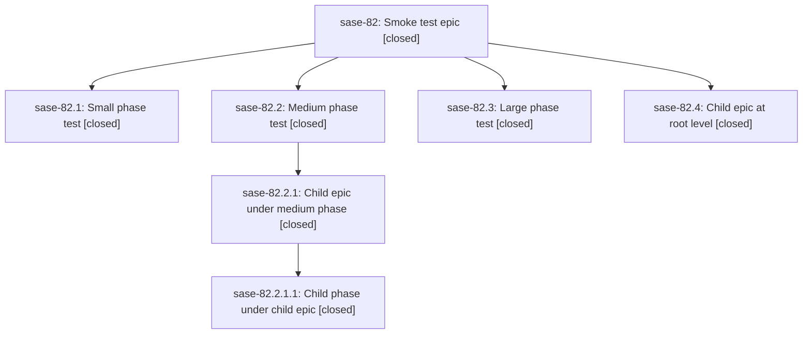

# Bead: sase-82 — Smoke test epic

[Bead Pages](../README.md) / sase-82

**Status:** ✓ closed · **Resolution:** (unrecorded) · **Type:** plan · **Tier:** epic
**Owner:** `bryanbugyi34@gmail.com`
**Created:** 2026-07-20 14:16:45 UTC · **Closed:** 2026-07-20 14:18:52 UTC
**Plan:** [202607/smoke\_test\_epic.md](https://github.com/sase-org/sase--plans/blob/main/202607/smoke_test_epic.md)

## Phases

| Bead | Title | Status | Size | Agents | Commits |
|---|---|---|---|---:|---:|
| [sase-82.1](sase-82.1.md) | Small phase test | ✓ closed | small | 0 | 0 |
| [sase-82.2](sase-82.2.md) | Medium phase test | ✓ closed | medium | 0 | 0 |
| [sase-82.3](sase-82.3.md) | Large phase test | ✓ closed | large | 0 | 0 |

## Lineage

