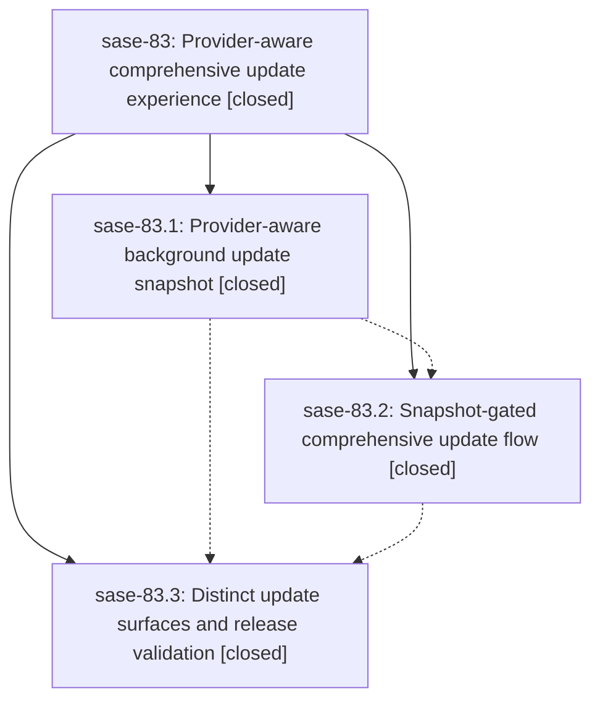

# Bead: sase-83 — Provider-aware comprehensive update experience

[Bead Pages](../README.md) / sase-83

**Status:** ✓ closed · **Resolution:** (unrecorded) · **Type:** plan · **Tier:** epic
**Owner:** `bryanbugyi34@gmail.com`
**Created:** 2026-07-20 14:22:42 UTC · **Closed:** 2026-07-20 16:47:48 UTC
**Plan:** [202607/agent\_cli\_update\_awareness.md](https://github.com/sase-org/sase--plans/blob/main/202607/agent_cli_update_awareness.md)

## Description

ACE's cached startup and periodic update checks include supported agent CLI providers without adding UI-thread or per-tick network cost, and the global ,U action safely updates exactly the provider CLIs identified by the latest completed background check while presenting a distinct, polished update state.

## Notes

COMMIT: df4c84813

## Phases

| Bead | Title | Status | Size | Agents | Commits |
|---|---|---|---|---:|---:|
| [sase-83.1](sase-83.1.md) | Provider-aware background update snapshot | ✓ closed | medium | 2 | 1 |
| [sase-83.2](sase-83.2.md) | Snapshot-gated comprehensive update flow | ✓ closed | medium | 2 | 1 |
| [sase-83.3](sase-83.3.md) | Distinct update surfaces and release validation | ✓ closed | small | 1 | 1 |

## Lineage

## Agents

| Agent | Bead | Commits |
|---|---|---:|
| [bbugyi200.athena.sase-83.1](https://github.com/sase-org/sase--agents/blob/main/agents/bbugyi200.athena.sase-83.1/README.md) | [sase-83.1](sase-83.1.md) | 1 |
| [bbugyi200.athena.sase-83.1--code](https://github.com/sase-org/sase--agents/blob/main/families/bbugyi200.athena.sase-83.1.md#member-code) | [sase-83.1](sase-83.1.md) | 0 |
| [bbugyi200.athena.sase-83.2](https://github.com/sase-org/sase--agents/blob/main/agents/bbugyi200.athena.sase-83.2/README.md) | [sase-83.2](sase-83.2.md) | 1 |
| [bbugyi200.athena.sase-83.2--code](https://github.com/sase-org/sase--agents/blob/main/families/bbugyi200.athena.sase-83.2.md#member-code) | [sase-83.2](sase-83.2.md) | 0 |
| [bbugyi200.athena.sase-83.3](https://github.com/sase-org/sase--agents/blob/main/agents/bbugyi200.athena.sase-83.3/README.md) | [sase-83.3](sase-83.3.md) | 1 |
| [bbugyi200.athena.sase-83.land](https://github.com/sase-org/sase--agents/blob/main/agents/bbugyi200.athena.sase-83.land/README.md) | [sase-83](README.md) | 1 |
| [bbugyi200.athena.sase-83.land--code](https://github.com/sase-org/sase--agents/blob/main/families/bbugyi200.athena.sase-83.land.md#member-code) | [sase-83](README.md) | 0 |

## Commits

| Commit | Subject | Bead | Committed (UTC) |
|---|---|---|---|
| [`c0d68a4`](https://github.com/sase-org/sase/commit/c0d68a4f21a7fdac281094d8823eef4b1e08294e) | feat(updates): track provider CLI update candidates (sase-83.1) | [sase-83.1](sase-83.1.md) | 2026-07-20 14:57:32 |
| [`c82006b`](https://github.com/sase-org/sase/commit/c82006bdca22a7c010d933923a1fcddbd4ac288a) | feat(ace): add snapshot-gated comprehensive updates (sase-83.2) | [sase-83.2](sase-83.2.md) | 2026-07-20 15:42:41 |
| [`bf84d7b`](https://github.com/sase-org/sase/commit/bf84d7b25424511fd98f44e7f302d0a8235f1022) | feat(updates): distinguish agent CLI update status (sase-83.3) | [sase-83.3](sase-83.3.md) | 2026-07-20 16:39:51 |
| [`1227d91`](https://github.com/sase-org/sase/commit/1227d918817639a90a291c953cc6da21e3ea3f72) | test: restore review-runner environment isolation (sase-83) | [sase-83](README.md) | 2026-07-20 17:40:28 |
