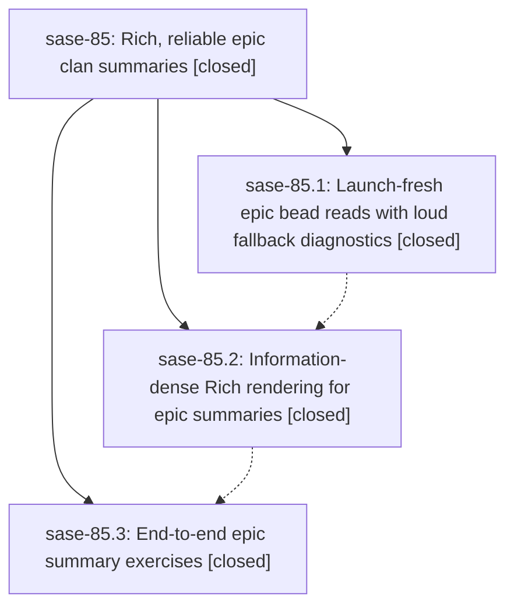

# Bead: sase-85 — Rich, reliable epic clan summaries

[Bead Pages](../README.md) / sase-85

**Status:** ✓ closed · **Resolution:** (unrecorded) · **Type:** plan · **Tier:** epic
**Owner:** `bryanbugyi34@gmail.com`
**Created:** 2026-07-20 14:58:37 UTC · **Closed:** 2026-07-20 16:39:31 UTC
**Plan:** [202607/epic\_clan\_summary\_rich.md](https://github.com/sase-org/sase--plans/blob/main/202607/epic_clan_summary_rich.md)

## Description

Epic clan panels always show a complete, launch-fresh summary — never the bare "EPIC <id>" fallback — and that summary is an information-dense, beautifully colored overview (markdown-aware highlighting, phase status glyphs, size chips, progress, and the plan reference) that finally meets the sase-7r "rendered beautifully" bar.

## Notes

COMMIT: 0ee1bac4

## Phases

| Bead | Title | Status | Size | Agents | Commits |
|---|---|---|---|---:|---:|
| [sase-85.1](sase-85.1.md) | Launch-fresh epic bead reads with loud fallback diagnostics | ✓ closed | medium | 2 | 1 |
| [sase-85.2](sase-85.2.md) | Information-dense Rich rendering for epic summaries | ✓ closed | medium | 2 | 1 |
| [sase-85.3](sase-85.3.md) | End-to-end epic summary exercises | ✓ closed | small | 0 | 0 |

## Lineage

## Agents

| Agent | Bead | Commits |
|---|---|---:|
| [bbugyi200.athena.sase-85.1](https://github.com/sase-org/sase--agents/blob/main/agents/bbugyi200.athena.sase-85.1/README.md) | [sase-85.1](sase-85.1.md) | 1 |
| [bbugyi200.athena.sase-85.1--code](https://github.com/sase-org/sase--agents/blob/main/families/bbugyi200.athena.sase-85.1.md#member-code) | [sase-85.1](sase-85.1.md) | 0 |
| [bbugyi200.athena.sase-85.2](https://github.com/sase-org/sase--agents/blob/main/agents/bbugyi200.athena.sase-85.2/README.md) | [sase-85.2](sase-85.2.md) | 1 |
| [bbugyi200.athena.sase-85.2--code](https://github.com/sase-org/sase--agents/blob/main/families/bbugyi200.athena.sase-85.2.md#member-code) | [sase-85.2](sase-85.2.md) | 0 |
| [bbugyi200.athena.sase-85.land](https://github.com/sase-org/sase--agents/blob/main/agents/bbugyi200.athena.sase-85.land/README.md) | [sase-85](README.md) | 1 |
| [bbugyi200.athena.sase-85.land--code](https://github.com/sase-org/sase--agents/blob/main/families/bbugyi200.athena.sase-85.land.md#member-code) | [sase-85](README.md) | 0 |

## Commits

| Commit | Subject | Bead | Committed (UTC) |
|---|---|---|---|
| [`0a1fd5f`](https://github.com/sase-org/sase/commit/0a1fd5f83e0d0bf3ed86b8638bdf266ea80c5557) | fix: refresh missing epic summaries before fallback (sase-85.1) | [sase-85.1](sase-85.1.md) | 2026-07-20 15:21:23 |
| [`01c5b80`](https://github.com/sase-org/sase/commit/01c5b8022662bba689d147a70fd7d2cd6c8d6c48) | feat: enrich epic clan summaries (sase-85.2) | [sase-85.2](sase-85.2.md) | 2026-07-20 16:01:27 |
| [`f87a09c`](https://github.com/sase-org/sase/commit/f87a09c423fef75701b816dbfaa67370d7a8832b) | test: cover stale epic summary clone recovery (sase-85) | [sase-85](README.md) | 2026-07-20 16:42:58 |
