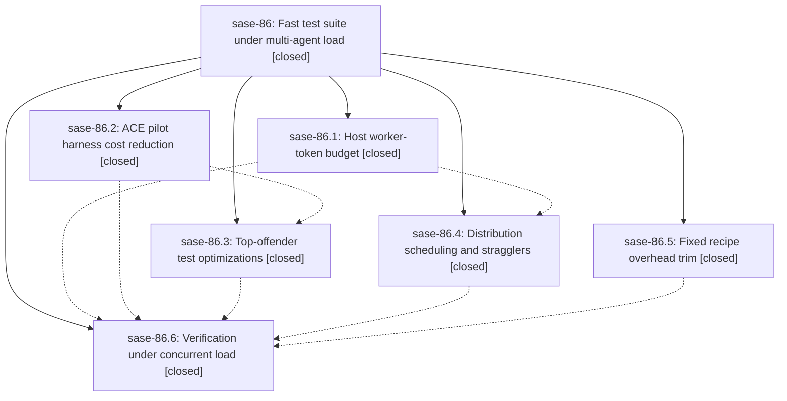

# Bead: sase-86 — Fast test suite under multi-agent load

[Bead Pages](../README.md) / sase-86

**Status:** ✓ closed · **Resolution:** (unrecorded) · **Type:** plan · **Tier:** epic
**Owner:** `bryanbugyi34@gmail.com`
**Created:** 2026-07-20 14:59:52 UTC · **Closed:** 2026-07-20 18:35:22 UTC
**Plan:** [202607/fast\_test\_suite.md](https://github.com/sase-org/sase--plans/blob/main/202607/fast_test_suite.md)

## Description

A solo `just test` on athena completes at least 2x faster than today's ~4-minute wall time with an identical test selection and no weakened assertions, and any number of concurrent agent suite runs share one host-wide worker budget so every run starts promptly and total resource use stays bounded below the levels that caused the 2026-07-20 host meltdown.

## Notes

COMMIT: d5b5ef49

## Phases

| Bead | Title | Status | Size | Agents | Commits |
|---|---|---|---|---:|---:|
| [sase-86.1](sase-86.1.md) | Host worker-token budget | ✓ closed | medium | 2 | 1 |
| [sase-86.2](sase-86.2.md) | ACE pilot harness cost reduction | ✓ closed | medium | 2 | 1 |
| [sase-86.3](sase-86.3.md) | Top-offender test optimizations | ✓ closed | medium | 2 | 1 |
| [sase-86.4](sase-86.4.md) | Distribution scheduling and stragglers | ✓ closed | medium | 2 | 1 |
| [sase-86.5](sase-86.5.md) | Fixed recipe overhead trim | ✓ closed | small | 1 | 1 |
| [sase-86.6](sase-86.6.md) | Verification under concurrent load | ✓ closed | small | 1 | 1 |

## Lineage

## Agents

| Agent | Bead | Commits |
|---|---|---:|
| [bbugyi200.athena.sase-86.1](https://github.com/sase-org/sase--agents/blob/main/agents/bbugyi200.athena.sase-86.1/README.md) | [sase-86.1](sase-86.1.md) | 1 |
| [bbugyi200.athena.sase-86.1--code](https://github.com/sase-org/sase--agents/blob/main/families/bbugyi200.athena.sase-86.1.md#member-code) | [sase-86.1](sase-86.1.md) | 0 |
| [bbugyi200.athena.sase-86.2](https://github.com/sase-org/sase--agents/blob/main/agents/bbugyi200.athena.sase-86.2/README.md) | [sase-86.2](sase-86.2.md) | 1 |
| [bbugyi200.athena.sase-86.2--code](https://github.com/sase-org/sase--agents/blob/main/families/bbugyi200.athena.sase-86.2.md#member-code) | [sase-86.2](sase-86.2.md) | 0 |
| [bbugyi200.athena.sase-86.3](https://github.com/sase-org/sase--agents/blob/main/agents/bbugyi200.athena.sase-86.3/README.md) | [sase-86.3](sase-86.3.md) | 1 |
| [bbugyi200.athena.sase-86.3--code](https://github.com/sase-org/sase--agents/blob/main/families/bbugyi200.athena.sase-86.3.md#member-code) | [sase-86.3](sase-86.3.md) | 0 |
| [bbugyi200.athena.sase-86.4](https://github.com/sase-org/sase--agents/blob/main/agents/bbugyi200.athena.sase-86.4/README.md) | [sase-86.4](sase-86.4.md) | 1 |
| [bbugyi200.athena.sase-86.4--code](https://github.com/sase-org/sase--agents/blob/main/families/bbugyi200.athena.sase-86.4.md#member-code) | [sase-86.4](sase-86.4.md) | 0 |
| [bbugyi200.athena.sase-86.5](https://github.com/sase-org/sase--agents/blob/main/agents/bbugyi200.athena.sase-86.5/README.md) | [sase-86.5](sase-86.5.md) | 1 |
| [bbugyi200.athena.sase-86.6](https://github.com/sase-org/sase--agents/blob/main/agents/bbugyi200.athena.sase-86.6/README.md) | [sase-86.6](sase-86.6.md) | 1 |

## Commits

| Commit | Subject | Bead | Committed (UTC) |
|---|---|---|---|
| [`4c46711`](https://github.com/sase-org/sase/commit/4c46711115fa8de5c9098798f3c9f1b26e862b61) | perf(test): cache setup environment validation (sase-86.5) | [sase-86.5](sase-86.5.md) | 2026-07-20 15:33:11 |
| [`6903e78`](https://github.com/sase-org/sase/commit/6903e78ec41cea2b98ce28c12d1db85fa5214647) | perf(test): reduce ACE pilot harness startup cost (sase-86.2) | [sase-86.2](sase-86.2.md) | 2026-07-20 15:53:07 |
| [`8599baa`](https://github.com/sase-org/sase/commit/8599baa3a93e6c1c4a8c1f05b6f0c014b64aa322) | feat(test): add host-global pytest worker budget (sase-86.1) | [sase-86.1](sase-86.1.md) | 2026-07-20 16:07:28 |
| [`8e544a3`](https://github.com/sase-org/sase/commit/8e544a398f7f733dfe92245b1941aee7813e499e) | perf(tests): distribute parallel tests with work stealing (sase-86.4) | [sase-86.4](sase-86.4.md) | 2026-07-20 17:02:45 |
| [`a0a09b2`](https://github.com/sase-org/sase/commit/a0a09b22a176d4449acbead9b7b6051efc9c8f81) | perf(test): reduce top-offender suite runtime (sase-86.3) | [sase-86.3](sase-86.3.md) | 2026-07-20 17:20:55 |
| [`9f4b529`](https://github.com/sase-org/sase/commit/9f4b529fbb9c2ea63d461c3823ceff9d1db16034) | fix: harden suite verification under load (sase-86.6) | [sase-86.6](sase-86.6.md) | 2026-07-20 18:30:19 |
