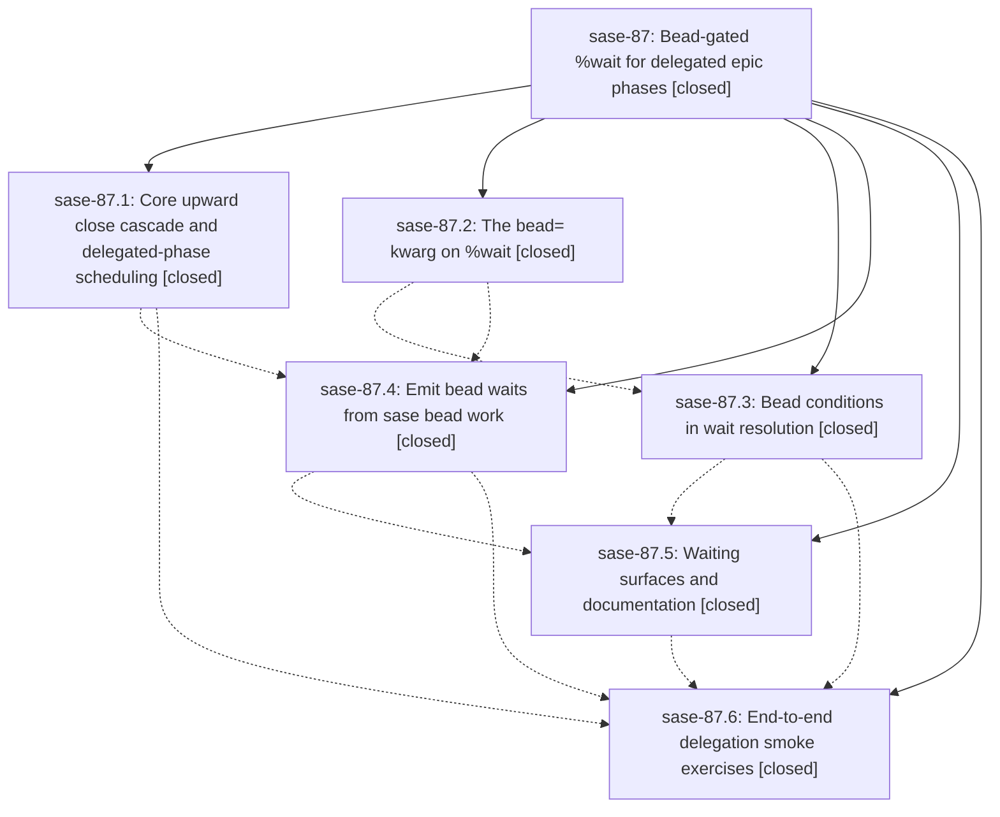

# Bead: sase-87 — Bead-gated %wait for delegated epic phases

[Bead Pages](../README.md) / sase-87

**Status:** ✓ closed · **Resolution:** (unrecorded) · **Type:** plan · **Tier:** epic
**Owner:** `bryanbugyi34@gmail.com`
**Created:** 2026-07-20 15:01:43 UTC · **Closed:** 2026-07-20 18:30:04 UTC
**Plan:** [202607/bead\_gated\_wait.md](https://github.com/sase-org/sase--plans/blob/main/202607/bead_gated_wait.md)

## Description

A dependent epic phase agent (and the land agent) does not start just because its blocker phase agents finished: %wait gains a bead=<bead_id> kwarg that also requires the named beads to be closed, sase bead work emits both conditions for every dependency edge, and a delegated phase bead (one whose agent handed its work to an auto-approved child epic) is closed automatically when that child epic lands, so bead waits eventually resolve.

## Notes

COMMIT: 891b27a9

## Phases

| Bead | Title | Status | Size | Agents | Commits |
|---|---|---|---|---:|---:|
| [sase-87.1](sase-87.1.md) | Core upward close cascade and delegated-phase scheduling | ✓ closed | medium | 1 | 0 |
| [sase-87.2](sase-87.2.md) | The bead= kwarg on %wait | ✓ closed | medium | 2 | 1 |
| [sase-87.3](sase-87.3.md) | Bead conditions in wait resolution | ✓ closed | large | 2 | 1 |
| [sase-87.4](sase-87.4.md) | Emit bead waits from sase bead work | ✓ closed | medium | 2 | 1 |
| [sase-87.5](sase-87.5.md) | Waiting surfaces and documentation | ✓ closed | small | 1 | 1 |
| [sase-87.6](sase-87.6.md) | End-to-end delegation smoke exercises | ✓ closed | small | 0 | 0 |

## Lineage

## Agents

| Agent | Bead | Commits |
|---|---|---:|
| [bbugyi200.athena.sase-87.1--code](https://github.com/sase-org/sase--agents/blob/main/families/bbugyi200.athena.sase-87.1.md#member-code) | [sase-87.1](sase-87.1.md) | 0 |
| [bbugyi200.athena.sase-87.2](https://github.com/sase-org/sase--agents/blob/main/agents/bbugyi200.athena.sase-87.2/README.md) | [sase-87.2](sase-87.2.md) | 1 |
| [bbugyi200.athena.sase-87.2--code](https://github.com/sase-org/sase--agents/blob/main/families/bbugyi200.athena.sase-87.2.md#member-code) | [sase-87.2](sase-87.2.md) | 0 |
| [bbugyi200.athena.sase-87.3](https://github.com/sase-org/sase--agents/blob/main/agents/bbugyi200.athena.sase-87.3/README.md) | [sase-87.3](sase-87.3.md) | 1 |
| [bbugyi200.athena.sase-87.3--code](https://github.com/sase-org/sase--agents/blob/main/families/bbugyi200.athena.sase-87.3.md#member-code) | [sase-87.3](sase-87.3.md) | 0 |
| [bbugyi200.athena.sase-87.4](https://github.com/sase-org/sase--agents/blob/main/agents/bbugyi200.athena.sase-87.4/README.md) | [sase-87.4](sase-87.4.md) | 1 |
| [bbugyi200.athena.sase-87.4--code](https://github.com/sase-org/sase--agents/blob/main/families/bbugyi200.athena.sase-87.4.md#member-code) | [sase-87.4](sase-87.4.md) | 0 |
| [bbugyi200.athena.sase-87.5](https://github.com/sase-org/sase--agents/blob/main/agents/bbugyi200.athena.sase-87.5/README.md) | [sase-87.5](sase-87.5.md) | 1 |
| [bbugyi200.athena.sase-87.land](https://github.com/sase-org/sase--agents/blob/main/agents/bbugyi200.athena.sase-87.land/README.md) | [sase-87](README.md) | 1 |

## Commits

| Commit | Subject | Bead | Committed (UTC) |
|---|---|---|---|
| [`e6c865e`](https://github.com/sase-org/sase/commit/e6c865e9ab838696545d21e6509a7eb5b7d612bd) | feat(xprompt): support bead waits (sase-87.2) | [sase-87.2](sase-87.2.md) | 2026-07-20 16:01:57 |
| [`a874efc`](https://github.com/sase-org/sase/commit/a874efce376f5886da4795610aed55e24d769c8c) | feat: resolve waits gated by closed beads (sase-87.3) | [sase-87.3](sase-87.3.md) | 2026-07-20 16:40:56 |
| [`0ee641f`](https://github.com/sase-org/sase/commit/0ee641f6c047f73870a345f682e484e152321409) | feat(bead): emit bead-gated waits for epic work (sase-87.4) | [sase-87.4](sase-87.4.md) | 2026-07-20 17:19:48 |
| [`b040020`](https://github.com/sase-org/sase/commit/b040020913e5284e5858a49b1404151c1e07be9e) | feat(ace): surface bead-gated waits (sase-87.5) | [sase-87.5](sase-87.5.md) | 2026-07-20 18:02:49 |
| [`ad39415`](https://github.com/sase-org/sase/commit/ad39415ea541e357af3fa90bebbd0b58d2004a04) | fix(ace): honor bead gates when resolving waiters on kill/dismiss (sase-87) | [sase-87](README.md) | 2026-07-20 18:42:59 |
