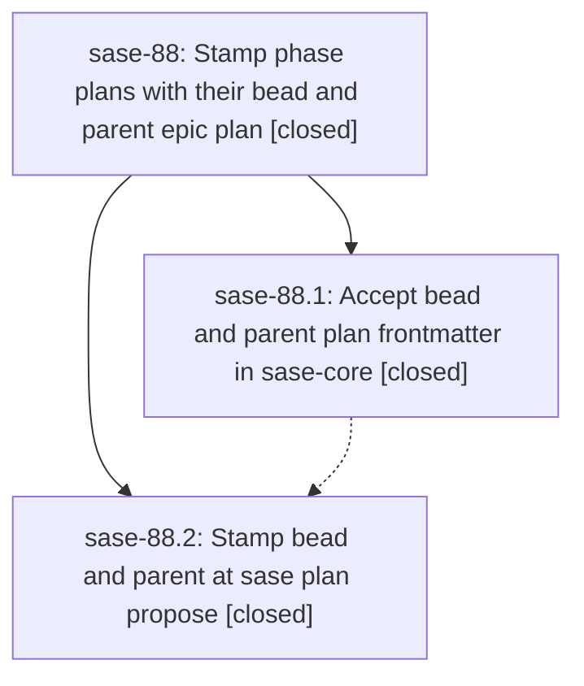

# Bead: sase-88 — Stamp phase plans with their bead and parent epic plan

[Bead Pages](../README.md) / sase-88

**Status:** ✓ closed · **Resolution:** (unrecorded) · **Type:** plan · **Tier:** epic
**Owner:** `bryanbugyi34@gmail.com`
**Created:** 2026-07-20 15:40:47 UTC · **Closed:** 2026-07-20 16:21:08 UTC
**Plan:** [202607/phase\_plan\_parent\_links.md](https://github.com/sase-org/sase--plans/blob/main/202607/phase_plan_parent_links.md)

## Description

Plans proposed from epic bead work automatically record which bead the proposing agent is working (`bead`) and which epic plan file spawned that work (`parent`), for both phase (tale) plans and child epic plans.

## Notes

COMMITS: sase 87e7a3a38; sase-core 298eb75

## Phases

| Bead | Title | Status | Size | Agents | Commits |
|---|---|---|---|---:|---:|
| [sase-88.1](sase-88.1.md) | Accept bead and parent plan frontmatter in sase-core | ✓ closed | small | 1 | 1 |
| [sase-88.2](sase-88.2.md) | Stamp bead and parent at sase plan propose | ✓ closed | small | 1 | 1 |

## Lineage

## Agents

| Agent | Bead | Commits |
|---|---|---:|
| [bbugyi200.athena.sase-88.1](https://github.com/sase-org/sase--agents/blob/main/agents/bbugyi200.athena.sase-88.1/README.md) | [sase-88.1](sase-88.1.md) | 1 |
| [bbugyi200.athena.sase-88.2](https://github.com/sase-org/sase--agents/blob/main/agents/bbugyi200.athena.sase-88.2/README.md) | [sase-88.2](sase-88.2.md) | 1 |

## Commits

| Commit | Subject | Bead | Committed (UTC) |
|---|---|---|---|
| [`sase-core@298eb75`](https://github.com/sase-org/sase-core/commit/298eb750d5995341088b528e729808380f162ce2) | feat(plan): expose managed bead links (sase-88.1) | [sase-88.1](sase-88.1.md) | 2026-07-20 15:52:37 |
| [`87e7a3a`](https://github.com/sase-org/sase/commit/87e7a3a388a1e6205906293866d219267e202923) | feat(plans): stamp bead associations during proposal (sase-88.2) | [sase-88.2](sase-88.2.md) | 2026-07-20 16:08:37 |
