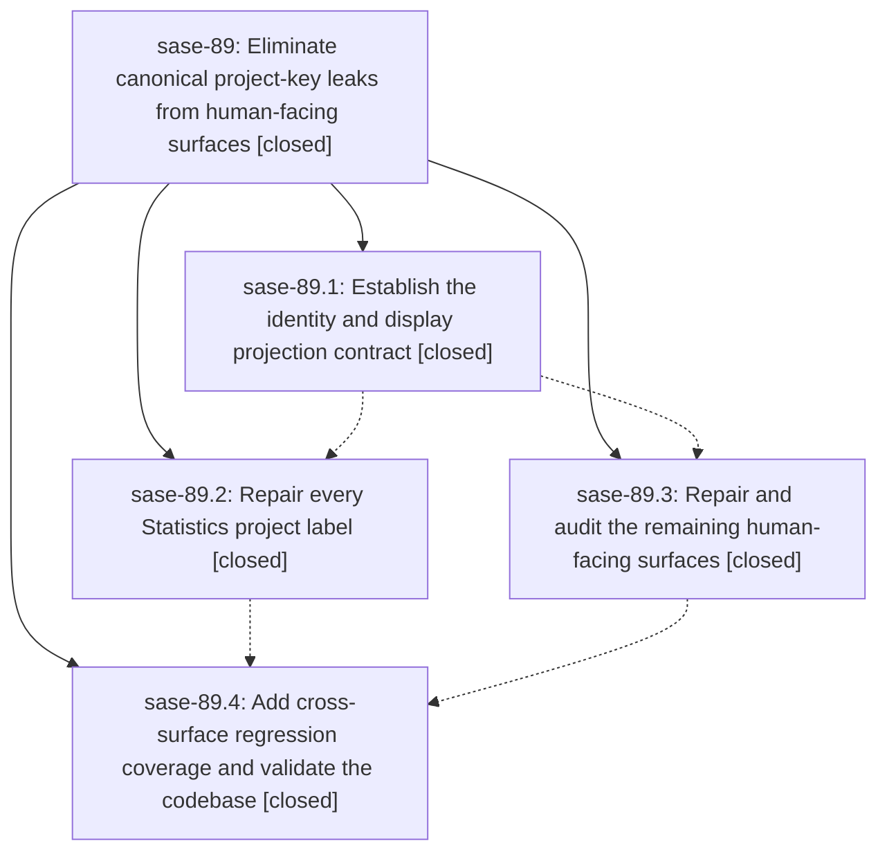

# Bead: sase-89 — Eliminate canonical project-key leaks from human-facing surfaces

[Bead Pages](../README.md) / sase-89

**Status:** ✓ closed · **Resolution:** (unrecorded) · **Type:** plan · **Tier:** epic
**Owner:** `bryanbugyi34@gmail.com`
**Created:** 2026-07-20 16:45:58 UTC · **Closed:** 2026-07-20 18:55:31 UTC
**Plan:** [202607/project\_display\_names.md](https://github.com/sase-org/sase--plans/blob/main/202607/project_display_names.md)

## Description

Make every human-facing project and ChangeSpec label use the configured project display name while preserving canonical directory keys for identity, persistence, paths, joins, filters, and machine-readable contracts.

## Notes

COMMIT: afebf675

## Phases

| Bead | Title | Status | Size | Agents | Commits |
|---|---|---|---|---:|---:|
| [sase-89.1](sase-89.1.md) | Establish the identity and display projection contract | ✓ closed | medium | 2 | 1 |
| [sase-89.2](sase-89.2.md) | Repair every Statistics project label | ✓ closed | medium | 2 | 1 |
| [sase-89.3](sase-89.3.md) | Repair and audit the remaining human-facing surfaces | ✓ closed | medium | 2 | 2 |
| [sase-89.4](sase-89.4.md) | Add cross-surface regression coverage and validate the codebase | ✓ closed | medium | 2 | 1 |

## Lineage

## Agents

| Agent | Bead | Commits |
|---|---|---:|
| [bbugyi200.athena.sase-89.1](https://github.com/sase-org/sase--agents/blob/main/agents/bbugyi200.athena.sase-89.1/README.md) | [sase-89.1](sase-89.1.md) | 1 |
| [bbugyi200.athena.sase-89.1--code](https://github.com/sase-org/sase--agents/blob/main/families/bbugyi200.athena.sase-89.1.md#member-code) | [sase-89.1](sase-89.1.md) | 0 |
| [bbugyi200.athena.sase-89.2](https://github.com/sase-org/sase--agents/blob/main/agents/bbugyi200.athena.sase-89.2/README.md) | [sase-89.2](sase-89.2.md) | 1 |
| [bbugyi200.athena.sase-89.2--code](https://github.com/sase-org/sase--agents/blob/main/families/bbugyi200.athena.sase-89.2.md#member-code) | [sase-89.2](sase-89.2.md) | 0 |
| [bbugyi200.athena.sase-89.3](https://github.com/sase-org/sase--agents/blob/main/agents/bbugyi200.athena.sase-89.3/README.md) | [sase-89.3](sase-89.3.md) | 2 |
| [bbugyi200.athena.sase-89.3--code](https://github.com/sase-org/sase--agents/blob/main/families/bbugyi200.athena.sase-89.3.md#member-code) | [sase-89.3](sase-89.3.md) | 0 |
| [bbugyi200.athena.sase-89.4](https://github.com/sase-org/sase--agents/blob/main/agents/bbugyi200.athena.sase-89.4/README.md) | [sase-89.4](sase-89.4.md) | 1 |
| [bbugyi200.athena.sase-89.4--code](https://github.com/sase-org/sase--agents/blob/main/families/bbugyi200.athena.sase-89.4.md#member-code) | [sase-89.4](sase-89.4.md) | 0 |

## Commits

| Commit | Subject | Bead | Committed (UTC) |
|---|---|---|---|
| [`2efe42a`](https://github.com/sase-org/sase/commit/2efe42a1583d70bd3f8c9ca56efd6c048fbb8957) | feat(projects): add immutable display snapshots (sase-89.1) | [sase-89.1](sase-89.1.md) | 2026-07-20 17:08:03 |
| [`e584c89`](https://github.com/sase-org/sase/commit/e584c89df570717429bdc477fdec0f76377d9f64) | feat(stats): render configured project labels (sase-89.2) | [sase-89.2](sase-89.2.md) | 2026-07-20 17:35:57 |
| [`148bbb1`](https://github.com/sase-org/sase/commit/148bbb1cc982f47100bdeb4ba9acd4e78744d08d) | fix(projects): humanize remaining display surfaces (sase-89.3) | [sase-89.3](sase-89.3.md) | 2026-07-20 17:58:37 |
| [`e3af45c`](https://github.com/sase-org/sase/commit/e3af45c7060abb9481e85c2a14c3c99cce74b20a) | fix(stats): retain project display projection helper (sase-89.3) | [sase-89.3](sase-89.3.md) | 2026-07-20 18:01:32 |
| [`e917679`](https://github.com/sase-org/sase/commit/e917679d1d690aa19241fce1d755ac7dba0bce4f) | fix: prevent canonical project keys leaking into displays (sase-89.4) | [sase-89.4](sase-89.4.md) | 2026-07-20 18:47:14 |
