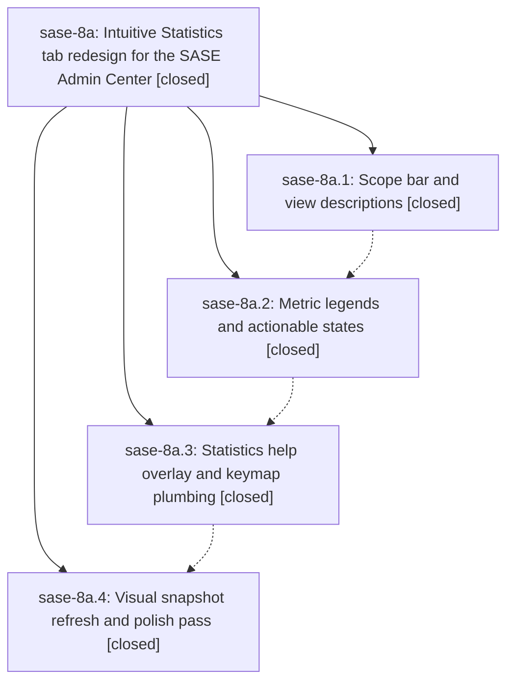

# Bead: sase-8a — Intuitive Statistics tab redesign for the SASE Admin Center

[Bead Pages](../README.md) / sase-8a

**Status:** ✓ closed · **Resolution:** (unrecorded) · **Type:** plan · **Tier:** epic
**Owner:** `bryanbugyi34@gmail.com`
**Created:** 2026-07-20 17:46:09 UTC · **Closed:** 2026-07-20 20:10:57 UTC
**Plan:** [202607/statistics\_tab\_intuitive\_redesign.md](https://github.com/sase-org/sase--plans/blob/main/202607/statistics_tab_intuitive_redesign.md)

## Description

The Admin Center Statistics tab explains itself: every view, control, and metric is labeled, described, and discoverable through visible scope chips, per-view descriptions, truthful metric legends, a contextual help overlay, and actionable empty/error states — all with a polished visual language consistent with the rest of the Admin Center.

## Notes

COMMIT: 66df848b

## Phases

| Bead | Title | Status | Size | Agents | Commits |
|---|---|---|---|---:|---:|
| [sase-8a.1](sase-8a.1.md) | Scope bar and view descriptions | ✓ closed | medium | 2 | 1 |
| [sase-8a.2](sase-8a.2.md) | Metric legends and actionable states | ✓ closed | medium | 2 | 1 |
| [sase-8a.3](sase-8a.3.md) | Statistics help overlay and keymap plumbing | ✓ closed | medium | 1 | 0 |
| [sase-8a.4](sase-8a.4.md) | Visual snapshot refresh and polish pass | ✓ closed | small | 1 | 1 |

## Lineage

## Agents

| Agent | Bead | Commits |
|---|---|---:|
| [bbugyi200.athena.sase-8a.1](https://github.com/sase-org/sase--agents/blob/main/agents/bbugyi200.athena.sase-8a.1/README.md) | [sase-8a.1](sase-8a.1.md) | 1 |
| [bbugyi200.athena.sase-8a.1--code](https://github.com/sase-org/sase--agents/blob/main/families/bbugyi200.athena.sase-8a.1.md#member-code) | [sase-8a.1](sase-8a.1.md) | 0 |
| [bbugyi200.athena.sase-8a.2](https://github.com/sase-org/sase--agents/blob/main/agents/bbugyi200.athena.sase-8a.2/README.md) | [sase-8a.2](sase-8a.2.md) | 1 |
| [bbugyi200.athena.sase-8a.2--code](https://github.com/sase-org/sase--agents/blob/main/families/bbugyi200.athena.sase-8a.2.md#member-code) | [sase-8a.2](sase-8a.2.md) | 0 |
| [bbugyi200.athena.sase-8a.3--code](https://github.com/sase-org/sase--agents/blob/main/families/bbugyi200.athena.sase-8a.3.md#member-code) | [sase-8a.3](sase-8a.3.md) | 0 |
| [bbugyi200.athena.sase-8a.4](https://github.com/sase-org/sase--agents/blob/main/agents/bbugyi200.athena.sase-8a.4/README.md) | [sase-8a.4](sase-8a.4.md) | 1 |
| [bbugyi200.athena.sase-8a.land](https://github.com/sase-org/sase--agents/blob/main/agents/bbugyi200.athena.sase-8a.land/README.md) | [sase-8a](README.md) | 2 |
| [bbugyi200.athena.sase-8a.land--code](https://github.com/sase-org/sase--agents/blob/main/families/bbugyi200.athena.sase-8a.land.md#member-code) | [sase-8a](README.md) | 0 |

## Commits

| Commit | Subject | Bead | Committed (UTC) |
|---|---|---|---|
| [`26ebac8`](https://github.com/sase-org/sase/commit/26ebac8584d0e0778ffa271deb4fd3b36a4b022d) | feat(ace): clarify statistics scope controls (sase-8a.1) | [sase-8a.1](sase-8a.1.md) | 2026-07-20 18:17:06 |
| [`75e2c64`](https://github.com/sase-org/sase/commit/75e2c647dfc2bbc58dc1ae54893f6a73ad3ff054) | feat(statistics): add metric legends and recovery states (sase-8a.2) | [sase-8a.2](sase-8a.2.md) | 2026-07-20 18:48:09 |
| [`5b56b56`](https://github.com/sase-org/sase/commit/5b56b56e3cde0224f22101e4d345f5a5f3959289) | feat(ace): polish statistics help and visual coverage (sase-8a.4) | [sase-8a.4](sase-8a.4.md) | 2026-07-20 19:50:28 |
| [`c7a4ef4`](https://github.com/sase-org/sase/commit/c7a4ef42d8b624d79c8392c3a43f58af6a691106) | fix: clear empty Statistics project filters (sase-8a) | [sase-8a](README.md) | 2026-07-20 20:13:30 |
| [`sase--plans@eddb0b4`](https://github.com/sase-org/sase--plans/commit/eddb0b48ccf6858d743146c98d13c4c93e2198a8) | docs: mark Statistics redesign plan done (sase-8a) | [sase-8a](README.md) | 2026-07-20 20:13:42 |
