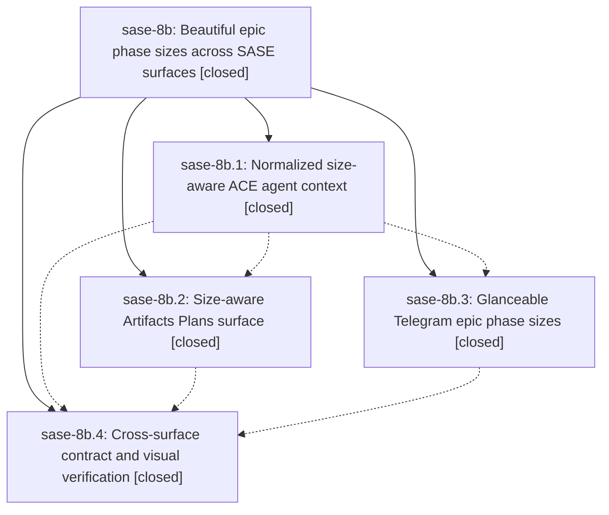

# Bead: sase-8b — Beautiful epic phase sizes across SASE surfaces

[Bead Pages](../README.md) / sase-8b

**Status:** ✓ closed · **Resolution:** (unrecorded) · **Type:** plan · **Tier:** epic
**Owner:** `bryanbugyi34@gmail.com`
**Created:** 2026-07-20 18:07:37 UTC · **Closed:** 2026-07-20 20:14:18 UTC
**Plan:** [202607/epic\_phase\_size\_surfaces.md](https://github.com/sase-org/sase--plans/blob/main/202607/epic_phase_size_surfaces.md)

## Description

Epic phase sizes are visible at a glance and attached to the correct phase wherever SASE presents epic plan metadata, with authoritative validation, safe legacy fallbacks, consistent accessible visuals, and no responsiveness or notification regression.

## Phases

| Bead | Title | Status | Size | Agents | Commits |
|---|---|---|---|---:|---:|
| [sase-8b.1](sase-8b.1.md) | Normalized size-aware ACE agent context | ✓ closed | medium | 2 | 1 |
| [sase-8b.2](sase-8b.2.md) | Size-aware Artifacts Plans surface | ✓ closed | medium | 1 | 0 |
| [sase-8b.3](sase-8b.3.md) | Glanceable Telegram epic phase sizes | ✓ closed | medium | 1 | 0 |
| [sase-8b.4](sase-8b.4.md) | Cross-surface contract and visual verification | ✓ closed | small | 1 | 1 |

## Lineage

## Agents

| Agent | Bead | Commits |
|---|---|---:|
| [bbugyi200.athena.sase-8b.1](https://github.com/sase-org/sase--agents/blob/main/agents/bbugyi200.athena.sase-8b.1/README.md) | [sase-8b.1](sase-8b.1.md) | 1 |
| [bbugyi200.athena.sase-8b.1--code](https://github.com/sase-org/sase--agents/blob/main/families/bbugyi200.athena.sase-8b.1.md#member-code) | [sase-8b.1](sase-8b.1.md) | 0 |
| [bbugyi200.athena.sase-8b.2--code](https://github.com/sase-org/sase--agents/blob/main/families/bbugyi200.athena.sase-8b.2.md#member-code) | [sase-8b.2](sase-8b.2.md) | 0 |
| [bbugyi200.athena.sase-8b.3--code](https://github.com/sase-org/sase--agents/blob/main/families/bbugyi200.athena.sase-8b.3.md#member-code) | [sase-8b.3](sase-8b.3.md) | 0 |
| [bbugyi200.athena.sase-8b.4](https://github.com/sase-org/sase--agents/blob/main/agents/bbugyi200.athena.sase-8b.4/README.md) | [sase-8b.4](sase-8b.4.md) | 1 |
| [bbugyi200.athena.sase-8b.land](https://github.com/sase-org/sase--agents/blob/main/agents/bbugyi200.athena.sase-8b.land/README.md) | [sase-8b](README.md) | 1 |

## Commits

| Commit | Subject | Bead | Committed (UTC) |
|---|---|---|---|
| [`00dd055`](https://github.com/sase-org/sase/commit/00dd055778bb153d2abbe622118413547f0e8969) | feat(ace): show normalized epic phase sizes (sase-8b.1) | [sase-8b.1](sase-8b.1.md) | 2026-07-20 18:43:35 |
| [`56264fa`](https://github.com/sase-org/sase/commit/56264fa316047d22aa480c6526314b5cc79b26fd) | feat(ace): show phase sizes in artifact plans (sase-8b.4) | [sase-8b.4](sase-8b.4.md) | 2026-07-20 19:54:20 |
| [`sase--plans@318ebdc`](https://github.com/sase-org/sase--plans/commit/318ebdc7dc2b4354c281478a6e57461c1e28d77b) | docs: mark epic phase size plan done (sase-8b) | [sase-8b](README.md) | 2026-07-20 20:38:36 |
