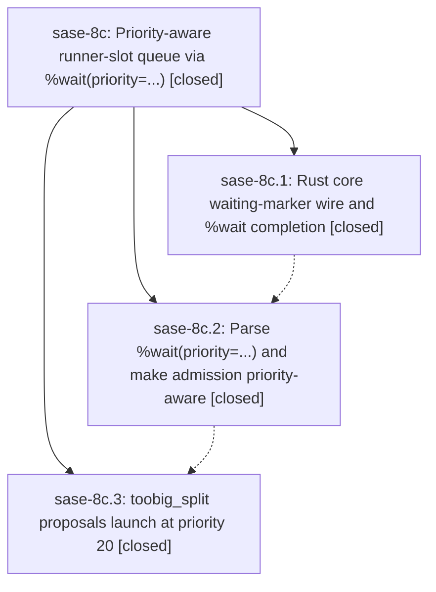

# Bead: sase-8c — Priority-aware runner-slot queue via %wait(priority=...)

[Bead Pages](../README.md) / sase-8c

**Status:** ✓ closed · **Resolution:** (unrecorded) · **Type:** plan · **Tier:** epic
**Owner:** `bryanbugyi34@gmail.com`
**Created:** 2026-07-20 18:10:58 UTC
**Plan:** [202607/wait\_priority\_directive.md](https://github.com/sase-org/sase--plans/blob/main/202607/wait_priority_directive.md)

## Description

The %wait directive gains an integer priority= keyword (default 10) that orders SASE's max-runner slot queue: lower values are admitted first, and equal priorities keep today's longest-waiting-first FIFO order. As the first consumer, the toobig_split chop in bugyi-chops launches all of its split agents at priority 20.

## Phases

| Bead | Title | Status | Size | Agents | Commits |
|---|---|---|---|---:|---:|
| [sase-8c.1](sase-8c.1.md) | Rust core waiting-marker wire and %wait completion | ✓ closed | small | 0 | 0 |
| [sase-8c.2](sase-8c.2.md) | Parse %wait(priority=...) and make admission priority-aware | ✓ closed | medium | 2 | 1 |
| [sase-8c.3](sase-8c.3.md) | toobig\_split proposals launch at priority 20 | ✓ closed | small | 0 | 0 |

## Lineage

## Agents

| Agent | Bead | Commits |
|---|---|---:|
| [bbugyi200.athena.sase-8c.2](https://github.com/sase-org/sase--agents/blob/main/agents/bbugyi200.athena.sase-8c.2/README.md) | [sase-8c.2](sase-8c.2.md) | 1 |
| [bbugyi200.athena.sase-8c.2--code](https://github.com/sase-org/sase--agents/blob/main/families/bbugyi200.athena.sase-8c.2.md#member-code) | [sase-8c.2](sase-8c.2.md) | 0 |

## Commits

| Commit | Subject | Bead | Committed (UTC) |
|---|---|---|---|
| [`46c2f06`](https://github.com/sase-org/sase/commit/46c2f0622a4998cf01e997a147df5c600ee1bae7) | feat: prioritize runner-slot wait admission (sase-8c.2) | [sase-8c.2](sase-8c.2.md) | 2026-07-20 18:49:41 |
