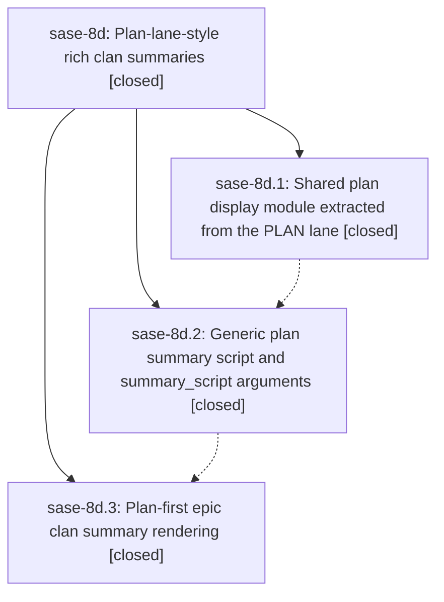

# Bead: sase-8d — Plan-lane-style rich clan summaries

[Bead Pages](../README.md) / sase-8d

**Status:** ✓ closed · **Resolution:** (unrecorded) · **Type:** plan · **Tier:** epic
**Owner:** `bryanbugyi34@gmail.com`
**Created:** 2026-07-20 18:39:47 UTC · **Closed:** 2026-07-20 21:21:40 UTC
**Plan:** [202607/clan\_summary\_plan\_lane.md](https://github.com/sase-org/sase--plans/blob/main/202607/clan_summary_plan_lane.md)

## Description

Epic agent clans present the same rich plan rendering in their clan summary that epic lander agents show in the PLAN lane, backed by generic %clan summary-script machinery that any clan declaration can reuse.

## Notes

COMMIT: 10ccbf65

## Phases

| Bead | Title | Status | Size | Agents | Commits |
|---|---|---|---|---:|---:|
| [sase-8d.1](sase-8d.1.md) | Shared plan display module extracted from the PLAN lane | ✓ closed | medium | 1 | 0 |
| [sase-8d.2](sase-8d.2.md) | Generic plan summary script and summary\_script arguments | ✓ closed | medium | 2 | 1 |
| [sase-8d.3](sase-8d.3.md) | Plan-first epic clan summary rendering | ✓ closed | medium | 2 | 1 |

## Lineage

## Agents

| Agent | Bead | Commits |
|---|---|---:|
| [bbugyi200.athena.sase-8d.1--code](https://github.com/sase-org/sase--agents/blob/main/families/bbugyi200.athena.sase-8d.1.md#member-code) | [sase-8d.1](sase-8d.1.md) | 0 |
| [bbugyi200.athena.sase-8d.2](https://github.com/sase-org/sase--agents/blob/main/agents/bbugyi200.athena.sase-8d.2/README.md) | [sase-8d.2](sase-8d.2.md) | 1 |
| [bbugyi200.athena.sase-8d.2--code](https://github.com/sase-org/sase--agents/blob/main/families/bbugyi200.athena.sase-8d.2.md#member-code) | [sase-8d.2](sase-8d.2.md) | 0 |
| [bbugyi200.athena.sase-8d.3](https://github.com/sase-org/sase--agents/blob/main/agents/bbugyi200.athena.sase-8d.3/README.md) | [sase-8d.3](sase-8d.3.md) | 1 |
| [bbugyi200.athena.sase-8d.3--code](https://github.com/sase-org/sase--agents/blob/main/families/bbugyi200.athena.sase-8d.3.md#member-code) | [sase-8d.3](sase-8d.3.md) | 0 |
| [bbugyi200.athena.sase-8d.land](https://github.com/sase-org/sase--agents/blob/main/agents/bbugyi200.athena.sase-8d.land/README.md) | [sase-8d](README.md) | 1 |
| [bbugyi200.athena.sase-8d.land--code](https://github.com/sase-org/sase--agents/blob/main/families/bbugyi200.athena.sase-8d.land.md#member-code) | [sase-8d](README.md) | 0 |

## Commits

| Commit | Subject | Bead | Committed (UTC) |
|---|---|---|---|
| [`cc8f7a5`](https://github.com/sase-org/sase/commit/cc8f7a50c26945cf0c3046b39098bc2e209d1ced) | feat: add generic clan plan summaries (sase-8d.2) | [sase-8d.2](sase-8d.2.md) | 2026-07-20 20:14:02 |
| [`7ab260d`](https://github.com/sase-org/sase/commit/7ab260ddba51c780c195d4180576fae508f0e87c) | fix: render epic clan summaries from authored plans (sase-8d.3) | [sase-8d.3](sase-8d.3.md) | 2026-07-20 20:37:20 |
| [`fc1c918`](https://github.com/sase-org/sase/commit/fc1c91844a8e4b1c0ad311c98d29f9c3beb61ecc) | fix(sdd): preserve plan path basenames when wrapping (sase-8d) | [sase-8d](README.md) | 2026-07-20 21:27:15 |
