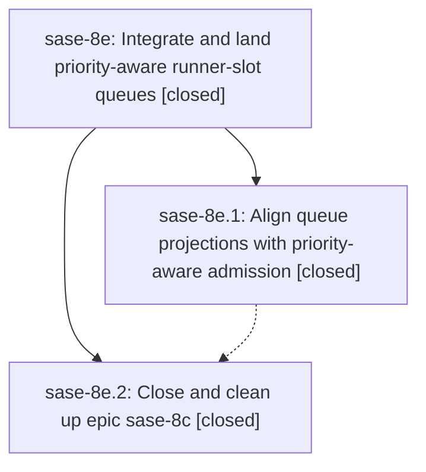

# Bead: sase-8e — Integrate and land priority-aware runner-slot queues

[Bead Pages](../README.md) / sase-8e

**Status:** ✓ closed · **Resolution:** (unrecorded) · **Type:** plan · **Tier:** epic
**Owner:** `bryanbugyi34@gmail.com`
**Created:** 2026-07-20 19:01:35 UTC · **Closed:** 2026-07-20 20:02:11 UTC
**Plan:** [202607/wait\_priority\_land.md](https://github.com/sase-org/sase--plans/blob/main/202607/wait_priority_land.md)

## Description

Existing agent-list and ACE queue-position projections match priority-aware runner-slot admission, then epic sase-8c is closed and its post-close Symvision and plan-state cleanup is completed.

## Notes

COMMIT: 3491b493

## Phases

| Bead | Title | Status | Size | Agents | Commits |
|---|---|---|---|---:|---:|
| [sase-8e.1](sase-8e.1.md) | Align queue projections with priority-aware admission | ✓ closed | small | 0 | 0 |
| [sase-8e.2](sase-8e.2.md) | Close and clean up epic sase-8c | ✓ closed | small | 0 | 0 |

## Lineage

