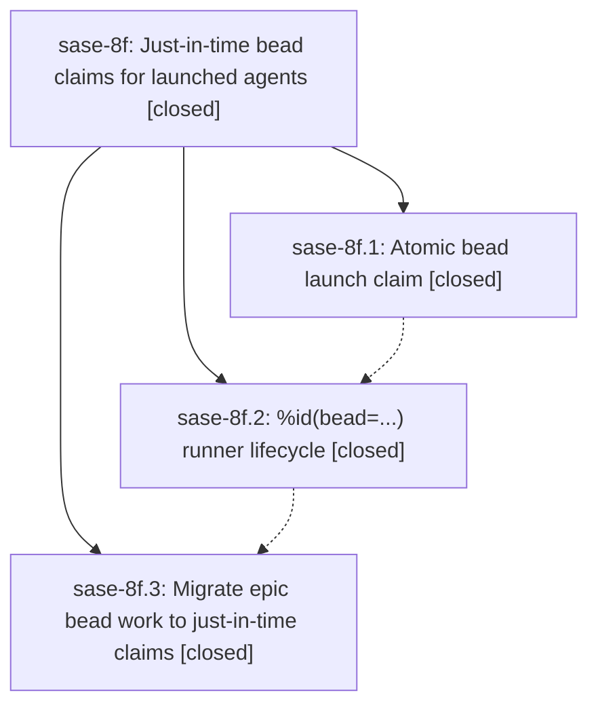

# Bead: sase-8f — Just-in-time bead claims for launched agents

[Bead Pages](../README.md) / sase-8f

**Status:** ✓ closed · **Resolution:** (unrecorded) · **Type:** plan · **Tier:** epic
**Owner:** `bryanbugyi34@gmail.com`
**Created:** 2026-07-20 19:48:27 UTC · **Closed:** 2026-07-20 21:51:34 UTC
**Plan:** [202607/jit\_bead\_claims.md](https://github.com/sase-org/sase--plans/blob/main/202607/jit_bead_claims.md)

## Description

Phase and epic beads stay open while their responsible agents are waiting, then transition atomically to in_progress with the responsible assignee immediately before model execution; claim failures prevent execution and report a clear bead-specific error.

## Notes

COMMIT: 29432eef

## Phases

| Bead | Title | Status | Size | Agents | Commits |
|---|---|---|---|---:|---:|
| [sase-8f.1](sase-8f.1.md) | Atomic bead launch claim | ✓ closed | medium | 2 | 2 |
| [sase-8f.2](sase-8f.2.md) | %id(bead=...) runner lifecycle | ✓ closed | medium | 2 | 2 |
| [sase-8f.3](sase-8f.3.md) | Migrate epic bead work to just-in-time claims | ✓ closed | medium | 2 | 1 |

## Lineage

## Agents

| Agent | Bead | Commits |
|---|---|---:|
| [bbugyi200.athena.sase-8f.1](https://github.com/sase-org/sase--agents/blob/main/agents/bbugyi200.athena.sase-8f.1/README.md) | [sase-8f.1](sase-8f.1.md) | 2 |
| [bbugyi200.athena.sase-8f.1--code](https://github.com/sase-org/sase--agents/blob/main/families/bbugyi200.athena.sase-8f.1.md#member-code) | [sase-8f.1](sase-8f.1.md) | 0 |
| [bbugyi200.athena.sase-8f.2](https://github.com/sase-org/sase--agents/blob/main/agents/bbugyi200.athena.sase-8f.2/README.md) | [sase-8f.2](sase-8f.2.md) | 2 |
| [bbugyi200.athena.sase-8f.2--code](https://github.com/sase-org/sase--agents/blob/main/families/bbugyi200.athena.sase-8f.2.md#member-code) | [sase-8f.2](sase-8f.2.md) | 0 |
| [bbugyi200.athena.sase-8f.3](https://github.com/sase-org/sase--agents/blob/main/agents/bbugyi200.athena.sase-8f.3/README.md) | [sase-8f.3](sase-8f.3.md) | 1 |
| [bbugyi200.athena.sase-8f.3--code](https://github.com/sase-org/sase--agents/blob/main/families/bbugyi200.athena.sase-8f.3.md#member-code) | [sase-8f.3](sase-8f.3.md) | 0 |
| [bbugyi200.athena.sase-8f.land](https://github.com/sase-org/sase--agents/blob/main/agents/bbugyi200.athena.sase-8f.land/README.md) | [sase-8f](README.md) | 1 |

## Commits

| Commit | Subject | Bead | Committed (UTC) |
|---|---|---|---|
| [`sase-core@7f80ad5`](https://github.com/sase-org/sase-core/commit/7f80ad5b1db54dbbfa89632ec0812b216c816c56) | feat(beads): add atomic agent launch claims (sase-8f.1) | [sase-8f.1](sase-8f.1.md) | 2026-07-20 20:20:52 |
| [`0ed5505`](https://github.com/sase-org/sase/commit/0ed55056f9acfb6ec60adba4b9d4330cacc4043d) | feat(beads): expose atomic agent launch claims (sase-8f.1) | [sase-8f.1](sase-8f.1.md) | 2026-07-20 20:21:27 |
| [`sase-core@67529b4`](https://github.com/sase-org/sase-core/commit/67529b44041e11995bc050dd9365affb0baab560) | feat(agent): carry bead IDs through repeat launches (sase-8f.2) | [sase-8f.2](sase-8f.2.md) | 2026-07-20 21:03:56 |
| [`b935b74`](https://github.com/sase-org/sase/commit/b935b7495d3b297b376370a5ef7bf9f9db9cdc92) | feat(agent): claim beads at launch execution (sase-8f.2) | [sase-8f.2](sase-8f.2.md) | 2026-07-20 21:04:38 |
| [`9d8b7e2`](https://github.com/sase-org/sase/commit/9d8b7e28054ef02f3bece5813fd337627144b0b2) | feat(beads): claim epic work just in time (sase-8f.3) | [sase-8f.3](sase-8f.3.md) | 2026-07-20 21:34:51 |
| [`sase--plans@29432ee`](https://github.com/sase-org/sase--plans/commit/29432eef3142ade5cb4793afccead15754576ba4) | docs: mark just-in-time bead claim plan done (sase-8f) | [sase-8f](README.md) | 2026-07-20 22:01:12 |
