# Bead: sase-8g — 24h log-audit bug sweep

[Bead Pages](../README.md) / sase-8g

**Status:** ✓ closed · **Resolution:** (unrecorded) · **Type:** plan · **Tier:** epic
**Owner:** `bryanbugyi34@gmail.com`
**Created:** 2026-07-20 20:31:12 UTC · **Closed:** 2026-07-21 11:41:49 UTC
**Plan:** [202607/audit\_24h\_fixes.md](https://github.com/sase-org/sase--plans/blob/main/202607/audit_24h_fixes.md)

## Description

The highest-frequency active failure loops found in the 2026-07-19/20 log audit stop recurring (hooks suffix oscillation, SDD clone wedge, axe restart churn, TUI error storms), verified regressions in the wait/runner-slot and retry flows are fixed, and log/test hygiene gaps that corrupted or bloated production state are closed.

## Phases

| Bead | Title | Status | Size | Agents | Commits |
|---|---|---|---|---:|---:|
| [sase-8g.1](sase-8g.1.md) | Converge hooks suffix-transform writes | ✓ closed | medium | 2 | 1 |
| [sase-8g.10](sase-8g.10.md) | Bound and harden log sinks | ✓ closed | medium | 2 | 2 |
| [sase-8g.11](sase-8g.11.md) | Keep tests out of production state | ✓ closed | medium | 2 | 2 |
| [sase-8g.2](sase-8g.2.md) | Retry family-phase agents under the family base name | ✓ closed | medium | 2 | 1 |
| [sase-8g.3](sase-8g.3.md) | Fix runner-slot wait regressions | ✓ closed | medium | 2 | 2 |
| [sase-8g.4](sase-8g.4.md) | Degrade TUI axe status gracefully | ✓ closed | small | 1 | 1 |
| [sase-8g.5](sase-8g.5.md) | Self-heal wedged SDD sidecar clones | ✓ closed | medium | 2 | 1 |
| [sase-8g.6](sase-8g.6.md) | Journal and damp axe fleet restarts | ✓ closed | medium | 2 | 1 |
| [sase-8g.7](sase-8g.7.md) | Reduce bead stream sync conflicts | ✓ closed | medium | 2 | 2 |
| [sase-8g.8](sase-8g.8.md) | Harden fork parent resolution | ✓ closed | medium | 2 | 1 |
| [sase-8g.9](sase-8g.9.md) | Close display and help-binding gaps | ✓ closed | small | 1 | 1 |

## Lineage

```mermaid
flowchart TD
    n0["sase-8g: 24h log-audit bug sweep [closed]"]
    n1["sase-8g.1: Converge hooks suffix-transform writes [closed]"]
    n2["sase-8g.10: Bound and harden log sinks [closed]"]
    n3["sase-8g.11: Keep tests out of production state [closed]"]
    n4["sase-8g.2: Retry family-phase agents under the family base name [closed]"]
    n5["sase-8g.3: Fix runner-slot wait regressions [closed]"]
    n6["sase-8g.4: Degrade TUI axe status gracefully [closed]"]
    n7["sase-8g.5: Self-heal wedged SDD sidecar clones [closed]"]
    n8["sase-8g.6: Journal and damp axe fleet restarts [closed]"]
    n9["sase-8g.7: Reduce bead stream sync conflicts [closed]"]
    n10["sase-8g.8: Harden fork parent resolution [closed]"]
    n11["sase-8g.9: Close display and help-binding gaps [closed]"]
    n0 --> n1
    n0 --> n2
    n0 --> n3
    n0 --> n4
    n0 --> n5
    n0 --> n6
    n0 --> n7
    n0 --> n8
    n0 --> n9
    n0 --> n10
    n0 --> n11
```

## Agents

| Agent | Bead | Commits |
|---|---|---:|
| [bbugyi200.athena.sase-8g.1](https://github.com/sase-org/sase--agents/blob/main/agents/bbugyi200.athena.sase-8g.1/README.md) | [sase-8g.1](sase-8g.1.md) | 1 |
| [bbugyi200.athena.sase-8g.1--code](https://github.com/sase-org/sase--agents/blob/main/families/bbugyi200.athena.sase-8g.1.md#member-code) | [sase-8g.1](sase-8g.1.md) | 0 |
| [bbugyi200.athena.sase-8g.10](https://github.com/sase-org/sase--agents/blob/main/agents/bbugyi200.athena.sase-8g.10/README.md) | [sase-8g.10](sase-8g.10.md) | 2 |
| [bbugyi200.athena.sase-8g.10--code](https://github.com/sase-org/sase--agents/blob/main/families/bbugyi200.athena.sase-8g.10.md#member-code) | [sase-8g.10](sase-8g.10.md) | 0 |
| [bbugyi200.athena.sase-8g.11](https://github.com/sase-org/sase--agents/blob/main/agents/bbugyi200.athena.sase-8g.11/README.md) | [sase-8g.11](sase-8g.11.md) | 2 |
| [bbugyi200.athena.sase-8g.11--code](https://github.com/sase-org/sase--agents/blob/main/families/bbugyi200.athena.sase-8g.11.md#member-code) | [sase-8g.11](sase-8g.11.md) | 0 |
| [bbugyi200.athena.sase-8g.2](https://github.com/sase-org/sase--agents/blob/main/agents/bbugyi200.athena.sase-8g.2/README.md) | [sase-8g.2](sase-8g.2.md) | 1 |
| [bbugyi200.athena.sase-8g.2--code](https://github.com/sase-org/sase--agents/blob/main/families/bbugyi200.athena.sase-8g.2.md#member-code) | [sase-8g.2](sase-8g.2.md) | 0 |
| [bbugyi200.athena.sase-8g.3](https://github.com/sase-org/sase--agents/blob/main/agents/bbugyi200.athena.sase-8g.3/README.md) | [sase-8g.3](sase-8g.3.md) | 2 |
| [bbugyi200.athena.sase-8g.3--code](https://github.com/sase-org/sase--agents/blob/main/families/bbugyi200.athena.sase-8g.3.md#member-code) | [sase-8g.3](sase-8g.3.md) | 0 |
| [bbugyi200.athena.sase-8g.4](https://github.com/sase-org/sase--agents/blob/main/agents/bbugyi200.athena.sase-8g.4/README.md) | [sase-8g.4](sase-8g.4.md) | 1 |
| [bbugyi200.athena.sase-8g.5](https://github.com/sase-org/sase--agents/blob/main/agents/bbugyi200.athena.sase-8g.5/README.md) | [sase-8g.5](sase-8g.5.md) | 1 |
| [bbugyi200.athena.sase-8g.5--code](https://github.com/sase-org/sase--agents/blob/main/families/bbugyi200.athena.sase-8g.5.md#member-code) | [sase-8g.5](sase-8g.5.md) | 0 |
| [bbugyi200.athena.sase-8g.6](https://github.com/sase-org/sase--agents/blob/main/agents/bbugyi200.athena.sase-8g.6/README.md) | [sase-8g.6](sase-8g.6.md) | 1 |
| [bbugyi200.athena.sase-8g.6--code](https://github.com/sase-org/sase--agents/blob/main/families/bbugyi200.athena.sase-8g.6.md#member-code) | [sase-8g.6](sase-8g.6.md) | 0 |
| [bbugyi200.athena.sase-8g.7](https://github.com/sase-org/sase--agents/blob/main/agents/bbugyi200.athena.sase-8g.7/README.md) | [sase-8g.7](sase-8g.7.md) | 2 |
| [bbugyi200.athena.sase-8g.7--code](https://github.com/sase-org/sase--agents/blob/main/families/bbugyi200.athena.sase-8g.7.md#member-code) | [sase-8g.7](sase-8g.7.md) | 0 |
| [bbugyi200.athena.sase-8g.8](https://github.com/sase-org/sase--agents/blob/main/agents/bbugyi200.athena.sase-8g.8/README.md) | [sase-8g.8](sase-8g.8.md) | 1 |
| [bbugyi200.athena.sase-8g.8--code](https://github.com/sase-org/sase--agents/blob/main/families/bbugyi200.athena.sase-8g.8.md#member-code) | [sase-8g.8](sase-8g.8.md) | 0 |
| [bbugyi200.athena.sase-8g.9](https://github.com/sase-org/sase--agents/blob/main/agents/bbugyi200.athena.sase-8g.9/README.md) | [sase-8g.9](sase-8g.9.md) | 1 |
| [bbugyi200.athena.sase-8g.land](https://github.com/sase-org/sase--agents/blob/main/agents/bbugyi200.athena.sase-8g.land/README.md) | [sase-8g](README.md) | 1 |

## Commits

| Commit | Subject | Bead | Committed (UTC) |
|---|---|---|---|
| [`47f6df2`](https://github.com/sase-org/sase/commit/47f6df24b96976ef4228910abc20182c77755372) | fix(tui): degrade invalid axe status gracefully (sase-8g.4) | [sase-8g.4](sase-8g.4.md) | 2026-07-20 20:48:33 |
| [`48abe26`](https://github.com/sase-org/sase/commit/48abe26ea0fed666630122073b303f4c8f67d0f2) | fix(agent): retry family phases from base names (sase-8g.2) | [sase-8g.2](sase-8g.2.md) | 2026-07-20 20:52:38 |
| [`sase-core@cc33040`](https://github.com/sase-org/sase-core/commit/cc330400e956101fbe8703f0f56dcb69968e0093) | fix(agent-scan): retain runner wait priority (sase-8g.3) | [sase-8g.3](sase-8g.3.md) | 2026-07-20 21:00:50 |
| [`9aed7d7`](https://github.com/sase-org/sase/commit/9aed7d72366ab5bbf243320fb3c621be21d6eea3) | fix(runner-slots): preserve waiter state across admission (sase-8g.3) | [sase-8g.3](sase-8g.3.md) | 2026-07-20 21:01:23 |
| [`e898a65`](https://github.com/sase-org/sase/commit/e898a65ba45c5a4baef7e9a0fa2f39135cac6ca0) | fix: honor display names and statistics help binding (sase-8g.9) | [sase-8g.9](sase-8g.9.md) | 2026-07-20 21:05:24 |
| [`84da472`](https://github.com/sase-org/sase/commit/84da4721c2f13a922590d1b30aea64b658b48aab) | fix: make suffix transforms merge current ChangeSpec state (sase-8g.1) | [sase-8g.1](sase-8g.1.md) | 2026-07-20 21:08:48 |
| [`e7c7680`](https://github.com/sase-org/sase/commit/e7c76807064bd53ea6fa97661c37d388d82fa1f8) | fix(sdd): self-heal wedged sidecar clones (sase-8g.5) | [sase-8g.5](sase-8g.5.md) | 2026-07-20 21:09:35 |
| [`0b9ef92`](https://github.com/sase-org/sase/commit/0b9ef92f46c33eb09c1e98fccdba1c4f78d204bf) | fix: harden fork parent resolution (sase-8g.8) | [sase-8g.8](sase-8g.8.md) | 2026-07-20 21:12:27 |
| [`4103e91`](https://github.com/sase-org/sase/commit/4103e9154d3f239a7652da06a30764a957aefe10) | fix(axe): damp restart storms (sase-8g.6) | [sase-8g.6](sase-8g.6.md) | 2026-07-20 21:15:48 |
| [`sase-core@06e500d`](https://github.com/sase-org/sase-core/commit/06e500dd84775a33931f549d6f042c4a06e13274) | fix(beads): reconcile concurrent event streams (sase-8g.7) | [sase-8g.7](sase-8g.7.md) | 2026-07-20 21:21:54 |
| [`sase-core@f304499`](https://github.com/sase-org/sase-core/commit/f304499e15f9996cfaf79a75fdabfaeb3a79a8ac) | fix(notifications): reap stale atomic temp files (sase-8g.10) | [sase-8g.10](sase-8g.10.md) | 2026-07-20 21:22:15 |
| [`350af96`](https://github.com/sase-org/sase/commit/350af961bfc203e823cf75ecd33b3ba6a9e0c742) | fix(logs): bound and harden persistent sinks (sase-8g.10) | [sase-8g.10](sase-8g.10.md) | 2026-07-20 21:22:56 |
| [`24d42d3`](https://github.com/sase-org/sase/commit/24d42d3813a12dd834e2766cffbd107136fa6513) | fix(beads): repair concurrent sync integrations (sase-8g.7) | [sase-8g.7](sase-8g.7.md) | 2026-07-20 21:24:29 |
| [`sase-core@f659642`](https://github.com/sase-org/sase-core/commit/f6596424d68371a16fe9554e11547cbefce338f4) | feat(telemetry): add exact-label cleanup API (sase-8g.11) | [sase-8g.11](sase-8g.11.md) | 2026-07-20 21:41:14 |
| [`866aea6`](https://github.com/sase-org/sase/commit/866aea65a3fc91224db3382125e71fd3494bcd70) | feat(telemetry): isolate test state and add cleanup command (sase-8g.11) | [sase-8g.11](sase-8g.11.md) | 2026-07-20 21:41:49 |
| [`sase--plans@9a8e010`](https://github.com/sase-org/sase--plans/commit/9a8e0105f3492818ed86d648ea0bdd606278b072) | chore(plans): mark audit\_24h\_fixes plan done (sase-8g) | [sase-8g](README.md) | 2026-07-21 11:43:15 |
