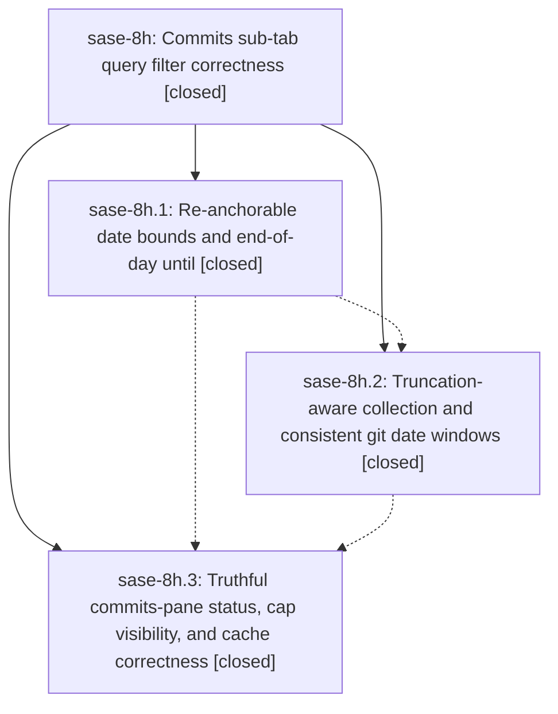

# Bead: sase-8h — Commits sub-tab query filter correctness

[Bead Pages](../README.md) / sase-8h

**Status:** ✓ closed · **Resolution:** (unrecorded) · **Type:** plan · **Tier:** epic
**Owner:** `bryanbugyi34@gmail.com` · **Assignee:** `sase-8h.land`
**Created:** 2026-07-21 14:14:38 UTC · **Closed:** 2026-07-21 16:31:12 UTC
**Plan:** [202607/commits\_filter\_correctness.md](https://github.com/sase-org/sase--plans/blob/main/202607/commits_filter_correctness.md)

## Description

Every supported query filter property on the Artifacts Commits sub-tab (repo:, author:, since:, until:, sidecar:, limit:, free text, and negations) behaves the way the query reads: date windows include the days the user named, relative windows stay anchored to "now", the match count never claims exactness while the hidden row cap is truncating results, and the cap itself is visible and actionable.

## Notes

COMMIT: 3acf36ad

## Phases

| Bead | Title | Status | Size | Agents | Commits |
|---|---|---|---|---:|---:|
| [sase-8h.1](sase-8h.1.md) | Re-anchorable date bounds and end-of-day until | ✓ closed | medium | 2 | 1 |
| [sase-8h.2](sase-8h.2.md) | Truncation-aware collection and consistent git date windows | ✓ closed | medium | 2 | 1 |
| [sase-8h.3](sase-8h.3.md) | Truthful commits-pane status, cap visibility, and cache correctness | ✓ closed | medium | 2 | 1 |

## Lineage

## Agents

| Agent | Bead | Commits |
|---|---|---:|
| [bbugyi200.athena.sase-8h.1](https://github.com/sase-org/sase--agents/blob/main/agents/bbugyi200.athena.sase-8h.1/README.md) | [sase-8h.1](sase-8h.1.md) | 1 |
| [bbugyi200.athena.sase-8h.1--code](https://github.com/sase-org/sase--agents/blob/main/families/bbugyi200.athena.sase-8h.1.md#member-code) | [sase-8h.1](sase-8h.1.md) | 0 |
| [bbugyi200.athena.sase-8h.2](https://github.com/sase-org/sase--agents/blob/main/agents/bbugyi200.athena.sase-8h.2/README.md) | [sase-8h.2](sase-8h.2.md) | 1 |
| [bbugyi200.athena.sase-8h.2--code](https://github.com/sase-org/sase--agents/blob/main/families/bbugyi200.athena.sase-8h.2.md#member-code) | [sase-8h.2](sase-8h.2.md) | 0 |
| [bbugyi200.athena.sase-8h.3](https://github.com/sase-org/sase--agents/blob/main/agents/bbugyi200.athena.sase-8h.3/README.md) | [sase-8h.3](sase-8h.3.md) | 1 |
| [bbugyi200.athena.sase-8h.3--code](https://github.com/sase-org/sase--agents/blob/main/families/bbugyi200.athena.sase-8h.3.md#member-code) | [sase-8h.3](sase-8h.3.md) | 0 |
| [bbugyi200.athena.sase-8h.land](https://github.com/sase-org/sase--agents/blob/main/agents/bbugyi200.athena.sase-8h.land/README.md) | [sase-8h](README.md) | 1 |

## Commits

| Commit | Subject | Bead | Committed (UTC) |
|---|---|---|---|
| [`08f91b4`](https://github.com/sase-org/sase/commit/08f91b43df3ccac5f40b2d7a334973ed7ddd8e85) | fix(vcs): re-anchor date filter bounds (sase-8h.1) | [sase-8h.1](sase-8h.1.md) | 2026-07-21 14:38:56 |
| [`f9345e7`](https://github.com/sase-org/sase/commit/f9345e7c11bedb3b947dc2e17ae65d7b2e6d6d72) | fix(vcs): make commit collection truncation-aware (sase-8h.2) | [sase-8h.2](sase-8h.2.md) | 2026-07-21 15:18:31 |
| [`54e8736`](https://github.com/sase-org/sase/commit/54e8736ea7ed487b3f600ad71939316764957b43) | fix(ace): report capped commit results truthfully (sase-8h.3) | [sase-8h.3](sase-8h.3.md) | 2026-07-21 16:17:45 |
| [`sase--plans@3acf36a`](https://github.com/sase-org/sase--plans/commit/3acf36ad053039d16bf60ba559182b105303dbba) | docs: mark commits filter correctness epic done (sase-8h) | [sase-8h](README.md) | 2026-07-21 16:32:59 |
