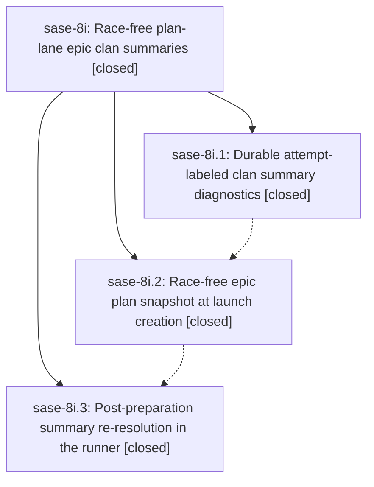

# Bead: sase-8i — Race-free plan-lane epic clan summaries

[Bead Pages](../README.md) / sase-8i

**Status:** ✓ closed · **Resolution:** (unrecorded) · **Type:** plan · **Tier:** epic
**Owner:** `bryanbugyi34@gmail.com` · **Assignee:** `sase-8i.land`
**Created:** 2026-07-21 14:39:27 UTC · **Closed:** 2026-07-21 16:25:22 UTC
**Plan:** [202607/race\_free\_epic\_clan\_summaries.md](https://github.com/sase-org/sase--plans/blob/main/202607/race_free_epic_clan_summaries.md)

## Description

Epic clan panels reliably render the PLAN-lane-style rich summary through the generic %clan summary_script machinery — never the bare "EPIC <id>" identity fallback in normal operation — because the launch flow hands the summary script a race-free plan source, the runner re-resolves the summary once the prepared workspace exists, and every residual failure leaves durable, attempt-labeled diagnostics instead of silently disappearing.

## Notes

COMMIT: 157cab94

## Phases

| Bead | Title | Status | Size | Agents | Commits |
|---|---|---|---|---:|---:|
| [sase-8i.1](sase-8i.1.md) | Durable attempt-labeled clan summary diagnostics | ✓ closed | small | 1 | 1 |
| [sase-8i.2](sase-8i.2.md) | Race-free epic plan snapshot at launch creation | ✓ closed | medium | 2 | 1 |
| [sase-8i.3](sase-8i.3.md) | Post-preparation summary re-resolution in the runner | ✓ closed | medium | 2 | 1 |

## Lineage

## Agents

| Agent | Bead | Commits |
|---|---|---:|
| [bbugyi200.athena.sase-8i.1](https://github.com/sase-org/sase--agents/blob/main/agents/bbugyi200.athena.sase-8i.1/README.md) | [sase-8i.1](sase-8i.1.md) | 1 |
| [bbugyi200.athena.sase-8i.2](https://github.com/sase-org/sase--agents/blob/main/agents/bbugyi200.athena.sase-8i.2/README.md) | [sase-8i.2](sase-8i.2.md) | 1 |
| [bbugyi200.athena.sase-8i.2--code](https://github.com/sase-org/sase--agents/blob/main/families/bbugyi200.athena.sase-8i.2.md#member-code) | [sase-8i.2](sase-8i.2.md) | 0 |
| [bbugyi200.athena.sase-8i.3](https://github.com/sase-org/sase--agents/blob/main/agents/bbugyi200.athena.sase-8i.3/README.md) | [sase-8i.3](sase-8i.3.md) | 1 |
| [bbugyi200.athena.sase-8i.3--code](https://github.com/sase-org/sase--agents/blob/main/families/bbugyi200.athena.sase-8i.3.md#member-code) | [sase-8i.3](sase-8i.3.md) | 0 |

## Commits

| Commit | Subject | Bead | Committed (UTC) |
|---|---|---|---|
| [`a75a477`](https://github.com/sase-org/sase/commit/a75a477d8b9511cdf9b16685828d9d94dfd8b037) | fix: persist clan summary stderr diagnostics (sase-8i.1) | [sase-8i.1](sase-8i.1.md) | 2026-07-21 15:02:21 |
| [`b825a0d`](https://github.com/sase-org/sase/commit/b825a0db49967ac243be2721eef722b5612c10a9) | fix: snapshot epic plans before clan launch (sase-8i.2) | [sase-8i.2](sase-8i.2.md) | 2026-07-21 15:38:14 |
| [`865d5c1`](https://github.com/sase-org/sase/commit/865d5c191e7fcecf6f7f96c9f1ba2732d6436d6b) | fix: refresh clan summaries after workspace preparation (sase-8i.3) | [sase-8i.3](sase-8i.3.md) | 2026-07-21 16:12:48 |
