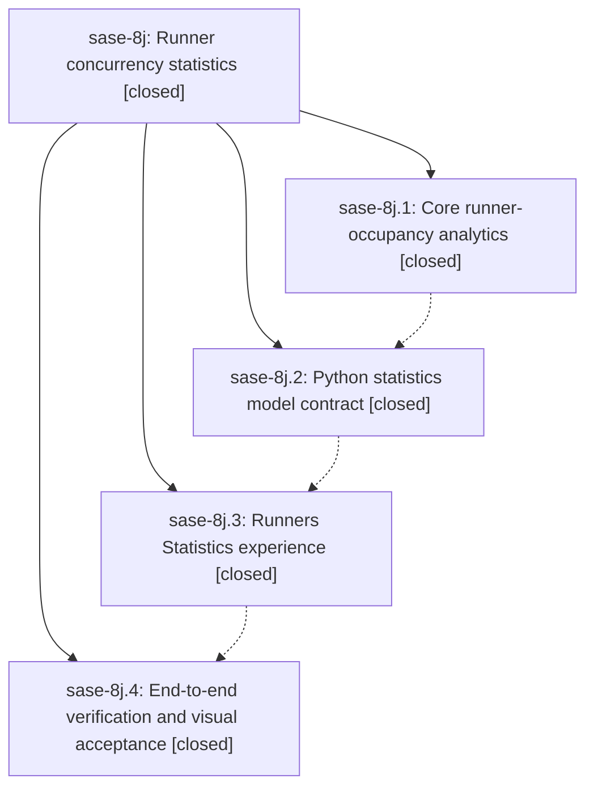

# Bead: sase-8j — Runner concurrency statistics

[Bead Pages](../README.md) / sase-8j

**Status:** ✓ closed · **Resolution:** (unrecorded) · **Type:** plan · **Tier:** epic
**Owner:** `bryanbugyi34@gmail.com` · **Assignee:** `sase-8j.land`
**Created:** 2026-07-21 20:28:12 UTC · **Closed:** 2026-07-21 22:28:46 UTC
**Plan:** [202607/runners\_statistics.md](https://github.com/sase-org/sase--plans/blob/main/202607/runners_statistics.md)

## Description

The SASE Admin Center Statistics tab gains a responsive Runners view that accurately and beautifully explains runner-slot occupancy throughout the selected time range with exact totals, time shares, and bounded trend slices.

## Notes

COMMIT: 5abc8eaf

## Phases

| Bead | Title | Status | Size | Agents | Commits |
|---|---|---|---|---:|---:|
| [sase-8j.1](sase-8j.1.md) | Core runner-occupancy analytics | ✓ closed | medium | 1 | 0 |
| [sase-8j.2](sase-8j.2.md) | Python statistics model contract | ✓ closed | small | 1 | 1 |
| [sase-8j.3](sase-8j.3.md) | Runners Statistics experience | ✓ closed | medium | 2 | 1 |
| [sase-8j.4](sase-8j.4.md) | End-to-end verification and visual acceptance | ✓ closed | small | 0 | 0 |

## Lineage

## Agents

| Agent | Bead | Commits |
|---|---|---:|
| [bbugyi200.athena.sase-8j.1--code](https://github.com/sase-org/sase--agents/blob/main/families/bbugyi200.athena.sase-8j.1.md#member-code) | [sase-8j.1](sase-8j.1.md) | 0 |
| [bbugyi200.athena.sase-8j.2](https://github.com/sase-org/sase--agents/blob/main/agents/bbugyi200.athena.sase-8j.2/README.md) | [sase-8j.2](sase-8j.2.md) | 1 |
| [bbugyi200.athena.sase-8j.3](https://github.com/sase-org/sase--agents/blob/main/agents/bbugyi200.athena.sase-8j.3/README.md) | [sase-8j.3](sase-8j.3.md) | 1 |
| [bbugyi200.athena.sase-8j.3--code](https://github.com/sase-org/sase--agents/blob/main/families/bbugyi200.athena.sase-8j.3.md#member-code) | [sase-8j.3](sase-8j.3.md) | 0 |

## Commits

| Commit | Subject | Bead | Committed (UTC) |
|---|---|---|---|
| [`624adb3`](https://github.com/sase-org/sase/commit/624adb3d843b107513ee4d150d3102abe8a9a9a5) | feat(stats): add Python runner-occupancy view model contract (sase-8j.2) | [sase-8j.2](sase-8j.2.md) | 2026-07-21 21:34:06 |
| [`6c052e8`](https://github.com/sase-org/sase/commit/6c052e8169789a0b4ffa1fd536cf642c9a9bd88f) | feat(tui): add runner statistics experience (sase-8j.3) | [sase-8j.3](sase-8j.3.md) | 2026-07-21 22:07:24 |
