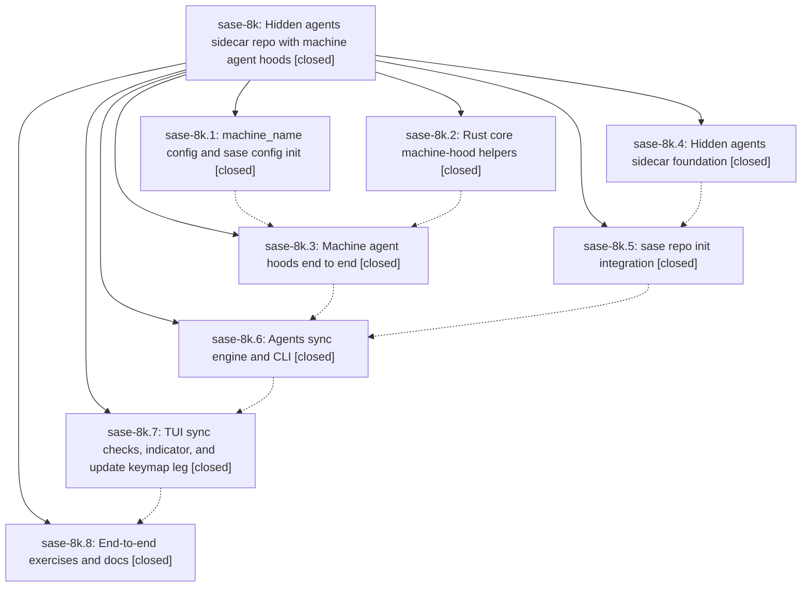

# Bead: sase-8k — Hidden agents sidecar repo with machine agent hoods

[Bead Pages](../README.md) / sase-8k

**Status:** ✓ closed · **Resolution:** (unrecorded) · **Type:** plan · **Tier:** epic
**Owner:** `bryanbugyi34@gmail.com` · **Assignee:** `sase-8k.land`
**Created:** 2026-07-22 14:53:31 UTC · **Closed:** 2026-07-22 21:25:01 UTC
**Plan:** [sase/repos/plans/202607/agents\_sidecar\_repo.md](https://github.com/sase-org/sase--plans/blob/main/sase/repos/plans/202607/agents_sidecar_repo.md)

## Description

Every sase-managed project gains a hidden `<project>--agents` sidecar repo that publicly (or privately, by config) stores the data needed to reconstruct every sase agent that created a commit for that project; agent names become globally unique via required machine agent hoods; syncing is wired into `sase repo init`, the `,U` comprehensive update, a cheap periodic per-project check, and a distinct top-right TUI indicator.

## Notes

COMMIT: 9a835e1d

## Phases

| Bead | Title | Status | Size | Agents | Commits |
|---|---|---|---|---:|---:|
| [sase-8k.1](sase-8k.1.md) | machine\_name config and sase config init | ✓ closed | medium | 2 | 1 |
| [sase-8k.2](sase-8k.2.md) | Rust core machine-hood helpers | ✓ closed | small | 1 | 1 |
| [sase-8k.3](sase-8k.3.md) | Machine agent hoods end to end | ✓ closed | large | 2 | 1 |
| [sase-8k.4](sase-8k.4.md) | Hidden agents sidecar foundation | ✓ closed | medium | 2 | 1 |
| [sase-8k.5](sase-8k.5.md) | sase repo init integration | ✓ closed | medium | 2 | 1 |
| [sase-8k.6](sase-8k.6.md) | Agents sync engine and CLI | ✓ closed | large | 2 | 1 |
| [sase-8k.7](sase-8k.7.md) | TUI sync checks, indicator, and update keymap leg | ✓ closed | medium | 2 | 1 |
| [sase-8k.8](sase-8k.8.md) | End-to-end exercises and docs | ✓ closed | small | 1 | 1 |

## Lineage

## Agents

| Agent | Bead | Commits |
|---|---|---:|
| [bbugyi200.athena.sase-8k.1](https://github.com/sase-org/sase--agents/blob/main/agents/bbugyi200.athena.sase-8k.1/README.md) | [sase-8k.1](sase-8k.1.md) | 1 |
| [bbugyi200.athena.sase-8k.1--code](https://github.com/sase-org/sase--agents/blob/main/families/bbugyi200.athena.sase-8k.1.md#member-code) | [sase-8k.1](sase-8k.1.md) | 0 |
| [bbugyi200.athena.sase-8k.2](https://github.com/sase-org/sase--agents/blob/main/agents/bbugyi200.athena.sase-8k.2/README.md) | [sase-8k.2](sase-8k.2.md) | 1 |
| [bbugyi200.athena.sase-8k.3](https://github.com/sase-org/sase--agents/blob/main/agents/bbugyi200.athena.sase-8k.3/README.md) | [sase-8k.3](sase-8k.3.md) | 1 |
| [bbugyi200.athena.sase-8k.3--code](https://github.com/sase-org/sase--agents/blob/main/families/bbugyi200.athena.sase-8k.3.md#member-code) | [sase-8k.3](sase-8k.3.md) | 0 |
| [bbugyi200.athena.sase-8k.4](https://github.com/sase-org/sase--agents/blob/main/agents/bbugyi200.athena.sase-8k.4/README.md) | [sase-8k.4](sase-8k.4.md) | 1 |
| [bbugyi200.athena.sase-8k.4--code](https://github.com/sase-org/sase--agents/blob/main/families/bbugyi200.athena.sase-8k.4.md#member-code) | [sase-8k.4](sase-8k.4.md) | 0 |
| [bbugyi200.athena.sase-8k.5](https://github.com/sase-org/sase--agents/blob/main/agents/bbugyi200.athena.sase-8k.5/README.md) | [sase-8k.5](sase-8k.5.md) | 1 |
| [bbugyi200.athena.sase-8k.5--code](https://github.com/sase-org/sase--agents/blob/main/families/bbugyi200.athena.sase-8k.5.md#member-code) | [sase-8k.5](sase-8k.5.md) | 0 |
| [bbugyi200.athena.sase-8k.6](https://github.com/sase-org/sase--agents/blob/main/agents/bbugyi200.athena.sase-8k.6/README.md) | [sase-8k.6](sase-8k.6.md) | 1 |
| [bbugyi200.athena.sase-8k.6--code](https://github.com/sase-org/sase--agents/blob/main/families/bbugyi200.athena.sase-8k.6.md#member-code) | [sase-8k.6](sase-8k.6.md) | 0 |
| [bbugyi200.athena.sase-8k.7](https://github.com/sase-org/sase--agents/blob/main/agents/bbugyi200.athena.sase-8k.7/README.md) | [sase-8k.7](sase-8k.7.md) | 1 |
| [bbugyi200.athena.sase-8k.7--code](https://github.com/sase-org/sase--agents/blob/main/families/bbugyi200.athena.sase-8k.7.md#member-code) | [sase-8k.7](sase-8k.7.md) | 0 |
| [bbugyi200.athena.sase-8k.8](https://github.com/sase-org/sase--agents/blob/main/agents/bbugyi200.athena.sase-8k.8/README.md) | [sase-8k.8](sase-8k.8.md) | 1 |
| [bbugyi200.athena.sase-8k.land](https://github.com/sase-org/sase--agents/blob/main/agents/bbugyi200.athena.sase-8k.land/README.md) | [sase-8k](README.md) | 2 |
| [bbugyi200.athena.sase-8k.land--code](https://github.com/sase-org/sase--agents/blob/main/families/bbugyi200.athena.sase-8k.land.md#member-code) | [sase-8k](README.md) | 0 |

## Commits

| Commit | Subject | Bead | Committed (UTC) |
|---|---|---|---|
| [`770ad01`](https://github.com/sase-org/sase/commit/770ad01ab111e5454d375ec786a1e60cb64c775d) | feat(config)!: add machine identity initialization (sase-8k.1) | [sase-8k.1](sase-8k.1.md) | 2026-07-22 15:51:28 |
| [`ba0a3cd`](https://github.com/sase-org/sase/commit/ba0a3cd92f02754effe0db0f647ff21c82b8b32f) | feat: add hidden agents sidecar foundation (sase-8k.4) | [sase-8k.4](sase-8k.4.md) | 2026-07-22 15:54:46 |
| [`sase-core@6b39455`](https://github.com/sase-org/sase-core/commit/6b39455b8899917df4c92f5c59a765b1286ea91a) | feat(machine\_hood): add machine agent hood canonicalization helpers (sase-8k.2) | [sase-8k.2](sase-8k.2.md) | 2026-07-22 16:12:40 |
| [`44ccbe8`](https://github.com/sase-org/sase/commit/44ccbe84c7c23d1ad21433b428235dc37493072e) | feat(repo-init): initialize agents sidecars with explicit consent (sase-8k.5) | [sase-8k.5](sase-8k.5.md) | 2026-07-22 17:11:53 |
| [`e828aa9`](https://github.com/sase-org/sase/commit/e828aa927e3dff3c3c4f1f4539a3c8c5201ea83e) | feat: add machine-qualified agent hoods (sase-8k.3) | [sase-8k.3](sase-8k.3.md) | 2026-07-22 19:07:39 |
| [`58d1ca2`](https://github.com/sase-org/sase/commit/58d1ca2da51df1bcd9bdc2464503985de59a416c) | feat(agents): add completed agent sync engine (sase-8k.6) | [sase-8k.6](sase-8k.6.md) | 2026-07-22 20:00:45 |
| [`a075c01`](https://github.com/sase-org/sase/commit/a075c014fd5faed7f6c7556fca7d4db51286b891) | feat(ace): surface agents repository sync status (sase-8k.7) | [sase-8k.7](sase-8k.7.md) | 2026-07-22 20:47:46 |
| [`b8441dc`](https://github.com/sase-org/sase/commit/b8441dc3895139d82bcc19f2391db5080ad6b91c) | test: add two-machine agents sidecar sync e2e exercise (sase-8k.8) | [sase-8k.8](sase-8k.8.md) | 2026-07-22 21:00:06 |
| [`61395b8`](https://github.com/sase-org/sase/commit/61395b8ab1fa2f2de8158f677abd2ae9017d4b6d) | fix(agents): normalize machine-hood presentation (sase-8k) | [sase-8k](README.md) | 2026-07-22 21:28:12 |
| [`sase--plans@9a835e1`](https://github.com/sase-org/sase--plans/commit/9a835e1d4634e3f79c4c62b6a9635a1e542658d5) | docs(plans): mark agents sidecar epic done (sase-8k) | [sase-8k](README.md) | 2026-07-22 21:28:38 |
