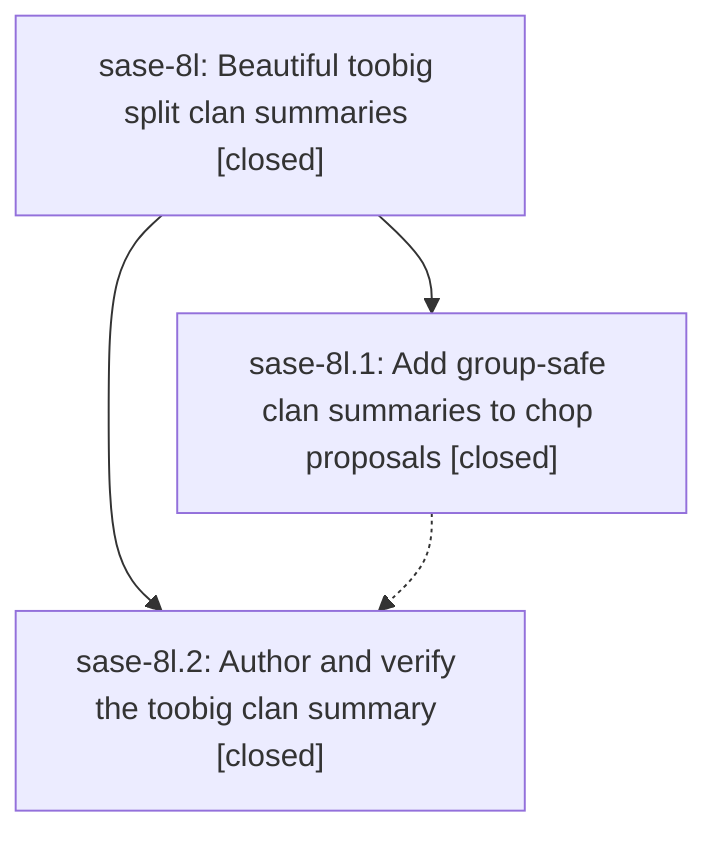

# Bead: sase-8l — Beautiful toobig split clan summaries

[Bead Pages](../README.md) / sase-8l

**Status:** ✓ closed · **Resolution:** (unrecorded) · **Type:** plan · **Tier:** epic
**Owner:** `bryanbugyi34@gmail.com` · **Assignee:** `sase-8l.land`
**Created:** 2026-07-22 15:17:04 UTC · **Closed:** 2026-07-22 17:32:39 UTC
**Plan:** [202607/toobig\_clan\_summary.md](https://github.com/sase-org/sase--plans/blob/main/202607/toobig_clan_summary.md)

## Description

Carry one safe, polished scan summary through the structured chop contract and attach it to the declaring toobig clan.

## Notes

COMMIT: ccba7718

## Phases

| Bead | Title | Status | Size | Agents | Commits |
|---|---|---|---|---:|---:|
| [sase-8l.1](sase-8l.1.md) | Add group-safe clan summaries to chop proposals | ✓ closed | large | 2 | 2 |
| [sase-8l.2](sase-8l.2.md) | Author and verify the toobig clan summary | ✓ closed | medium | 1 | 0 |

## Lineage

## Agents

| Agent | Bead | Commits |
|---|---|---:|
| [bbugyi200.athena.sase-8l.1](https://github.com/sase-org/sase--agents/blob/main/agents/bbugyi200.athena.sase-8l.1/README.md) | [sase-8l.1](sase-8l.1.md) | 2 |
| [bbugyi200.athena.sase-8l.1--code](https://github.com/sase-org/sase--agents/blob/main/families/bbugyi200.athena.sase-8l.1.md#member-code) | [sase-8l.1](sase-8l.1.md) | 0 |
| [bbugyi200.athena.sase-8l.2--code](https://github.com/sase-org/sase--agents/blob/main/families/bbugyi200.athena.sase-8l.2.md#member-code) | [sase-8l.2](sase-8l.2.md) | 0 |
| [bbugyi200.athena.sase-8l.land](https://github.com/sase-org/sase--agents/blob/main/agents/bbugyi200.athena.sase-8l.land/README.md) | [sase-8l](README.md) | 1 |

## Commits

| Commit | Subject | Bead | Committed (UTC) |
|---|---|---|---|
| [`sase-core@778a94b`](https://github.com/sase-org/sase-core/commit/778a94b2588efeebded13cf2c24e9c65bf79ce74) | feat(axe): support clan summaries in chop proposals (sase-8l.1) | [sase-8l.1](sase-8l.1.md) | 2026-07-22 16:41:32 |
| [`eaef2d7`](https://github.com/sase-org/sase/commit/eaef2d78b1faf15a0764e08b066383ee4d6a48e3) | feat(axe): carry clan summaries through chop launches (sase-8l.1) | [sase-8l.1](sase-8l.1.md) | 2026-07-22 16:42:07 |
| [`sase--plans@ccba771`](https://github.com/sase-org/sase--plans/commit/ccba7718a993c6267c3ab1b73bd0b942ed4917dd) | docs: mark toobig clan summary plan done (sase-8l) | [sase-8l](README.md) | 2026-07-22 17:34:42 |
