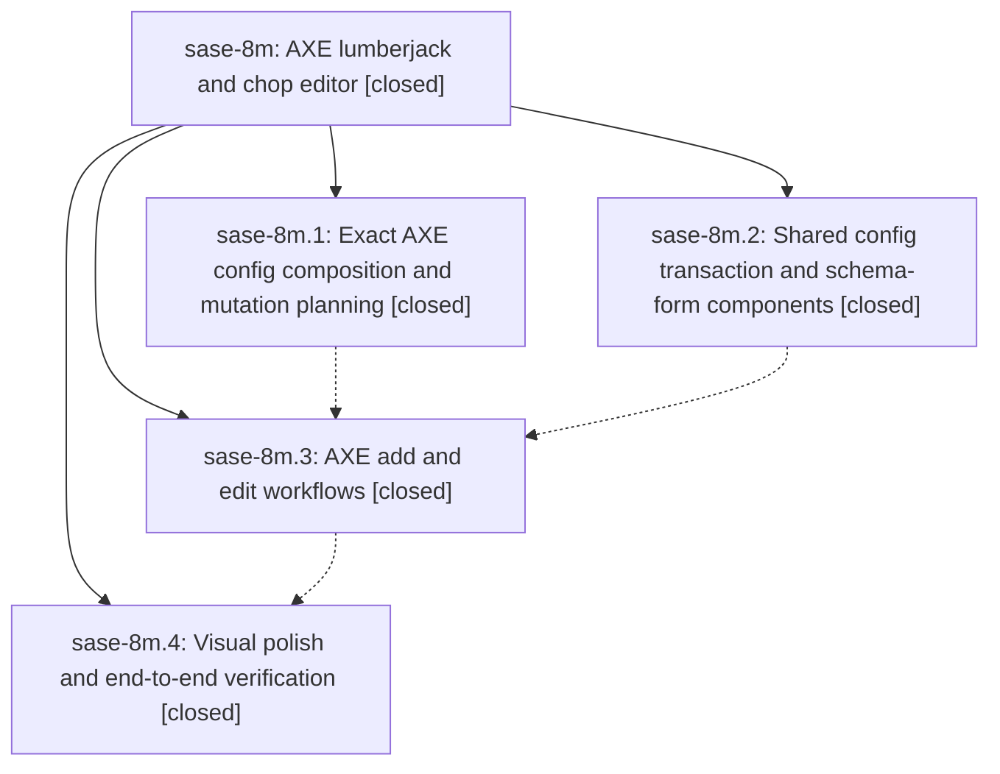

# Bead: sase-8m — AXE lumberjack and chop editor

[Bead Pages](../README.md) / sase-8m

**Status:** ✓ closed · **Resolution:** (unrecorded) · **Type:** plan · **Tier:** epic
**Owner:** `bryanbugyi34@gmail.com` · **Assignee:** `sase-8m.land`
**Created:** 2026-07-22 15:38:56 UTC · **Closed:** 2026-07-22 20:00:04 UTC
**Plan:** [202607/axe\_config\_editor.md](https://github.com/sase-org/sase--plans/blob/main/202607/axe_config_editor.md)

## Description

Users can add lumberjacks and chops and safely edit selected AXE entries from the sase ace AXE tab through a responsive, validated, source-preserving, and polished TUI workflow.

## Phases

| Bead | Title | Status | Size | Agents | Commits |
|---|---|---|---|---:|---:|
| [sase-8m.1](sase-8m.1.md) | Exact AXE config composition and mutation planning | ✓ closed | medium | 2 | 2 |
| [sase-8m.2](sase-8m.2.md) | Shared config transaction and schema-form components | ✓ closed | medium | 2 | 1 |
| [sase-8m.3](sase-8m.3.md) | AXE add and edit workflows | ✓ closed | medium | 2 | 1 |
| [sase-8m.4](sase-8m.4.md) | Visual polish and end-to-end verification | ✓ closed | small | 1 | 1 |

## Lineage

## Agents

| Agent | Bead | Commits |
|---|---|---:|
| [bbugyi200.athena.sase-8m.1](https://github.com/sase-org/sase--agents/blob/main/agents/bbugyi200.athena.sase-8m.1/README.md) | [sase-8m.1](sase-8m.1.md) | 2 |
| [bbugyi200.athena.sase-8m.1--code](https://github.com/sase-org/sase--agents/blob/main/families/bbugyi200.athena.sase-8m.1.md#member-code) | [sase-8m.1](sase-8m.1.md) | 0 |
| [bbugyi200.athena.sase-8m.2](https://github.com/sase-org/sase--agents/blob/main/agents/bbugyi200.athena.sase-8m.2/README.md) | [sase-8m.2](sase-8m.2.md) | 1 |
| [bbugyi200.athena.sase-8m.2--code](https://github.com/sase-org/sase--agents/blob/main/families/bbugyi200.athena.sase-8m.2.md#member-code) | [sase-8m.2](sase-8m.2.md) | 0 |
| [bbugyi200.athena.sase-8m.3](https://github.com/sase-org/sase--agents/blob/main/agents/bbugyi200.athena.sase-8m.3/README.md) | [sase-8m.3](sase-8m.3.md) | 1 |
| [bbugyi200.athena.sase-8m.3--code](https://github.com/sase-org/sase--agents/blob/main/families/bbugyi200.athena.sase-8m.3.md#member-code) | [sase-8m.3](sase-8m.3.md) | 0 |
| [bbugyi200.athena.sase-8m.4](https://github.com/sase-org/sase--agents/blob/main/agents/bbugyi200.athena.sase-8m.4/README.md) | [sase-8m.4](sase-8m.4.md) | 1 |

## Commits

| Commit | Subject | Bead | Committed (UTC) |
|---|---|---|---|
| [`331932b`](https://github.com/sase-org/sase/commit/331932b2c8c82517dd5920b5129822e50466079d) | feat(ace): add shared config editor components (sase-8m.2) | [sase-8m.2](sase-8m.2.md) | 2026-07-22 17:19:57 |
| [`sase-core@213bd95`](https://github.com/sase-org/sase-core/commit/213bd95e3567a1397671d511ade911bfb31af3bc) | feat(config): add exact AXE composition planning (sase-8m.1) | [sase-8m.1](sase-8m.1.md) | 2026-07-22 17:22:55 |
| [`5a9cef8`](https://github.com/sase-org/sase/commit/5a9cef88329bc5f3323603300bc86040509530a0) | feat(axe): apply exact conflict-safe config edits (sase-8m.1) | [sase-8m.1](sase-8m.1.md) | 2026-07-22 17:23:39 |
| [`058cd64`](https://github.com/sase-org/sase/commit/058cd646fb1d3113fe28186473f252dc4f488d13) | feat(axe): add config management workflows (sase-8m.3) | [sase-8m.3](sase-8m.3.md) | 2026-07-22 18:39:16 |
| [`5a15d18`](https://github.com/sase-org/sase/commit/5a15d188c2af2e21c06465e70e99913ebee25a9c) | test(axe): add editor polish verification (sase-8m.4) | [sase-8m.4](sase-8m.4.md) | 2026-07-22 19:44:02 |
