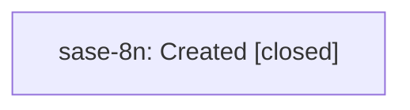

# Bead: sase-8n — Created

[Bead Pages](../README.md) / sase-8n

**Status:** ✓ closed · **Resolution:** (unrecorded) · **Type:** plan · **Tier:** epic
**Owner:** `bryanbugyi34@gmail.com`
**Created:** 2026-07-22 16:48:38 UTC · **Closed:** 2026-07-24 18:26:16 UTC
**Plan:** [plan.md](https://github.com/sase-org/sase--plans/blob/main/plan.md)

## Lineage

