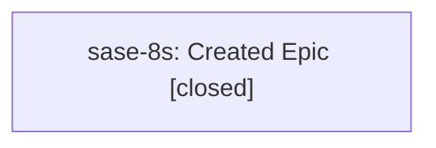

# Bead: sase-8s — Created Epic

[Bead Pages](../README.md) / sase-8s

**Status:** ✓ closed · **Resolution:** (unrecorded) · **Type:** plan · **Tier:** epic
**Owner:** `bryanbugyi34@gmail.com` · **Assignee:** `bob`
**Created:** 2026-07-22 16:50:19 UTC · **Closed:** 2026-07-24 18:26:16 UTC
**Plan:** [.sase-check-tmp.n8lLpAvb/pytest-of-bryan/pytest-0/popen-gw0/test\_bead\_cli\_golden\_contract\_1/initialized/plans/new.md](https://github.com/sase-org/sase--plans/blob/main/.sase-check-tmp.n8lLpAvb/pytest-of-bryan/pytest-0/popen-gw0/test_bead_cli_golden_contract_1/initialized/plans/new.md)

## Description

Created description

## Lineage

