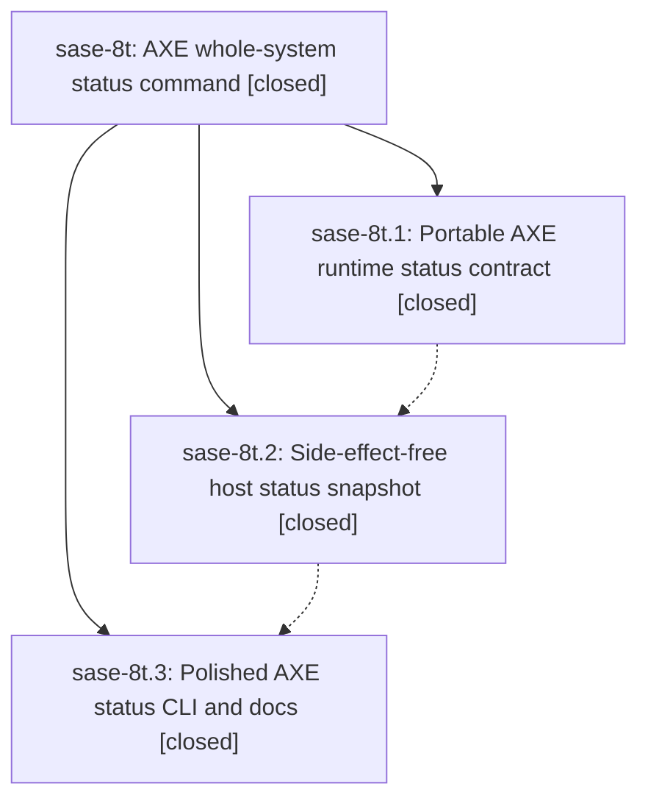

# Bead: sase-8t — AXE whole-system status command

[Bead Pages](../README.md) / sase-8t

**Status:** ✓ closed · **Resolution:** (unrecorded) · **Type:** plan · **Tier:** epic
**Owner:** `bryanbugyi34@gmail.com` · **Assignee:** `athena.sase-8t.land`
**Created:** 2026-07-23 11:31:16 UTC · **Closed:** 2026-07-23 13:17:55 UTC
**Plan:** [202607/axe\_status.md](https://github.com/sase-org/sase--plans/blob/main/202607/axe_status.md)

## Description

Operators can run `sase axe status` to get one read-only, trustworthy, beautiful snapshot of AXE lifecycle intent, orchestrator coherence, lumberjack health, runner occupancy, and actionable recovery guidance in either human or stable JSON form.

## Notes

COMMIT: 00538bca

## Phases

| Bead | Title | Status | Size | Agents | Commits |
|---|---|---|---|---:|---:|
| [sase-8t.1](sase-8t.1.md) | Portable AXE runtime status contract | ✓ closed | medium | 1 | 1 |
| [sase-8t.2](sase-8t.2.md) | Side-effect-free host status snapshot | ✓ closed | medium | 2 | 1 |
| [sase-8t.3](sase-8t.3.md) | Polished AXE status CLI and docs | ✓ closed | medium | 2 | 1 |

## Lineage

## Agents

| Agent | Bead | Commits |
|---|---|---:|
| [bbugyi200.athena.sase-8t.1](https://github.com/sase-org/sase--agents/blob/main/agents/bbugyi200.athena.sase-8t.1/README.md) | [sase-8t.1](sase-8t.1.md) | 1 |
| [bbugyi200.athena.sase-8t.2](https://github.com/sase-org/sase--agents/blob/main/agents/bbugyi200.athena.sase-8t.2/README.md) | [sase-8t.2](sase-8t.2.md) | 1 |
| [bbugyi200.athena.sase-8t.2--code](https://github.com/sase-org/sase--agents/blob/main/families/bbugyi200.athena.sase-8t.2.md#member-code) | [sase-8t.2](sase-8t.2.md) | 0 |
| [bbugyi200.athena.sase-8t.3](https://github.com/sase-org/sase--agents/blob/main/agents/bbugyi200.athena.sase-8t.3/README.md) | [sase-8t.3](sase-8t.3.md) | 1 |
| [bbugyi200.athena.sase-8t.3--code](https://github.com/sase-org/sase--agents/blob/main/families/bbugyi200.athena.sase-8t.3.md#member-code) | [sase-8t.3](sase-8t.3.md) | 0 |
| [bbugyi200.athena.sase-8t.land](https://github.com/sase-org/sase--agents/blob/main/agents/bbugyi200.athena.sase-8t.land/README.md) | [sase-8t](README.md) | 1 |

## Commits

| Commit | Subject | Bead | Committed (UTC) |
|---|---|---|---|
| [`sase-core@be7318d`](https://github.com/sase-org/sase-core/commit/be7318d7e3ea4b3c500619faebab5928a2c08bba) | feat(axe): add portable runtime status classifier (sase-8t.1) | [sase-8t.1](sase-8t.1.md) | 2026-07-23 12:03:31 |
| [`0689333`](https://github.com/sase-org/sase/commit/0689333f778ad10c96e2fe82a03076b3c3f7e752) | feat(axe): add side-effect-free status snapshots (sase-8t.2) | [sase-8t.2](sase-8t.2.md) | 2026-07-23 12:38:49 |
| [`d0cf97a`](https://github.com/sase-org/sase/commit/d0cf97a12930b4c28e0f86097518cf05965ca306) | feat(axe): add whole-system status command (sase-8t.3) | [sase-8t.3](sase-8t.3.md) | 2026-07-23 13:05:49 |
| [`sase--plans@00538bc`](https://github.com/sase-org/sase--plans/commit/00538bcafd7531383169792d98f43e02bc888289) | docs: mark AXE status plan done (sase-8t) | [sase-8t](README.md) | 2026-07-23 13:33:49 |
