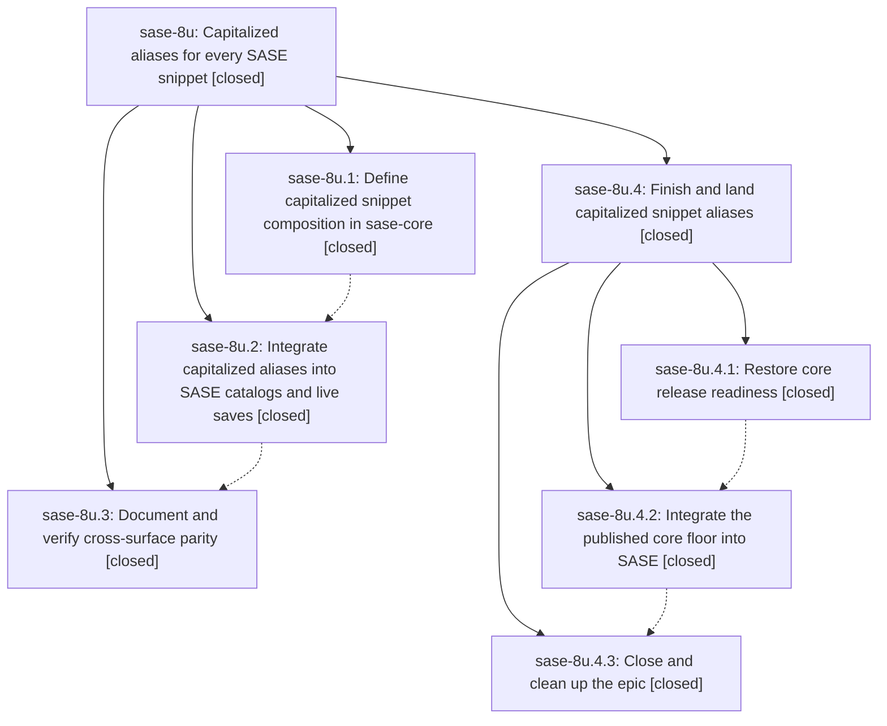

# Bead: sase-8u — Capitalized aliases for every SASE snippet

[Bead Pages](../README.md) / sase-8u

**Status:** ✓ closed · **Resolution:** (unrecorded) · **Type:** plan · **Tier:** epic
**Owner:** `bryanbugyi34@gmail.com` · **Assignee:** `athena.sase-8u.land`
**Created:** 2026-07-23 12:10:53 UTC · **Closed:** 2026-07-24 18:38:56 UTC
**Plan:** [202607/capitalized\_snippet\_aliases.md](https://github.com/sase-org/sase--plans/blob/main/202607/capitalized_snippet_aliases.md)

## Description

Make every effective SASE snippet available through a generated initial-capital trigger with a correspondingly capitalized expansion, consistently across ACE, editor helpers, and the native LSP fallback.

## Phases

| Bead | Title | Status | Size | Agents | Commits |
|---|---|---|---|---:|---:|
| [sase-8u.1](sase-8u.1.md) | Define capitalized snippet composition in sase-core | ✓ closed | medium | 2 | 1 |
| [sase-8u.2](sase-8u.2.md) | Integrate capitalized aliases into SASE catalogs and live saves | ✓ closed | medium | 2 | 1 |
| [sase-8u.3](sase-8u.3.md) | Document and verify cross-surface parity | ✓ closed | small | 1 | 1 |

## Lineage

## Agents

| Agent | Bead | Commits |
|---|---|---:|
| [bbugyi200.athena.sase-8u.1](https://github.com/sase-org/sase--agents/blob/main/agents/bbugyi200.athena.sase-8u.1/README.md) | [sase-8u.1](sase-8u.1.md) | 1 |
| [bbugyi200.athena.sase-8u.1--code](https://github.com/sase-org/sase--agents/blob/main/families/bbugyi200.athena.sase-8u.1.md#member-code) | [sase-8u.1](sase-8u.1.md) | 0 |
| [bbugyi200.athena.sase-8u.2](https://github.com/sase-org/sase--agents/blob/main/agents/bbugyi200.athena.sase-8u.2/README.md) | [sase-8u.2](sase-8u.2.md) | 1 |
| [bbugyi200.athena.sase-8u.2--code](https://github.com/sase-org/sase--agents/blob/main/families/bbugyi200.athena.sase-8u.2.md#member-code) | [sase-8u.2](sase-8u.2.md) | 0 |
| [bbugyi200.athena.sase-8u.3](https://github.com/sase-org/sase--agents/blob/main/agents/bbugyi200.athena.sase-8u.3/README.md) | [sase-8u.3](sase-8u.3.md) | 1 |
| [bbugyi200.athena.sase-8u.4.1](https://github.com/sase-org/sase--agents/blob/main/agents/bbugyi200.athena.sase-8u.4.1/README.md) | [sase-8u.4.1](sase-8u.4.1.md) | 1 |
| [bbugyi200.athena.sase-8u.4.1--code](https://github.com/sase-org/sase--agents/blob/main/families/bbugyi200.athena.sase-8u.4.1.md#member-code) | [sase-8u.4.1](sase-8u.4.1.md) | 0 |

## Commits

| Commit | Subject | Bead | Committed (UTC) |
|---|---|---|---|
| [`sase-core@f6f6a83`](https://github.com/sase-org/sase-core/commit/f6f6a83111128cd27e3c85ec4ac84d2a367e12bb) | feat(xprompt): compose capitalized snippet aliases (sase-8u.1) | [sase-8u.1](sase-8u.1.md) | 2026-07-23 12:27:36 |
| [`6e6b8d8`](https://github.com/sase-org/sase/commit/6e6b8d85c3c4314d84ba5167c22a955bacf623fe) | feat: integrate core capitalized snippet aliases (sase-8u.2) | [sase-8u.2](sase-8u.2.md) | 2026-07-23 13:04:22 |
| [`ec229ad`](https://github.com/sase-org/sase/commit/ec229ad32c315ccd7b0754dd1140fe9cf46610eb) | docs: document capitalized snippet alias parity across surfaces (sase-8u.3) | [sase-8u.3](sase-8u.3.md) | 2026-07-23 13:34:35 |
| [`sase-core@7d55028`](https://github.com/sase-org/sase-core/commit/7d5502869608043de3e0441d1b204bc0e3acf5d7) | fix(gateway): box API error wire payload (sase-8u.4.1) | [sase-8u.4.1](sase-8u.4.1.md) | 2026-07-23 14:10:43 |
