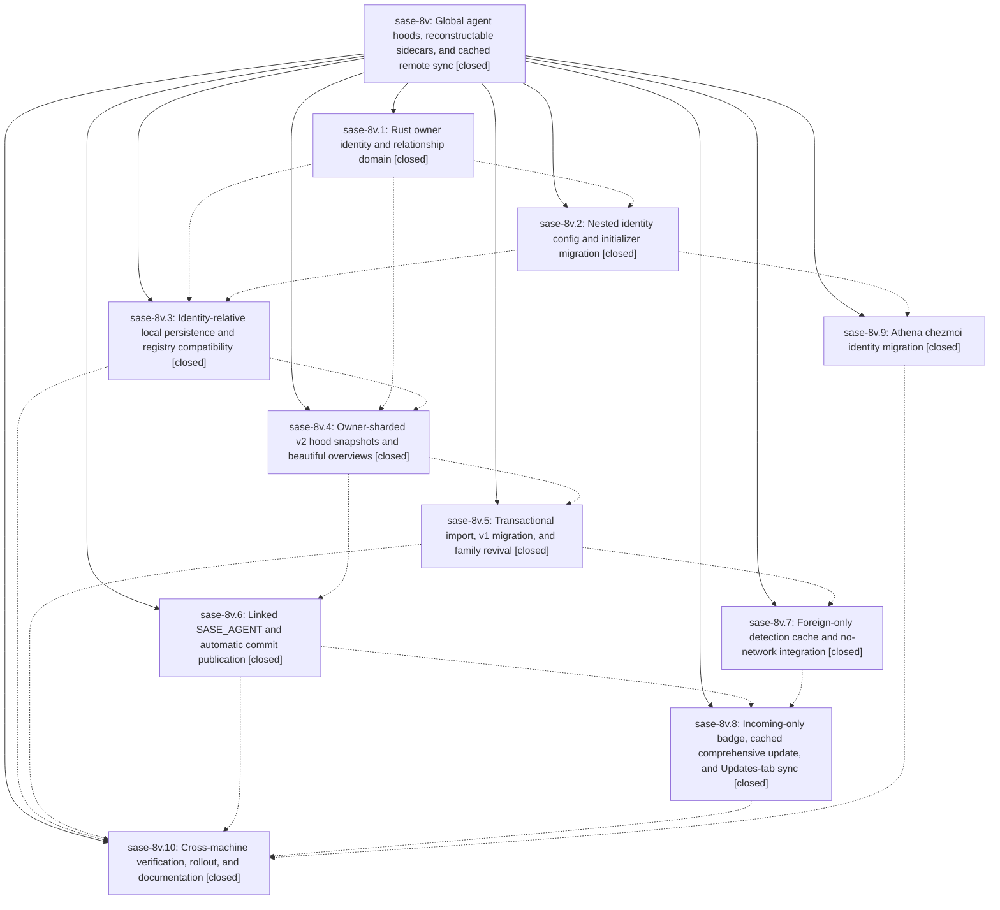

# Bead: sase-8v — Global agent hoods, reconstructable sidecars, and cached remote sync

[Bead Pages](../README.md) / sase-8v

**Status:** ✓ closed · **Resolution:** (unrecorded) · **Type:** plan · **Tier:** epic
**Owner:** `bryanbugyi34@gmail.com` · **Assignee:** `sase-8v.land`
**Created:** 2026-07-23 16:58:56 UTC · **Closed:** 2026-07-24 22:36:20 UTC
**Plan:** [202607/global\_agent\_hoods.md](https://github.com/sase-org/sase--plans/blob/main/202607/global_agent_hoods.md)

## Description

Keep locally owned agent names identity-relative on disk while publishing globally unique username.machine.agent identities; make one agent commit publish its complete, revivable top-level hood with deterministic agent/family overviews; replace SASE_MACHINE with a linked SASE_AGENT; and make remote detection, cached integration, and explicit full synchronization truthful, fast, and recoverable.

## Notes

COMMIT: d05f3bdf

## Phases

| Bead | Title | Status | Size | Agents | Commits |
|---|---|---|---|---:|---:|
| [sase-8v.1](sase-8v.1.md) | Rust owner identity and relationship domain | ✓ closed | large | 2 | 2 |
| [sase-8v.10](sase-8v.10.md) | Cross-machine verification, rollout, and documentation | ✓ closed | medium | 1 | 1 |
| [sase-8v.2](sase-8v.2.md) | Nested identity config and initializer migration | ✓ closed | medium | 2 | 1 |
| [sase-8v.3](sase-8v.3.md) | Identity-relative local persistence and registry compatibility | ✓ closed | large | 2 | 1 |
| [sase-8v.4](sase-8v.4.md) | Owner-sharded v2 hood snapshots and beautiful overviews | ✓ closed | large | 2 | 1 |
| [sase-8v.5](sase-8v.5.md) | Transactional import, v1 migration, and family revival | ✓ closed | large | 2 | 2 |
| [sase-8v.6](sase-8v.6.md) | Linked SASE\_AGENT and automatic commit publication | ✓ closed | medium | 1 | 1 |
| [sase-8v.7](sase-8v.7.md) | Foreign-only detection cache and no-network integration | ✓ closed | large | 2 | 1 |
| [sase-8v.8](sase-8v.8.md) | Incoming-only badge, cached comprehensive update, and Updates-tab sync | ✓ closed | medium | 1 | 1 |
| [sase-8v.9](sase-8v.9.md) | Athena chezmoi identity migration | ✓ closed | small | 0 | 0 |

## Lineage

## Agents

| Agent | Bead | Commits |
|---|---|---:|
| [bbugyi200.athena.sase-8v.1](https://github.com/sase-org/sase--agents/blob/main/agents/bbugyi200.athena.sase-8v.1/README.md) | [sase-8v.1](sase-8v.1.md) | 2 |
| [bbugyi200.athena.sase-8v.1--code](https://github.com/sase-org/sase--agents/blob/main/families/bbugyi200.athena.sase-8v.1.md#member-code) | [sase-8v.1](sase-8v.1.md) | 0 |
| [bbugyi200.athena.sase-8v.10](https://github.com/sase-org/sase--agents/blob/main/agents/bbugyi200.athena.sase-8v.10/README.md) | [sase-8v.10](sase-8v.10.md) | 1 |
| [bbugyi200.athena.sase-8v.2](https://github.com/sase-org/sase--agents/blob/main/agents/bbugyi200.athena.sase-8v.2/README.md) | [sase-8v.2](sase-8v.2.md) | 1 |
| [bbugyi200.athena.sase-8v.2--code](https://github.com/sase-org/sase--agents/blob/main/families/bbugyi200.athena.sase-8v.2.md#member-code) | [sase-8v.2](sase-8v.2.md) | 0 |
| [bbugyi200.athena.sase-8v.3](https://github.com/sase-org/sase--agents/blob/main/agents/bbugyi200.athena.sase-8v.3/README.md) | [sase-8v.3](sase-8v.3.md) | 1 |
| [bbugyi200.athena.sase-8v.3--code](https://github.com/sase-org/sase--agents/blob/main/families/bbugyi200.athena.sase-8v.3.md#member-code) | [sase-8v.3](sase-8v.3.md) | 0 |
| [bbugyi200.athena.sase-8v.4](https://github.com/sase-org/sase--agents/blob/main/agents/bbugyi200.athena.sase-8v.4/README.md) | [sase-8v.4](sase-8v.4.md) | 1 |
| [bbugyi200.athena.sase-8v.4--code](https://github.com/sase-org/sase--agents/blob/main/families/bbugyi200.athena.sase-8v.4.md#member-code) | [sase-8v.4](sase-8v.4.md) | 0 |
| [bbugyi200.athena.sase-8v.5](https://github.com/sase-org/sase--agents/blob/main/agents/bbugyi200.athena.sase-8v.5/README.md) | [sase-8v.5](sase-8v.5.md) | 2 |
| [bbugyi200.athena.sase-8v.5--code](https://github.com/sase-org/sase--agents/blob/main/families/bbugyi200.athena.sase-8v.5.md#member-code) | [sase-8v.5](sase-8v.5.md) | 0 |
| [bbugyi200.athena.sase-8v.6](https://github.com/sase-org/sase--agents/blob/main/agents/bbugyi200.athena.sase-8v.6/README.md) | [sase-8v.6](sase-8v.6.md) | 1 |
| [bbugyi200.athena.sase-8v.7](https://github.com/sase-org/sase--agents/blob/main/agents/bbugyi200.athena.sase-8v.7/README.md) | [sase-8v.7](sase-8v.7.md) | 1 |
| [bbugyi200.athena.sase-8v.7--code](https://github.com/sase-org/sase--agents/blob/main/families/bbugyi200.athena.sase-8v.7.md#member-code) | [sase-8v.7](sase-8v.7.md) | 0 |
| [bbugyi200.athena.sase-8v.8](https://github.com/sase-org/sase--agents/blob/main/agents/bbugyi200.athena.sase-8v.8/README.md) | [sase-8v.8](sase-8v.8.md) | 1 |
| [bbugyi200.athena.sase-8v.land](https://github.com/sase-org/sase--agents/blob/main/agents/bbugyi200.athena.sase-8v.land/README.md) | [sase-8v](README.md) | 2 |

## Commits

| Commit | Subject | Bead | Committed (UTC) |
|---|---|---|---|
| [`sase-core@d54a56f`](https://github.com/sase-org/sase-core/commit/d54a56fe185ed0b0a882e857781e4e4c836742b5) | feat(identity): add owner-aware relationship domain (sase-8v.1) | [sase-8v.1](sase-8v.1.md) | 2026-07-23 18:06:54 |
| [`de816e0`](https://github.com/sase-org/sase/commit/de816e064b19a40f4490f4aa1407e0e8093de614) | feat(identity): expose owner-aware agent facade (sase-8v.1) | [sase-8v.1](sase-8v.1.md) | 2026-07-23 18:07:30 |
| [`97230f1`](https://github.com/sase-org/sase/commit/97230f1a2901308ea2c28d1079d561ab00670847) | feat(identity)!: require nested owner configuration (sase-8v.2) | [sase-8v.2](sase-8v.2.md) | 2026-07-23 18:56:53 |
| [`5bf430b`](https://github.com/sase-org/sase/commit/5bf430b67eb42f61e5472f689e0cba4a0d276669) | feat(agent): persist local names relative to owner (sase-8v.3) | [sase-8v.3](sase-8v.3.md) | 2026-07-23 19:56:11 |
| [`2464be5`](https://github.com/sase-org/sase/commit/2464be5462bd99580d0a91b2802abea3560e9064) | feat(agents): publish owner-sharded v2 hood snapshots (sase-8v.4) | [sase-8v.4](sase-8v.4.md) | 2026-07-23 21:54:50 |
| [`9aab8a7`](https://github.com/sase-org/sase/commit/9aab8a713d27977956c68eb80b4affa9ac41a00b) | feat!: publish linked agent hoods after commits (sase-8v.6) | [sase-8v.6](sase-8v.6.md) | 2026-07-24 18:56:52 |
| [`sase-core@17b36ba`](https://github.com/sase-org/sase-core/commit/17b36baecd8f5b9351c6915d23f432f75af1b0ba) | feat: support transaction-gated imported agent families (sase-8v.5) | [sase-8v.5](sase-8v.5.md) | 2026-07-24 19:51:34 |
| [`2409ed2`](https://github.com/sase-org/sase/commit/2409ed2e37e454f712f44651534516d04517ef4f) | feat: import agent packages transactionally (sase-8v.5) | [sase-8v.5](sase-8v.5.md) | 2026-07-24 19:54:41 |
| [`f76a9ed`](https://github.com/sase-org/sase/commit/f76a9ede7738308fc89ca7cfe6f476e0a6598727) | feat: cache foreign agent state for offline integration (sase-8v.7) | [sase-8v.7](sase-8v.7.md) | 2026-07-24 21:07:49 |
| [`906690b`](https://github.com/sase-org/sase/commit/906690b506d82c39c7b970a30293fe580fda94ca) | feat(ace): separate cached agent updates from full sync (sase-8v.8) | [sase-8v.8](sase-8v.8.md) | 2026-07-24 21:44:06 |
| [`e47f240`](https://github.com/sase-org/sase/commit/e47f240e14efb6cc9c3c8112c756df4bcb09c0ae) | fix(agents): support same-user multi-machine imports (sase-8v.10) | [sase-8v.10](sase-8v.10.md) | 2026-07-24 22:13:45 |
| [`9b46bc9`](https://github.com/sase-org/sase/commit/9b46bc94bd0ad625ad9b405319ba10720b2b8fe6) | test(tui): refresh lane cleanup snapshot (sase-8v) | [sase-8v](README.md) | 2026-07-24 23:14:30 |
| [`sase--plans@d05f3bd`](https://github.com/sase-org/sase--plans/commit/d05f3bdfbf156036c0b5e6ea73e3a4152cfd09f8) | docs: mark global agent hoods epic done (sase-8v) | [sase-8v](README.md) | 2026-07-24 23:14:46 |
