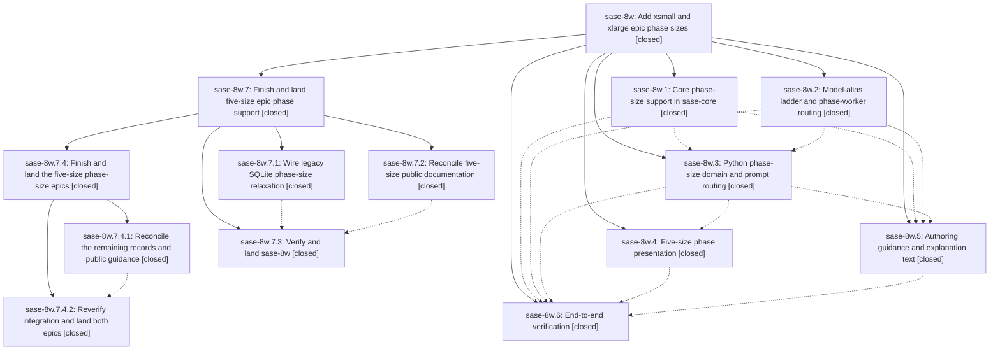

# Bead: sase-8w — Add xsmall and xlarge epic phase sizes

[Bead Pages](../README.md) / sase-8w

**Status:** ✓ closed · **Resolution:** (unrecorded) · **Type:** plan · **Tier:** epic
**Owner:** `bryanbugyi34@gmail.com` · **Assignee:** `sase-8w.land`
**Created:** 2026-07-23 21:38:11 UTC · **Closed:** 2026-07-24 01:36:43 UTC
**Plan:** [202607/phase\_sizes.md](https://github.com/sase-org/sase--plans/blob/main/202607/phase_sizes.md)

## Description

Epic plans can declare `xsmall` and `xlarge` phases end to end — validated and persisted, model-routed through new phase-worker aliases, `#plan`-gated correctly, beautifully displayed everywhere phase sizes appear, and documented with clear authoring guidance for when to reach for each of the five sizes.

## Phases

| Bead | Title | Status | Size | Agents | Commits |
|---|---|---|---|---:|---:|
| [sase-8w.1](sase-8w.1.md) | Core phase-size support in sase-core | ✓ closed | medium | 1 | 1 |
| [sase-8w.2](sase-8w.2.md) | Model-alias ladder and phase-worker routing | ✓ closed | medium | 1 | 1 |
| [sase-8w.3](sase-8w.3.md) | Python phase-size domain and prompt routing | ✓ closed | medium | 1 | 1 |
| [sase-8w.4](sase-8w.4.md) | Five-size phase presentation | ✓ closed | medium | 1 | 1 |
| [sase-8w.5](sase-8w.5.md) | Authoring guidance and explanation text | ✓ closed | small | 1 | 1 |
| [sase-8w.6](sase-8w.6.md) | End-to-end verification | ✓ closed | small | 0 | 0 |

## Lineage

## Agents

| Agent | Bead | Commits |
|---|---|---:|
| [bbugyi200.athena.sase-8w.1](https://github.com/sase-org/sase--agents/blob/main/agents/bbugyi200.athena.sase-8w.1/README.md) | [sase-8w.1](sase-8w.1.md) | 1 |
| [bbugyi200.athena.sase-8w.2](https://github.com/sase-org/sase--agents/blob/main/agents/bbugyi200.athena.sase-8w.2/README.md) | [sase-8w.2](sase-8w.2.md) | 1 |
| [bbugyi200.athena.sase-8w.3](https://github.com/sase-org/sase--agents/blob/main/agents/bbugyi200.athena.sase-8w.3/README.md) | [sase-8w.3](sase-8w.3.md) | 1 |
| [bbugyi200.athena.sase-8w.4](https://github.com/sase-org/sase--agents/blob/main/agents/bbugyi200.athena.sase-8w.4/README.md) | [sase-8w.4](sase-8w.4.md) | 1 |
| [bbugyi200.athena.sase-8w.5](https://github.com/sase-org/sase--agents/blob/main/agents/bbugyi200.athena.sase-8w.5/README.md) | [sase-8w.5](sase-8w.5.md) | 1 |
| [bbugyi200.athena.sase-8w.7.1](https://github.com/sase-org/sase--agents/blob/main/agents/bbugyi200.athena.sase-8w.7.1/README.md) | [sase-8w.7.1](sase-8w.7.1.md) | 2 |
| [bbugyi200.athena.sase-8w.7.2](https://github.com/sase-org/sase--agents/blob/main/agents/bbugyi200.athena.sase-8w.7.2/README.md) | [sase-8w.7.2](sase-8w.7.2.md) | 1 |
| [bbugyi200.athena.sase-8w.7.3](https://github.com/sase-org/sase--agents/blob/main/agents/bbugyi200.athena.sase-8w.7.3/README.md) | [sase-8w.7.3](sase-8w.7.3.md) | 1 |
| [bbugyi200.athena.sase-8w.7.4.1](https://github.com/sase-org/sase--agents/blob/main/agents/bbugyi200.athena.sase-8w.7.4.1/README.md) | [sase-8w.7.4.1](sase-8w.7.4.1.md) | 1 |
| [bbugyi200.athena.sase-8w.7.4.2](https://github.com/sase-org/sase--agents/blob/main/agents/bbugyi200.athena.sase-8w.7.4.2/README.md) | [sase-8w.7.4.2](sase-8w.7.4.2.md) | 1 |
| [bbugyi200.athena.sase-8w.7.4.land](https://github.com/sase-org/sase--agents/blob/main/agents/bbugyi200.athena.sase-8w.7.4.land/README.md) | [sase-8w.7.4](sase-8w.7.4.md) | 2 |
| [bbugyi200.athena.sase-8w.7.4.land--code](https://github.com/sase-org/sase--agents/blob/main/families/bbugyi200.athena.sase-8w.7.4.land.md#member-code) | [sase-8w.7.4](sase-8w.7.4.md) | 0 |

## Commits

| Commit | Subject | Bead | Committed (UTC) |
|---|---|---|---|
| [`sase-core@f9d9c37`](https://github.com/sase-org/sase-core/commit/f9d9c37a452602a9021c5170892e94346f302390) | feat: support xsmall and xlarge phase sizes (sase-8w.1) | [sase-8w.1](sase-8w.1.md) | 2026-07-23 21:51:06 |
| [`18ca7cb`](https://github.com/sase-org/sase/commit/18ca7cb9684c5b24ca311b6a8e8f8706a3a13f85) | feat: expand phase-worker model alias ladder (sase-8w.2) | [sase-8w.2](sase-8w.2.md) | 2026-07-23 22:03:24 |
| [`a5c5d03`](https://github.com/sase-org/sase/commit/a5c5d0398e31032622ca93624fddc95d8a1bcc58) | feat(bead): support extended phase sizes (sase-8w.3) | [sase-8w.3](sase-8w.3.md) | 2026-07-23 22:18:40 |
| [`39f90d3`](https://github.com/sase-org/sase/commit/39f90d3764eb050ae869f711a62e36f467874d64) | feat(plan): document five phase sizes in --explain text (sase-8w.5) | [sase-8w.5](sase-8w.5.md) | 2026-07-23 22:26:05 |
| [`f19e031`](https://github.com/sase-org/sase/commit/f19e031dd1aebbb6ebb1b86fd4385f02d91c5901) | feat(tui): present all five phase sizes (sase-8w.4) | [sase-8w.4](sase-8w.4.md) | 2026-07-23 22:33:32 |
| [`39c9fe7`](https://github.com/sase-org/sase/commit/39c9fe7dca53caf21b23e86049efeb346219d4ff) | docs: reconcile manuals with five-size phase routing (sase-8w.7.2) | [sase-8w.7.2](sase-8w.7.2.md) | 2026-07-23 23:25:32 |
| [`sase-core@32a146d`](https://github.com/sase-org/sase-core/commit/32a146df0ce75d4c5c57c792805789cdb492e156) | fix(bead): expose legacy size constraint migration (sase-8w.7.1) | [sase-8w.7.1](sase-8w.7.1.md) | 2026-07-23 23:35:30 |
| [`b638df3`](https://github.com/sase-org/sase/commit/b638df32f1709b59c8c3bed44f6d37abe9b227d3) | fix(bead): relax legacy phase size constraints (sase-8w.7.1) | [sase-8w.7.1](sase-8w.7.1.md) | 2026-07-23 23:35:57 |
| [`c2fd043`](https://github.com/sase-org/sase/commit/c2fd0433617be4862dc33c2e883646f8be30931b) | test(tui): tolerate commits pane preview timing (sase-8w.7.3) | [sase-8w.7.3](sase-8w.7.3.md) | 2026-07-24 00:21:23 |
| [`4c3fde9`](https://github.com/sase-org/sase/commit/4c3fde93ece244e409c9514f390b18e8e166f1c9) | docs: reconcile phase-size guidance (sase-8w.7.4.1) | [sase-8w.7.4.1](sase-8w.7.4.1.md) | 2026-07-24 00:46:47 |
| [`f22a49f`](https://github.com/sase-org/sase/commit/f22a49f0dca472f0a99992841be4e62b939a9116) | test: stabilize family relaunch async waits (sase-8w.7.4.2) | [sase-8w.7.4.2](sase-8w.7.4.2.md) | 2026-07-24 01:07:02 |
| [`sase-core@765d784`](https://github.com/sase-org/sase-core/commit/765d7842af6566218ad5973909150b01d145c3a5) | fix(plan): describe phase-size alias routing (sase-8w.7.4) | [sase-8w.7.4](sase-8w.7.4.md) | 2026-07-24 01:24:18 |
| [`sase--plans@4e2698a`](https://github.com/sase-org/sase--plans/commit/4e2698a533d612e090ff069b77af5a8c4401e4f1) | docs(plans): complete phase-size epic chain (sase-8w.7.4) | [sase-8w.7.4](sase-8w.7.4.md) | 2026-07-24 01:38:13 |
