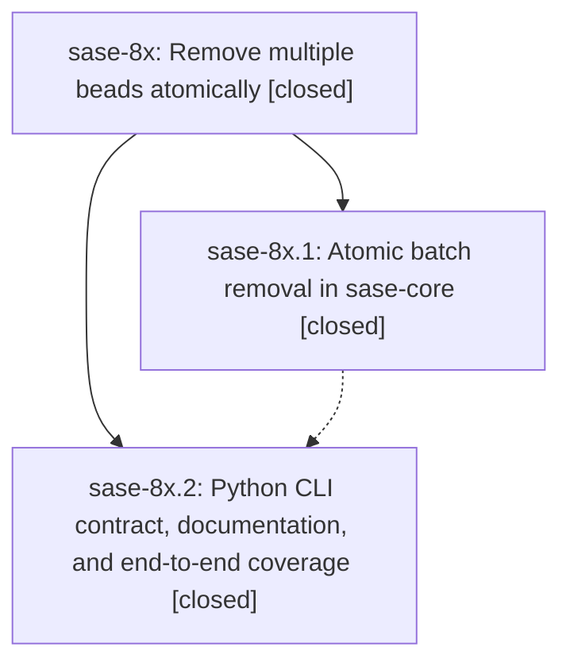

# Bead: sase-8x — Remove multiple beads atomically

[Bead Pages](../README.md) / sase-8x

**Status:** ✓ closed · **Resolution:** (unrecorded) · **Type:** plan · **Tier:** epic
**Owner:** `bryanbugyi34@gmail.com` · **Assignee:** `sase-8x.land`
**Created:** 2026-07-24 18:32:59 UTC · **Closed:** 2026-07-24 19:27:01 UTC
**Plan:** [202607/multi\_bead\_rm.md](https://github.com/sase-org/sase--plans/blob/main/202607/multi_bead_rm.md)

## Description

`sase bead rm` accepts one or more bead IDs, removes the requested beads and their descendant cascades in one atomic operation, and behaves consistently through the Rust fast path and Python compatibility path.

## Notes

COMMIT: b8fbc9b3

## Phases

| Bead | Title | Status | Size | Agents | Commits |
|---|---|---|---|---:|---:|
| [sase-8x.1](sase-8x.1.md) | Atomic batch removal in sase-core | ✓ closed | medium | 0 | 0 |
| [sase-8x.2](sase-8x.2.md) | Python CLI contract, documentation, and end-to-end coverage | ✓ closed | medium | 1 | 1 |

## Lineage

## Agents

| Agent | Bead | Commits |
|---|---|---:|
| [bbugyi200.athena.sase-8x.2](https://github.com/sase-org/sase--agents/blob/main/agents/bbugyi200.athena.sase-8x.2/README.md) | [sase-8x.2](sase-8x.2.md) | 1 |

## Commits

| Commit | Subject | Bead | Committed (UTC) |
|---|---|---|---|
| [`fed1886`](https://github.com/sase-org/sase/commit/fed18866e1738bee92fbdb9587ca261bfa895e26) | feat(beads): support atomic multi-bead removal (sase-8x.2) | [sase-8x.2](sase-8x.2.md) | 2026-07-24 19:06:33 |
