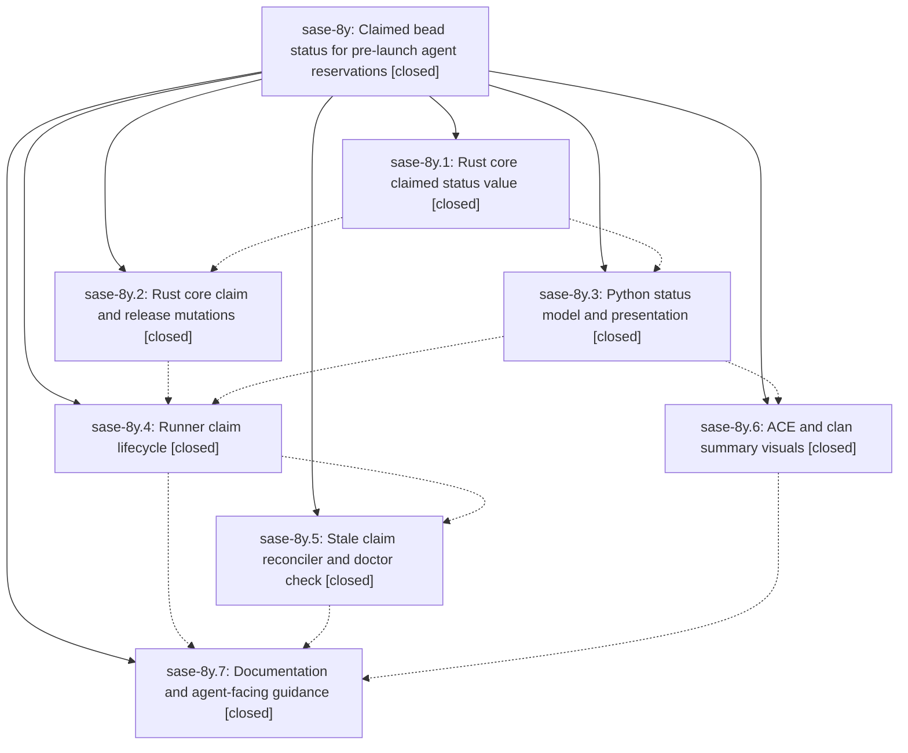

# Bead: sase-8y — Claimed bead status for pre-launch agent reservations

[Bead Pages](../README.md) / sase-8y

**Status:** ✓ closed · **Resolution:** (unrecorded) · **Type:** plan · **Tier:** epic
**Owner:** `bryanbugyi34@gmail.com` · **Assignee:** `sase-8y.land`
**Created:** 2026-07-24 20:21:12 UTC · **Closed:** 2026-07-24 22:38:03 UTC
**Plan:** [sase/repos/plans/202607/claimed\_bead\_status.md](https://github.com/sase-org/sase--plans/blob/main/sase/repos/plans/202607/claimed_bead_status.md)

## Description

A bead whose agent has started but has not yet reached model execution shows a durable `claimed` status across every bead surface, the claim is released back to `open` when that agent dies before launching, and `sase bead work` keeps deciding purely from live agent liveness.

## Notes

COMMIT: 6b7f40b8

## Phases

| Bead | Title | Status | Size | Agents | Commits |
|---|---|---|---|---:|---:|
| [sase-8y.1](sase-8y.1.md) | Rust core claimed status value | ✓ closed | medium | 0 | 0 |
| [sase-8y.2](sase-8y.2.md) | Rust core claim and release mutations | ✓ closed | medium | 0 | 0 |
| [sase-8y.3](sase-8y.3.md) | Python status model and presentation | ✓ closed | medium | 1 | 1 |
| [sase-8y.4](sase-8y.4.md) | Runner claim lifecycle | ✓ closed | medium | 1 | 1 |
| [sase-8y.5](sase-8y.5.md) | Stale claim reconciler and doctor check | ✓ closed | medium | 1 | 1 |
| [sase-8y.6](sase-8y.6.md) | ACE and clan summary visuals | ✓ closed | small | 1 | 1 |
| [sase-8y.7](sase-8y.7.md) | Documentation and agent-facing guidance | ✓ closed | small | 1 | 1 |

## Lineage

## Agents

| Agent | Bead | Commits |
|---|---|---:|
| [bbugyi200.athena.sase-8y.3](https://github.com/sase-org/sase--agents/blob/main/agents/bbugyi200.athena.sase-8y.3/README.md) | [sase-8y.3](sase-8y.3.md) | 1 |
| [bbugyi200.athena.sase-8y.4](https://github.com/sase-org/sase--agents/blob/main/agents/bbugyi200.athena.sase-8y.4/README.md) | [sase-8y.4](sase-8y.4.md) | 1 |
| [bbugyi200.athena.sase-8y.5](https://github.com/sase-org/sase--agents/blob/main/agents/bbugyi200.athena.sase-8y.5/README.md) | [sase-8y.5](sase-8y.5.md) | 1 |
| [bbugyi200.athena.sase-8y.6](https://github.com/sase-org/sase--agents/blob/main/agents/bbugyi200.athena.sase-8y.6/README.md) | [sase-8y.6](sase-8y.6.md) | 1 |
| [bbugyi200.athena.sase-8y.7](https://github.com/sase-org/sase--agents/blob/main/agents/bbugyi200.athena.sase-8y.7/README.md) | [sase-8y.7](sase-8y.7.md) | 1 |
| [bbugyi200.athena.sase-8y.land](https://github.com/sase-org/sase--agents/blob/main/agents/bbugyi200.athena.sase-8y.land/README.md) | [sase-8y](README.md) | 1 |
| [bbugyi200.athena.sase-8y.land--code](https://github.com/sase-org/sase--agents/blob/main/families/bbugyi200.athena.sase-8y.land.md#member-code) | [sase-8y](README.md) | 0 |

## Commits

| Commit | Subject | Bead | Committed (UTC) |
|---|---|---|---|
| [`5ca1756`](https://github.com/sase-org/sase/commit/5ca1756fc685499fa42e8a784ae5c3beb7e5c39e) | feat(beads): add claimed status read-side support (sase-8y.3) | [sase-8y.3](sase-8y.3.md) | 2026-07-24 20:48:00 |
| [`408b789`](https://github.com/sase-org/sase/commit/408b7894952c7c8504915df22e6f1ac68cae1048) | feat(beads): manage claims across runner lifecycle (sase-8y.4) | [sase-8y.4](sase-8y.4.md) | 2026-07-24 21:13:20 |
| [`cf1d3aa`](https://github.com/sase-org/sase/commit/cf1d3aa4fc181597d71ddbcb19e9908e1e2928b9) | feat: render claimed bead status in TUI (sase-8y.6) | [sase-8y.6](sase-8y.6.md) | 2026-07-24 21:17:52 |
| [`bd7ad46`](https://github.com/sase-org/sase/commit/bd7ad46a43a2c894aec15d319ec069a1ae25c451) | feat(beads): reconcile stale pre-launch claims (sase-8y.5) | [sase-8y.5](sase-8y.5.md) | 2026-07-24 21:40:57 |
| [`3b5937b`](https://github.com/sase-org/sase/commit/3b5937b986bf37520a852eb5954c8fc642d1ea9f) | docs(beads): document the claimed bead status (sase-8y.7) | [sase-8y.7](sase-8y.7.md) | 2026-07-24 22:04:11 |
| [`d0495f1`](https://github.com/sase-org/sase/commit/d0495f1cba07b4706cc7696a1561d9fa0a0c3343) | fix: finish claimed status landing cleanup (sase-8y) | [sase-8y](README.md) | 2026-07-24 22:58:11 |
