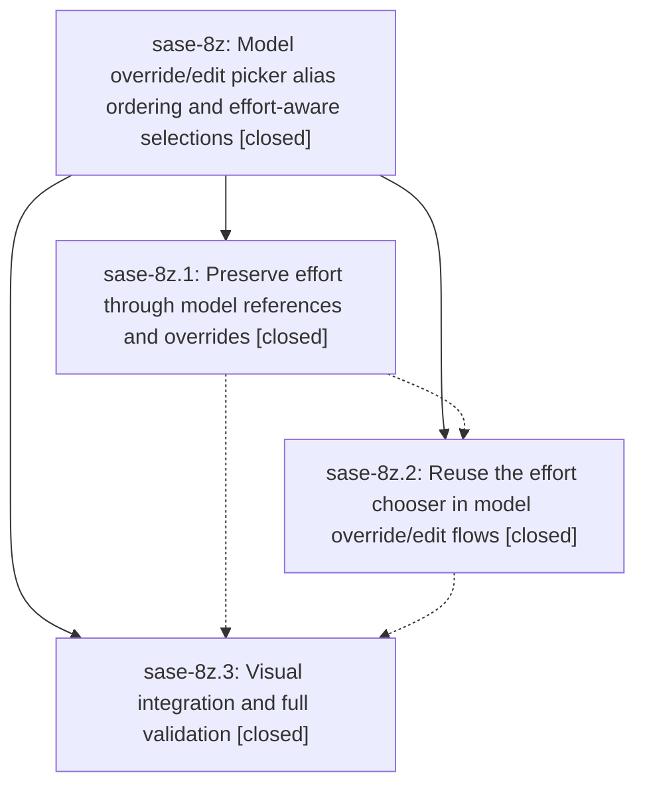

# Bead: sase-8z — Model override/edit picker alias ordering and effort-aware selections

[Bead Pages](../README.md) / sase-8z

**Status:** ✓ closed · **Resolution:** (unrecorded) · **Type:** plan · **Tier:** epic
**Owner:** `bryanbugyi34@gmail.com` · **Assignee:** `sase-8z.land`
**Created:** 2026-07-24 20:42:31 UTC · **Closed:** 2026-07-24 22:51:53 UTC
**Plan:** [202607/model\_override\_effort.md](https://github.com/sase-org/sase--plans/blob/main/202607/model_override_effort.md)

## Description

Model overrides and persistent alias edits present builtin models before all aliases, collect a defaulted reasoning-effort choice, and preserve explicit model or alias effort suffixes through resolution, storage, display, and launch.

## Notes

COMMIT: 8e0a8cf0

## Phases

| Bead | Title | Status | Size | Agents | Commits |
|---|---|---|---|---:|---:|
| [sase-8z.1](sase-8z.1.md) | Preserve effort through model references and overrides | ✓ closed | medium | 1 | 1 |
| [sase-8z.2](sase-8z.2.md) | Reuse the effort chooser in model override/edit flows | ✓ closed | medium | 1 | 1 |
| [sase-8z.3](sase-8z.3.md) | Visual integration and full validation | ✓ closed | small | 1 | 1 |

## Lineage

## Agents

| Agent | Bead | Commits |
|---|---|---:|
| [bbugyi200.athena.sase-8z.1](https://github.com/sase-org/sase--agents/blob/main/agents/bbugyi200.athena.sase-8z.1/README.md) | [sase-8z.1](sase-8z.1.md) | 1 |
| [bbugyi200.athena.sase-8z.2](https://github.com/sase-org/sase--agents/blob/main/agents/bbugyi200.athena.sase-8z.2/README.md) | [sase-8z.2](sase-8z.2.md) | 1 |
| [bbugyi200.athena.sase-8z.3](https://github.com/sase-org/sase--agents/blob/main/agents/bbugyi200.athena.sase-8z.3/README.md) | [sase-8z.3](sase-8z.3.md) | 1 |

## Commits

| Commit | Subject | Bead | Committed (UTC) |
|---|---|---|---|
| [`4457a87`](https://github.com/sase-org/sase/commit/4457a87c4290fa08751ac6e9c161b87fce2f3831) | feat: preserve effort through model aliases and overrides (sase-8z.1) | [sase-8z.1](sase-8z.1.md) | 2026-07-24 21:10:51 |
| [`28c5c86`](https://github.com/sase-org/sase/commit/28c5c86d274f1fbdfb47f3b001384f419f5ab027) | feat(tui): preserve effort in model picker flows (sase-8z.2) | [sase-8z.2](sase-8z.2.md) | 2026-07-24 21:52:38 |
| [`7dd50f2`](https://github.com/sase-org/sase/commit/7dd50f2f277a44ff5790cc396500a54ce916cde6) | test: add model picker visual coverage (sase-8z.3) | [sase-8z.3](sase-8z.3.md) | 2026-07-24 22:30:58 |
