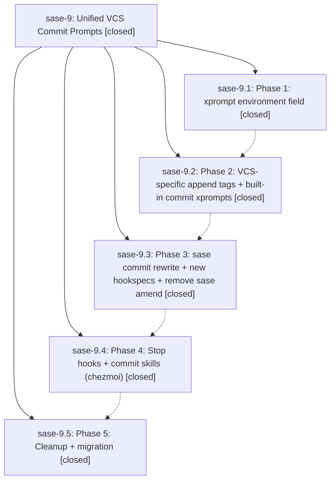

# Bead: sase-9 — Unified VCS Commit Prompts

[Bead Pages](../README.md) / sase-9

**Status:** ✓ closed · **Resolution:** (unrecorded) · **Type:** plan · **Tier:** epic
**Owner:** `bryanbugyi34@gmail.com`
**Created:** 2026-03-24 04:26:40 UTC · **Closed:** 2026-03-24 16:31:00 UTC
**Plan:** [202603/unified\_vcs\_commit.md](https://github.com/sase-org/sase--plans/blob/main/202603/unified_vcs_commit.md)

## Phases

| Bead | Title | Status | Size | Agents | Commits |
|---|---|---|---|---:|---:|
| [sase-9.1](sase-9.1.md) | Phase 1: xprompt environment field | ✓ closed | small | 0 | 1 |
| [sase-9.2](sase-9.2.md) | Phase 2: VCS-specific append tags + built-in commit xprompts | ✓ closed | small | 0 | 1 |
| [sase-9.3](sase-9.3.md) | Phase 3: sase commit rewrite + new hookspecs + remove sase amend | ✓ closed | small | 0 | 1 |
| [sase-9.4](sase-9.4.md) | Phase 4: Stop hooks + commit skills (chezmoi) | ✓ closed | small | 0 | 1 |
| [sase-9.5](sase-9.5.md) | Phase 5: Cleanup + migration | ✓ closed | small | 0 | 1 |

## Lineage

## Commits

| Commit | Subject | Bead | Committed (UTC) |
|---|---|---|---|
| [`7d1ca2d`](https://github.com/sase-org/sase/commit/7d1ca2dd7e0b63496b4bd136ac2911dba1f51f8a) | feat: Add workflow-level environment field for xprompt workflows (sase-9.1) | [sase-9.1](sase-9.1.md) | 2026-03-24 04:35:01 |
| [`4db645f`](https://github.com/sase-org/sase/commit/4db645f25779824b4e1b85d7e1fd5b5391957925) | feat: Add VCS-specific append tags and built-in commit xprompts (sase-9.2) | [sase-9.2](sase-9.2.md) | 2026-03-24 04:52:42 |
| [`84f0c41`](https://github.com/sase-org/sase/commit/84f0c4149e7e6c323b5ce153a1d33e5985abe835) | feat: Rewrite sase commit to VCS-agnostic JSON dispatch + remove sase amend (sase-9.3) | [sase-9.3](sase-9.3.md) | 2026-03-24 06:33:14 |
| [`b203fa2`](https://github.com/sase-org/sase/commit/b203fa2a8cd0c77528d012d55e72fced61c6142d) | feat: Split stop hook into quality checks + commit orchestration and add VCS commit skills (sase-9.4) | [sase-9.4](sase-9.4.md) | 2026-03-24 06:46:58 |
| [`a13e27a`](https://github.com/sase-org/sase/commit/a13e27a146a7befa14d0a22c047d84559cb1950a) | chore: Remove old VCS-specific xprompts and sase\_commit\_workflow script (sase-9.5) | [sase-9.5](sase-9.5.md) | 2026-03-24 06:58:22 |
