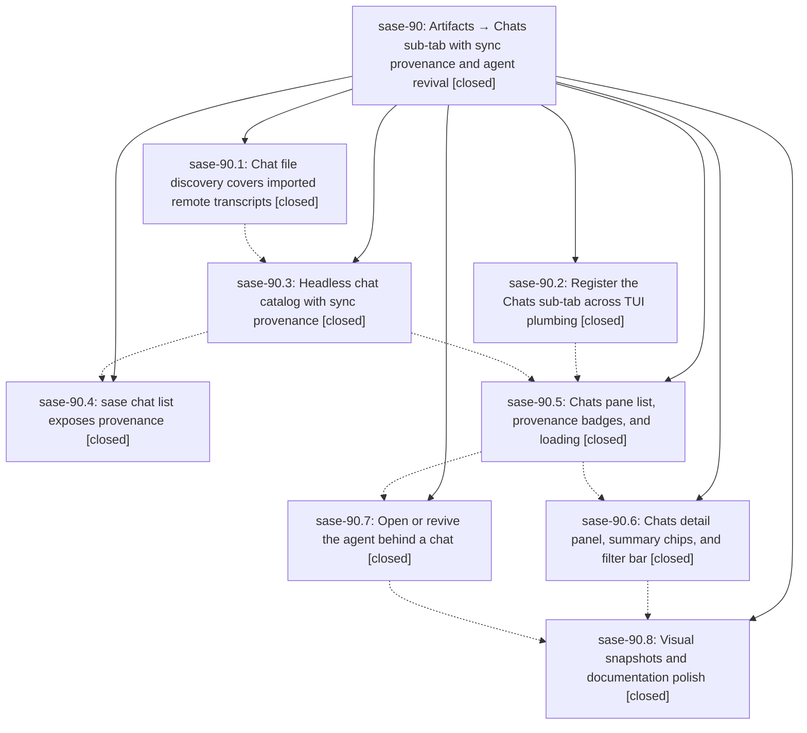

# Bead: sase-90 — Artifacts → Chats sub-tab with sync provenance and agent revival

[Bead Pages](../README.md) / sase-90

**Status:** ✓ closed · **Resolution:** (unrecorded) · **Type:** plan · **Tier:** epic
**Owner:** `bryanbugyi34@gmail.com` · **Assignee:** `sase-90.land`
**Created:** 2026-07-24 23:29:31 UTC · **Closed:** 2026-07-25 02:08:28 UTC
**Plan:** [sase/repos/plans/202607/artifacts\_chats\_subtab.md](https://github.com/sase-org/sase--plans/blob/main/sase/repos/plans/202607/artifacts_chats_subtab.md)

## Description

The ACE Artifacts tab gains a fifth "Chats" sub-tab that lists every SASE chat transcript known to this machine — including remote transcripts imported from the agents sidecar repo — makes each transcript's sync provenance (local-only / shared / remote) unmistakable at a glance, and lets the user jump from a chat straight to its agent on the Agents tab, reviving that agent first when it is dismissed.

## Notes

COMMIT: 3281be8f

## Phases

| Bead | Title | Status | Size | Agents | Commits |
|---|---|---|---|---:|---:|
| [sase-90.1](sase-90.1.md) | Chat file discovery covers imported remote transcripts | ✓ closed | small | 1 | 1 |
| [sase-90.2](sase-90.2.md) | Register the Chats sub-tab across TUI plumbing | ✓ closed | medium | 1 | 1 |
| [sase-90.3](sase-90.3.md) | Headless chat catalog with sync provenance | ✓ closed | medium | 1 | 1 |
| [sase-90.4](sase-90.4.md) | sase chat list exposes provenance | ✓ closed | small | 1 | 1 |
| [sase-90.5](sase-90.5.md) | Chats pane list, provenance badges, and loading | ✓ closed | medium | 1 | 1 |
| [sase-90.6](sase-90.6.md) | Chats detail panel, summary chips, and filter bar | ✓ closed | medium | 1 | 1 |
| [sase-90.7](sase-90.7.md) | Open or revive the agent behind a chat | ✓ closed | medium | 1 | 1 |
| [sase-90.8](sase-90.8.md) | Visual snapshots and documentation polish | ✓ closed | small | 1 | 1 |

## Lineage

## Agents

| Agent | Bead | Commits |
|---|---|---:|
| [bbugyi200.athena.sase-90.1](https://github.com/sase-org/sase--agents/blob/main/agents/bbugyi200.athena.sase-90.1/README.md) | [sase-90.1](sase-90.1.md) | 1 |
| [bbugyi200.athena.sase-90.2](https://github.com/sase-org/sase--agents/blob/main/agents/bbugyi200.athena.sase-90.2/README.md) | [sase-90.2](sase-90.2.md) | 1 |
| [bbugyi200.athena.sase-90.3](https://github.com/sase-org/sase--agents/blob/main/agents/bbugyi200.athena.sase-90.3/README.md) | [sase-90.3](sase-90.3.md) | 1 |
| [bbugyi200.athena.sase-90.4](https://github.com/sase-org/sase--agents/blob/main/agents/bbugyi200.athena.sase-90.4/README.md) | [sase-90.4](sase-90.4.md) | 1 |
| [bbugyi200.athena.sase-90.5](https://github.com/sase-org/sase--agents/blob/main/agents/bbugyi200.athena.sase-90.5/README.md) | [sase-90.5](sase-90.5.md) | 1 |
| [bbugyi200.athena.sase-90.6](https://github.com/sase-org/sase--agents/blob/main/agents/bbugyi200.athena.sase-90.6/README.md) | [sase-90.6](sase-90.6.md) | 1 |
| [bbugyi200.athena.sase-90.7](https://github.com/sase-org/sase--agents/blob/main/agents/bbugyi200.athena.sase-90.7/README.md) | [sase-90.7](sase-90.7.md) | 1 |
| [bbugyi200.athena.sase-90.8](https://github.com/sase-org/sase--agents/blob/main/agents/bbugyi200.athena.sase-90.8/README.md) | [sase-90.8](sase-90.8.md) | 1 |
| [bbugyi200.athena.sase-90.land](https://github.com/sase-org/sase--agents/blob/main/agents/bbugyi200.athena.sase-90.land/README.md) | [sase-90](README.md) | 2 |
| [bbugyi200.athena.sase-90.land--code](https://github.com/sase-org/sase--agents/blob/main/families/bbugyi200.athena.sase-90.land.md#member-code) | [sase-90](README.md) | 0 |

## Commits

| Commit | Subject | Bead | Committed (UTC) |
|---|---|---|---|
| [`e7da5cd`](https://github.com/sase-org/sase/commit/e7da5cd18d378bf10a0289e849f028816e2b813f) | fix(history): discover imported chat transcripts (sase-90.1) | [sase-90.1](sase-90.1.md) | 2026-07-24 23:45:46 |
| [`7bb87b1`](https://github.com/sase-org/sase/commit/7bb87b1f54e9ed4da661fe169e11948740dfa595) | feat(history): add provenance-aware chat catalog (sase-90.3) | [sase-90.3](sase-90.3.md) | 2026-07-25 00:09:15 |
| [`5fa1507`](https://github.com/sase-org/sase/commit/5fa15073914d71aec5271d46db369b45ec371bf4) | feat(tui): scaffold artifacts chats pane (sase-90.2) | [sase-90.2](sase-90.2.md) | 2026-07-25 00:23:41 |
| [`c1c0e15`](https://github.com/sase-org/sase/commit/c1c0e1557314fb6a0db27a0bce919c9c466c72e7) | feat(chat): surface sync provenance in \`sase chat list\` (sase-90.4) | [sase-90.4](sase-90.4.md) | 2026-07-25 00:40:10 |
| [`cc85ef8`](https://github.com/sase-org/sase/commit/cc85ef89b3ba7f2f03389a751a6a212b94030267) | feat(tui): add catalog-backed Chats list (sase-90.5) | [sase-90.5](sase-90.5.md) | 2026-07-25 00:47:50 |
| [`99bcd56`](https://github.com/sase-org/sase/commit/99bcd567f0e6f6a129bac9616a55f9d59730beb5) | feat(ace): add chat details and filtering (sase-90.6) | [sase-90.6](sase-90.6.md) | 2026-07-25 01:17:02 |
| [`8a0ae27`](https://github.com/sase-org/sase/commit/8a0ae2730091422830390c8385b59df993e753e7) | feat(tui): link chats to local agents (sase-90.7) | [sase-90.7](sase-90.7.md) | 2026-07-25 01:18:40 |
| [`5876514`](https://github.com/sase-org/sase/commit/58765147ac29d0c0ad7f000f740233def8f5c926) | test(ace): add Chats visual snapshots (sase-90.8) | [sase-90.8](sase-90.8.md) | 2026-07-25 01:41:15 |
| [`e5d953e`](https://github.com/sase-org/sase/commit/e5d953eadd0b66ce4c9d8806d045048943107825) | feat(chats): expose publication quarantine provenance (sase-90) | [sase-90](README.md) | 2026-07-25 02:12:39 |
| [`sase--plans@3281be8`](https://github.com/sase-org/sase--plans/commit/3281be8ffb62b7ae74299fc3a159a75aa0929ef7) | docs(plans): mark chats provenance epic complete (sase-90) | [sase-90](README.md) | 2026-07-25 02:15:05 |
