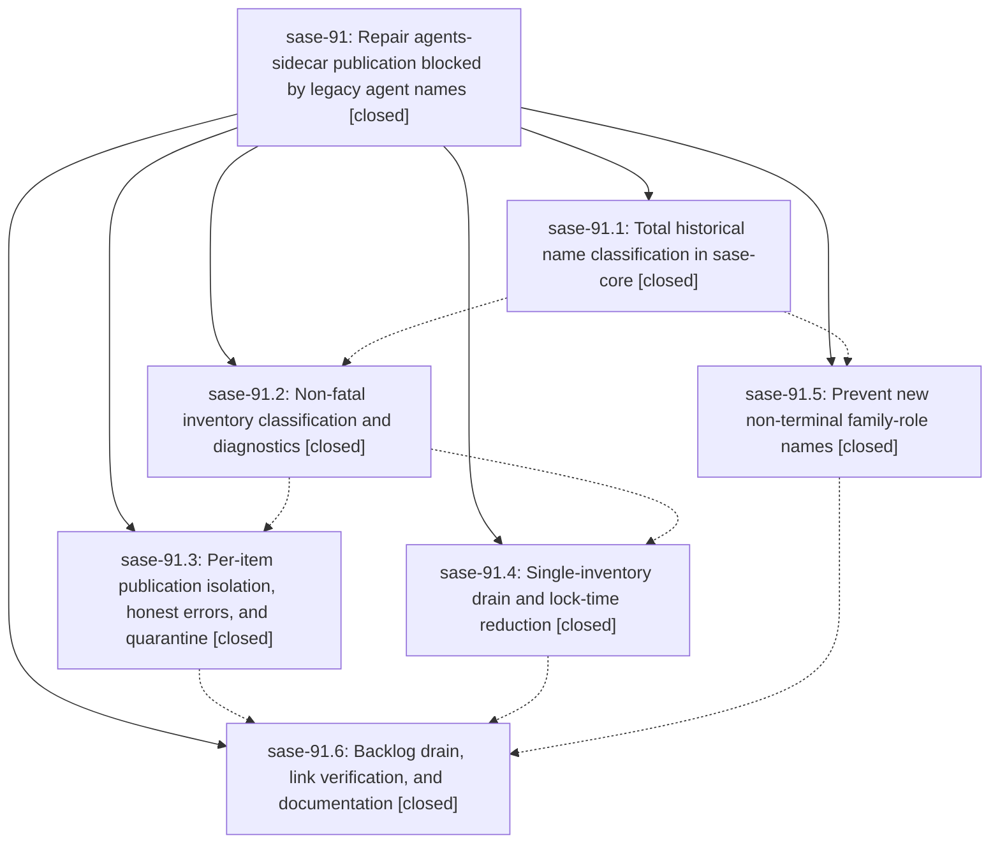

# Bead: sase-91 — Repair agents-sidecar publication blocked by legacy agent names

[Bead Pages](../README.md) / sase-91

**Status:** ✓ closed · **Resolution:** (unrecorded) · **Type:** plan · **Tier:** epic
**Owner:** `bryanbugyi34@gmail.com` · **Assignee:** `sase-91.land`
**Created:** 2026-07-24 23:41:50 UTC · **Closed:** 2026-07-25 03:29:08 UTC
**Plan:** [202607/agents\_sidecar\_publication\_recovery.md](https://github.com/sase-org/sase--plans/blob/main/202607/agents_sidecar_publication_recovery.md)

## Description

Automatic `--agents` sidecar publication works end to end again: legacy agent names can never block publication, one failing outbox item can never block the others, the drain is fast enough to finish under its lock, the stuck backlog is published, and every `SASE_AGENT` commit link resolves to a real page.

## Notes

COMMIT: 85fac0f4

## Phases

| Bead | Title | Status | Size | Agents | Commits |
|---|---|---|---|---:|---:|
| [sase-91.1](sase-91.1.md) | Total historical name classification in sase-core | ✓ closed | medium | 0 | 0 |
| [sase-91.2](sase-91.2.md) | Non-fatal inventory classification and diagnostics | ✓ closed | small | 1 | 1 |
| [sase-91.3](sase-91.3.md) | Per-item publication isolation, honest errors, and quarantine | ✓ closed | medium | 1 | 1 |
| [sase-91.4](sase-91.4.md) | Single-inventory drain and lock-time reduction | ✓ closed | medium | 1 | 1 |
| [sase-91.5](sase-91.5.md) | Prevent new non-terminal family-role names | ✓ closed | small | 1 | 1 |
| [sase-91.6](sase-91.6.md) | Backlog drain, link verification, and documentation | ✓ closed | medium | 1 | 1 |

## Lineage

## Agents

| Agent | Bead | Commits |
|---|---|---:|
| [bbugyi200.athena.sase-91.2](https://github.com/sase-org/sase--agents/blob/main/agents/bbugyi200.athena.sase-91.2/README.md) | [sase-91.2](sase-91.2.md) | 1 |
| [bbugyi200.athena.sase-91.3](https://github.com/sase-org/sase--agents/blob/main/agents/bbugyi200.athena.sase-91.3/README.md) | [sase-91.3](sase-91.3.md) | 1 |
| [bbugyi200.athena.sase-91.4](https://github.com/sase-org/sase--agents/blob/main/agents/bbugyi200.athena.sase-91.4/README.md) | [sase-91.4](sase-91.4.md) | 1 |
| [bbugyi200.athena.sase-91.5](https://github.com/sase-org/sase--agents/blob/main/agents/bbugyi200.athena.sase-91.5/README.md) | [sase-91.5](sase-91.5.md) | 1 |
| [bbugyi200.athena.sase-91.6](https://github.com/sase-org/sase--agents/blob/main/agents/bbugyi200.athena.sase-91.6/README.md) | [sase-91.6](sase-91.6.md) | 1 |

## Commits

| Commit | Subject | Bead | Committed (UTC) |
|---|---|---|---|
| [`d31c886`](https://github.com/sase-org/sase/commit/d31c8866bb473f3cfd36b95cfe5cb0670b19d89a) | fix(agent): keep generated family-role suffixes terminal (sase-91.5) | [sase-91.5](sase-91.5.md) | 2026-07-25 00:20:40 |
| [`ae44c73`](https://github.com/sase-org/sase/commit/ae44c73b551a0e9fb88c7a81ccc4f7257d4127dc) | fix(agents-sync): diagnose inventory classifier failures (sase-91.2) | [sase-91.2](sase-91.2.md) | 2026-07-25 00:32:38 |
| [`1449c9b`](https://github.com/sase-org/sase/commit/1449c9bb7b46348f391ffdbb8fffdd6d5a38384d) | perf(agents-sync): reduce publication drain lock work (sase-91.4) | [sase-91.4](sase-91.4.md) | 2026-07-25 00:56:13 |
| [`7bb485d`](https://github.com/sase-org/sase/commit/7bb485d33f966a4471cd67c59a20b0b4e6c0982e) | fix(agents): quarantine failing publication requests (sase-91.3) | [sase-91.3](sase-91.3.md) | 2026-07-25 01:07:50 |
| [`447d96e`](https://github.com/sase-org/sase/commit/447d96e09d692f77b72783ca7e78c5e8bce41c3d) | fix(agents): recover historical sidecar publications (sase-91.6) | [sase-91.6](sase-91.6.md) | 2026-07-25 02:48:16 |
